这是关于虎书《Fundamentals of Computer Graphics-5th》的笔记，主要是对书中亮点知识（个人认为具有价值）的总结。对于某些地方也会尝试加入自己的见解和搜集来的其他方面的资料。

# 2. Miscellaneous Math

The cleaner the math, the cleaner the resulting code.This chapter reviews various tools from high school andcollege mathematics and is designed to be used more as a reference than as a tutorial.

## 2.1 Sets and Mappings

- 集合的概念

  $a\in S$，Cartesian product(笛卡尔积)$A \times B$，固定符号表：

  
- 函数\映射\代码 相关概念

  

### 2.1.1 Inverse Mappings

- 满射 / 双射 /单射相应的概念

  
- 反函数存在的对应条件是原函数是双射函数

### 2.1.2 Intervals

- 开集闭集的区别 \ 间隔与集合之间相似的操作

  

### 2.1.3 logarithm

## 2.2 Solving Quadratic Equations

基本的求解二次方程定理（判断是否有根）和相应的求根公式：

$$
x = \frac{-B \pm \sqrt{B^2-4AC}}{2A}
$$

## 2.3 Trigonometry

In graphics, we use basic trigonometry in many contexts. Usually, it is nothing too fancy, and it often helps to remember the basic definitions.

### 2.3.1 Angles

An angle is defined by the length of the src segment in cuts out on the unit circle.

The sign of the angle is determined by the order in which the two half-lines are specified.

上述是弧度的定义，弧度角度也可以相互转换：

### 2.3.2 Trigonometric Functions

- 勾股定理：

  $$
  a^2+o^2=h^2,\\
  area = (a+o)^2,\\
  2ao+h^2=(a+o)^2.
  $$

  
- 三角符号的定义

### 2.3.3 Useful Identities

- Shifting identities(偏移公式)

  
- Pythagorean identities(毕达哥拉斯恒等式)

  
- Addition and subtraction identities(相加相减公式)

  
- Half-angle identities(半角公式)

  
- Product identities(乘积公式)

  
- Arbitrary triangles with side lengths a,b,c, each with an angle opposite it given by A,B,C.(边与角公式)

  
- Triangle area(面积公式)

  

### 2.3.4 Solid Angles and Spherical Trigonometry

- 立体角（Solid Angles）

  相对于角度的直观概念，立体角就是角度在三维空间的概念延申。“角度可以帮助我们判断视野内两个极点之间的距离，而立体角可以让我们知道物体覆盖了我们视野范围的多少”。

  角度（弧度）=  弧长/半径；立体角（立体度sr）= 球面覆盖面积/半径$^2$,

  

  **立体角的微分：**

  $\theta$代表z轴方向的角度摆动，$\phi$代表x-y平面的角度摆动。$\theta$和$\phi$的组合可以扫过球面上的任何一个点。

  考虑球面面积的微分$dA$（有$d\theta$和$d\phi$决定）:

  1. 先让$\theta$移动$d\theta$距离，扫过$rd\theta$长度
  2. 以$rsin\theta$为边，让$\phi$移动$d\phi$距离，扫过$rsin\theta d\phi$长度
  3. 面积等于两个长度的乘积：

  $$
  dA & = & rd\theta \times rsin\theta d\phi,\\
  & = & r^2sin\theta d\theta d\phi.
  $$

  4. 微分立体角等于微分面积除以半径平方：

  $$
  d\Omega = \frac{dA}{r^2} = sin\theta d\theta d\phi
  $$

  **立体角的积分：**

  通过微分计算积分：

  $$
  \Omega = \int_S{d\Omega} = \int_S{sin\theta d\theta d\phi}
  $$
- 球面三角（Spherical Trigonometry）

  三角形也可以定义在非平面的表面上，比如球面。这些球面三角形的边是球体上大圆的部分。

  没有详细说明（余弦球面定律，正弦球面定律）

## 2.4 Vectors

a Vector describes a length and a direction.

**向量可以描述偏移（不知起始位置），也可以描述由某位置经过偏移后的另一个位置，但不能描述位置。**

因为偏移加偏移可以描述一种新的偏移，可位置加上位置没有意义。

### 2.4.1 Vector Operations

- 相加相减操作对应三角几何

### 2.4.2 Cartesian Coordinates of a Vector

向量的笛卡尔坐标。

A 2D vector can be written as a combination of any two nonzero vectors which are not parallel.

This property of the two vectors is called **linear independence**.

线性独立的向量组（basis）都可以唯一确定地表示对应维线性空间的任意一个向量

**orthogonal(正交) orthonormal(正交且单位长度)** 具有很好的表示性

### 2.4.3 Dot Product

scalar product

a投影到b上的长度：

满足的性质：

坐标化表示：

### 2.4.4 Cross Product

vector product

长度等于a,b所围成的面积，方向由右手定则决定：

满足的性质：

order: 由前者旋转到后者（e.g. $a\times b$ a旋转到b）

坐标化表示：

### 2.4.5 Orthonormal Bases and Cooridinate Frames

任意一组彼此正交且长度为1的向量组都可以是笛卡尔规范正交基。

笛卡尔规范正交基可以不用存储原点的位置和坐标轴的具体信息，其已经被隐式表达。

> What makes it special is that it and **its implicit origin location** are used for low-level representation within a program. Thus,
>
> the **vectors x, y, and z are never explicitly stored** and neither is the canonical origin location **o**.
>
> The global model is typically stored in this canonical coordinate system, and it is thus often called the **global coordinate system.**

如果想要存储其他的坐标系（不同的原点，同样正交的basis），则需要显式地存储他们。这样的坐标系统叫做**frame**.

> However, if we want to use another coordinate system with origin p and orthonormal basis vectors u, v, and w, then we do
>
> store those vectors **explicitly**. Such a system is called **a frame of reference or coordinate frame**.

对于任意向量p位于标准正交基中，可以表示为：

$$
p = x_p\vec{x}+y_p\vec{y}+z_p\vec{z} = o+x_p\vec{x}+y_p\vec{y}+z_p\vec{z}
$$

同样起点位于原点的标准化**frame**(uvw，$||u||=||v||=||w||=1$)，对于p也有自己的坐标表示$(u_p,v_p,w_p)$，现在只知道p在global coordinate system中的坐标$(x_p,y_p,z_p)$，想要得到基于uvw的local coordinate system的坐标表示：

$$
u_p=\bold p\cdot \bold u,\\
v_p=\bold p\cdot \bold v,\\
w_p=\bold p\cdot \bold w.
$$

因为$\bold u,\bold v,\bold w$都是单位向量，且其对应的坐标也是位于global coordinate system中，所以显式计算是可行的。

$\bold p \cdot \bold u,\bold p \cdot \bold v,\bold p \cdot \bold w$就相当于$\bold p$在$\bold u,\bold v,\bold w$上的投影，等价于对应坐标。

### 2.4.6 Constructing a Basis from a Single Vector

已知$\vec{a}$，构建出一个标准正交基：

1. 对$\vec{a}$做标准化

   $$
   \vec{w}=\frac{\vec{a}}{||\vec{a}||}
   $$
2. 任选一个与$\vec{w}$不平行的向量$\vec{t}$:

   $$
   \vec{u}=\frac{\vec{t}\times \vec{w}}{||\vec{t}\times \vec{w}||}
   $$
3. 得到$\vec{v}$:

   $$
   \vec{v}=\vec{w}\times \vec{u}
   $$

> An example of a situation where this construction is used is surface shading, where a basis aligned to the surface normal is
>
> needed but the rotation around the normal is often unimportant.

###2.4.7 Constructing a Basis from Two Vector

已知$\vec{a},\vec{b}$，构建出一个标准正交基：

- $\vec{a},\vec{b}$已经正交

  $$
  \vec{u}=\vec{a}\times\vec{b},\\
  \vec{v}=\vec{a},\\
  \vec{w}=\vec{b}.
  $$
- $\vec{a},\vec{b}$不正交(但也不平行)

  $$
  \vec{w}=\frac{\vec{a}}{||\vec{a}||},\\
  \vec{u}=\frac{\vec{b}\times \vec{w}}{||\vec{b}\times \vec{w}||},\\
  \vec{v}=\vec{w}\times \vec{u}.
  $$
- $\vec{a},\vec{b}$平行

  参考Constructing a Basis from a Single Vector.

> In this case, w will be **constructed exactly in the direction of a**, and v is chosen to be **the closest vector to b among all vectors** perpendicular to w.

对于相机坐标系的构建，可以选用观察方向和世界坐标的正上方向作为$\vec{a},\vec{b}$.

### 2.4.8 Squaring Up a Basis

> However, it is **asymmetric**: it “favors” w over v and v over u (whose starting value is thrown away). **It chooses a basis close to the starting basis but has no guarantee of choosing the closest orthonormal basis**. When this is not good enough, the **SVD** (Section 6.4.1) can be used to compute an orthonormal basis that is **guaranteed to be closest to the original basis**.

## 2.5 Integration

积分包括：

- The function being integrated
- The domain over which it is integrated

### 2.5.1 Averages and weighted averages

> Integrals compute the total of things. Lengths, areas, volumes, etc. But they are often used to compute averages.
>
> Often integrals contain a weighted average without explicitly pointing that out and it can sometimes help intuition.

### 2.5.2 Integrals over solid angle

对立体角的积分是很常见的，对某一个区域的立体角积分有时可以写做：

在半球上$cos\theta$的积分为$\pi$，所以在这个区域的shade平均值为：

这样就可以把平均值当成这个区域（某个像素区域）的shade

另一些常见的积分形式：

上述积分即是漫反射模型，既表示某个区域接收到的光会完全均匀的反射出去，同时也表示所有入射颜色的加权平均值。

## 2.6 Density Functions

密度函数，通常的形式为概率密度函数，不多赘述

## 2.7 Curves and Surfaces

The geometry of curves, and especially surfaces, plays a central role in graphics, and here, we review the basics of curves and surfaces in 2D and 3D space.

### 2.7.1 2D Implicit Curves

a curve is a set of points that can be drawn on a piece of paper without lifting the pen.A common way to describe a curve is using an implicit equation.

一条曲线的隐式表示是一种规则，代表曲线上的点都需要满足的规则。这利于判定，但无法显式地构建出整条曲线：

而$f(x,y)>0$和$f(x,y)<0$代表对于空间的一种划分，比如（上方，下方）和（外部，内部）。这种划分可以通过取相反数来获得相反的划分，但是整个曲线的表达不会改变（因为0的相反数仍然是0）。

隐式表达有时候可以很好的表示出曲线的几何信息：

利用向量的形式会比利用坐标的形式更加简洁，也更不容易犯错，尤其是在写代码的时候，所以编程时建议使用向量形式。

### 2.7.2 The 2D Gradient

梯度代表着函数值上升最快的方向：

> The gradient vector evaluated at a point on the **implicit curve** $f(x,y)=0$ is **perpendicular to the tangent vector** of the curve at that point.

在隐式表达函数中，某点的梯度垂直于某点的切线方向，并且由于是指向上升最快的方向，所以位于$f(x,y)>0$的区域。

**为什么梯度方向是垂直于曲面方向的呢？**

> Suppose that near the point (a,b)，$f(x,y)$ is a plane.

在这个平面的两侧，分别是$f(x,y)>0$和$f(x,y)<0$的区域，由于梯度方向是uphill的，所以指向$f(x,y)>0$的区域。

任意一个指向$f(x,y)>0$区域的向量都可以让函数值上升，**那么在固定向量长度的前提下，哪个方向是上升最快的方向呢？**

可以对向量进行分解，一个分解到平面上，一个分解到垂直平面的方向上。固定长度的向量按比例对这两个分解方向进行贡献。

$$
||\vec{v_{on}}||=||\vec{v}||cos\theta,\\
||\vec{v_{per}}||=||\vec{v}||sin\theta.
$$

但是任何在平面上的移动都不会导致函数值的改变（因为这个平面本身就是$f(x,y)=0$曲面的微分），所以对平面上移动的贡献就是一

种浪费，**那么上升最快的方向，就是完全不对平面上移动做贡献的方向**，即$|||\vec{v_{on}}||=0$，而这自然就是垂直于平面的方向。

**为什么梯度可以表示成偏导组成的向量呢？**

同样取曲面的一个微分，该点微分切线方向写做$\vec{a}=(\bigtriangleup x, \bigtriangleup y)$。

设梯度的坐标信息为$\bigtriangledown f=(x_\bigtriangledown,y_\bigtriangledown)$，因为梯度要与微分平面垂直，自然也要与切线垂直，所以：

$$
(\bigtriangledown f)\cdot \vec{a} = x_\bigtriangledown \bigtriangleup x + y_\bigtriangledown \bigtriangleup y = 0
$$

因为微分是一个平面，而移动微小的$\bigtriangleup x$和$\bigtriangleup y$都会使得点位于平面上，所以：

$$
f(x+\bigtriangleup x, y) - f(x,y) = 0,\\
f(x,y+\bigtriangleup y) - f(x,y) = 0.\\
\Rightarrow \frac{f(x+\bigtriangleup x, y) - f(x,y)}{\bigtriangleup x}\bigtriangleup x + \frac{f(x,y+\bigtriangleup y) - f(x,y)}{\bigtriangleup y}\bigtriangleup y = 0,\\
\Rightarrow \frac{\partial f}{\partial x}\bigtriangleup x + \frac{\partial f}{\partial y}\bigtriangleup y = 0.
$$

将上面两式进行比较，就可以发现：

$$
x_\bigtriangledown = \frac{\partial f}{\partial x},\\
y_\bigtriangledown = \frac{\partial f}{\partial y}.
$$

- Implicit 2D Lines

  一般的“斜率-截距”写法为：

  $$
  y = mx+b
  $$

  转换成隐式表达即为：

  $$
  y - mx - b = 0
  $$

  对这个隐式表达函数乘以任何非零常数都不会改变这个直线的表达。但是对于像$x=0$这样的情况，“斜率-截距”写法就有明显的局限，因为此时m为无穷，于是有更一般的写法：

  $$
  Ax+By+C=0
  $$

  由于空间中任意两点代表一条直线，所以取两点$(x_0,y_0)$和$(x_1,y_1)$，将其带入：

  $$
  Ax_0 + By_0 + C = 0,\\
  Ax_1 + By_1 + C = 0.
  $$

  发现无法解方程，变量个数大于公式数，如果假定C=某个常数，也会导致无法表达某条特定直线的情况。为了解决这个问题，采用梯度的方法去考量这个问题：

  

  直线$Ax+By+C=0$的梯度为$(A,B)$，与直线垂直。考虑直线上两点连成的向量$(x_1-x_0,y_1-y_0)$，该向量要与梯度垂直。

  那么很显然，当：

  $$
  A = y0-y1,\\
  B = x1-x0.
  $$

  时，满足垂直的条件，此时直线隐式表达函数为：

  $$
  (y_0-y_1)x+(x_1-x_0)y+C = 0
  $$

  再将任意一点代入直线方程，可得$C=x_0y_1-x_1y_0$，**直线方程即为：**

  $$
  (y_0-y_1)x+(x_1-x_0)y+x_0y_1-x_1y_0 = 0
  $$

  该表达没有任何的除法，不用担心数值退化的问题，并且可以轻易转变成"斜率-截距"的形式：

  $$
  y = \frac{y_1-y_0}{x_1-x_0}x + \frac{x_1y_0-x_0y_1}{x_1-x_0}
  $$

  直线的隐式表达可以很方便地求出点到直线的**带符号距离**，因为到直线的距离与隐式函数值是成正比的：

  

  对于任意一个不在直线上的点$\vec{a}$，可以从该点向直线做一条垂线，并与直线相交于点$\vec{b}$。那么$||\vec{ab}||$就是点到直线的距离，由于$\vec{b}$的垂线方向为直线的梯度方向，所以：

  $$
  \vec{ab} = k(A,B),\\
  \Rightarrow ||\vec{ab}|| = k\sqrt{A^2+B^2}.
  $$

  k是一个非零实数。

  

同时点$\vec{a}$可以表示为$\vec{b}+k(A,B)$，所以其对应的函数值为：

经过对比可以发现：

这里的distance是带符号的，取决于$f(x,y)$。想要转变符号只需变为相反数。

可以让$\sqrt{A^2+B^2}=1$来让函数值直接就表示带符号距离，做法就是对直线除以某个常数进行归一化：

$$
f(x,y) = \frac{f(x,y)}{\sqrt{(x_1-x_0)^2+(y_0-y_1)^2}}
$$

- Implicit Quardric Curves

### 2.7.3 3D Implicit Surfaces

$f(x,y)$代表一个曲面，而$f(x,y)=0$代表一个曲线。

$f(x,y,z)$代表一个四维空间，而$f(x,y,z)=0$代表一个曲面（三维）。

通常可以用向量表示坐标，如$\vec{p}=(x,y,z)$：

$$
f(\vec{p}) = 0
$$

### 2.7.4 Surface Normal to an Implicit Surface

与2D情况一样，梯度方向就是三维曲面中某一点的法向量：

同样代表着函数值上升最快的方向，并且与该点所有切线垂直。同时对$f(x,y)$取反可以修改梯度的符号，即：

### 2.7.5 Implicit Planes

对于一个无限平面，可以用一个法向量和一个点来表示它：

若一个平面上有三个点$\vec{a},\vec{b},\vec{c}$，可以求出平面的法向量：

所以平面可以表示为：

可以从另一个角度考虑这件事情，当p位于平面上时，就意味这p要与a,b,c都共面，即由$p-a$，$b-a$，$c-a$组成的平行六面体体积要为0。而行列式的几何意义就是向量围成的面积或者体积，所以平面的隐式表达还可以为：

- 3D Quardric Surfaces

  与2D类似，球体就可以表示为：

  

  而椭球体可以表示为：

  
- 3D Curves from Implicit Surfaces

  由于$f(x,y,z)=0$表示曲面，很自然地想要知道有没有$f(p)=0$的形式可以表示3D中的曲线，但是这不能办到，因为$f(x,y,z)$是四

  维，而曲线是二维，$f(x,y,z)=0$只能降下一维。

  但是3D中的曲线可以用两个曲面方程去表达，因为两个不平行的曲面相交即可产生一条曲线，即：

  $$
  \left\{
  \begin{array}{**lr**}
  f(x,y,z)&=&0,\\
  g(x,y,z)&=&0.
  \end{array}
  \right.
  $$

    用参数化方程可以更好地表达。

### 2.7.6 2D Parametric Curves

2D参数化的曲线可以用单变量t来表达：

$$
\left[\
\begin{matrix}
x \\ y
\end{matrix}
\right] = \left[\
\begin{matrix}
g(t) \\ h(t)
\end{matrix}
\right].
$$

其中**g**和**h**都是可微函数，所以t的微小改变都会导致x和y的微小改变，从而可以swept out出一条曲线。上述式子也可以写成向量的形式：

$$
\bold p = f(t)
$$

其中$f:\mathbb{R}\mapsto\mathbb{R}^2$.

- 2D Parametric Lines

  

  若一条直线经过点$\mathbf p_0 = (x_0,y_0)$和$\mathbf p_1 = (x_1,y_1)$，那么直线就可以写做：

  $$
  \left[\
  \begin{matrix}
  x \\ y
  \end{matrix}
  \right] = \left[\
  \begin{matrix}
  x_0+t(x_1-x_0) \\ y_0+t(y_1-y_0)
  \end{matrix}
  \right].
  $$

  同样可以写做向量的形式：

  $$
  \mathbf p(t) = \mathbf p_0+t(\mathbf p_1-\mathbf p_0)
  $$

  这里就是插值的做法，t从0到1时，直线从$\mathbf p_0$到$\mathbf p_1$。当t<0时，直线远离$\mathbf p_0$；当t>1时，直线远离$\mathbf p_1$。

  > Parametric lines can also be described as just a point o and a vector **d**:
  >

  $$
  \mathbf p(t) = \mathbf o+t(\mathbf d).
  $$

  当d是单位向量时，t就代表p到o的实际距离。
- 2D Parametric Circles

  对于一个半径为r的圆，其圆心为$(x_c,y_c)$，则其参数表达为：

  $$
  \left[\
  \begin{matrix}
  x \\ y
  \end{matrix}
  \right] = \left[\
  \begin{matrix}
  x_c+rcos\phi \\ y_c+rsin\phi
  \end{matrix}
  \right].
  $$

  $\phi$跨度为$2\pi$，可以是$[0,2\pi)$，也可以是$(-\pi,\pi]$。

  坐标对齐的椭圆可以参数表示为：

  $$
  \left[\
  \begin{matrix}
  x \\ y
  \end{matrix}
  \right] = \left[\
  \begin{matrix}
  x_0+a(x_1-x_0) \\ y_0+b(y_1-y_0)
  \end{matrix}
  \right].
  $$

### 2.7.7 3D Parametric Curves

与2D相同

$$
\left[\
\begin{matrix}
x \\ y \\ z
\end{matrix}
\right] = \left[\
\begin{matrix}
f(t) \\ g(t) \\ h(t)
\end{matrix}
\right].
$$

同样可以写成向量形式：

$$
\left[\
\begin{matrix}
x \\ y \\ z
\end{matrix}
\right] = \mathbf p(t).
$$

- 3D Parametric Lines

### 2.7.8 3D Parametric Surfaces

对于表面，需要2个参数，比曲线的参数多一个，其定义方式为：

$$
x = f(u,v),\\
y = g(u,v),\\
z = h(u,v).
$$

其向量形式为：

$$
\left[\
\begin{matrix}
x \\ y \\ z
\end{matrix}
\right] = \mathbf p(u,v).
$$

**为什么表面需要两个参变量，而曲线只需要一个呢？**

对于曲线，当变化参变量时，变量也会随之变化，并且方向只有一个。所以当参变量发生varing时，按固定方向前进的点就会构成一条曲

线。

对于表面，两个参变量可以同时发生变化，也会让变量随之变化。对于同一个起始点，当固定其中一个参变量并改变另一个参变量时，点

会按某个方向前行；但当固定另一个参变量并改变这一个参变量时，点会按另一个方向前行，从而扩散出了一个平面。

**上面所说的”方向“，代表的某点某一切线的方向**。当固定u改变v时，得到的切线方向是$\bold p_v$，反之则是$\bold p_u$。那么该点表面的法线方向就可

以表示为：

$$
\bold n = \bold p_u \times \bold p_v
$$

方向由右手定则决定。

### 2.7.9 Summary of Curves and Surfaces

1. 隐式2d曲线或者3d表面是一种scalar-valued functions

   满足：

   $$
   S = \{\bold p|f(\bold p)=0\}.
   $$

   其中函数满足$f:\mathbb{R}^2\mapsto\mathbb{R}$或者$f:\mathbb{R}^3\mapsto\mathbb{R}$.
2. 2d或者3d参数化曲线是一种vector-valued functions

   满足：

   $$
   S = \{\bold p(t)|t\in D\}.
   $$

   其中函数满足$p:D\subset \mathbb{R}\mapsto\mathbb{R}^2$或者$p:D\subset \mathbb{R}\mapsto\mathbb{R}^3$。其中D是参数t所处的空间。
3. 2d或者3d参数化与2类似

   满足：

   $$
   S = \{\bold p(u,v)|(u,v)\in D\}.
   $$

   其中函数满足$p:D\subset \mathbb{R}^2\mapsto\mathbb{R}^3$。

**隐式表达和参数化表达的两大区别：**

1. 隐式表达意如其名，参数化表达是显式表达。
2. 隐式表达的函数$f$对于坐标的梯度代表法向量，如果想要求得切线，就通过构建正交坐标系的方法。

   > For implicit curves and surfaces, the normal vector is given by the derivative of f (the gradient), and the tangent vector
   >
   > (for a curve) or vectors (for a surface) can be derived from the normal by constructing a basis.
   >
3. 参数化表达的函数$p$对于参变量的梯度代表切线，如果想要求得法向量，就通过构建正交坐标系的方法。

   > For parametric curves and surfaces, the derivative of p gives the tangent vector (for a curve) or vectors (for a surface),
   >
   > and the normal vector can be derived from the tangents by constructing a basis.
   >

## 2.8 Linear Interpolation

上述关于直线的表达就体现了线性插值的思想。

线性插值同样可以从离散点中拟合函数（分段），具体公式如下：

$$
f(x) = y_i + \frac{x-x_i}{x_{i+1}-x_i}(y_{i+1}-y_i)
$$

## 2.9 Triangles

通常给定三角形三个顶点的属性，就可以通过插值的方法给出三角形内部任何一个位置的属性值。

这种插值方法通常使用**barycentric coordinate(重心坐标)**。

### 2.9.1 2D Triangles

对于一个2D三角形，给定点$a,b,c$，可以通过行列式几何原理得到其面积：

同样也可以利用三角形中的两条边作为basis表达对应平面的任意一个点：

$$
\bold p &=& \bold a + \beta(\bold b-\bold a) + \gamma(\bold c-\bold a),\\
&=& (1-\beta-\gamma)\bold a + \beta \bold b + \gamma \bold c,\\
&=& \alpha \bold a+\beta \bold b+\gamma \bold c.(\alpha\equiv 1-\beta-\gamma).
$$

这里包含隐式的约束$\alpha + \beta + \gamma=1$。

这种basis可以表达平面中的任意一个点，但是只有满足下述条件的点才位于三角形内部：

$$
0<\alpha<1,\\
0<\beta<1,\\
0<\gamma<1.
$$

对于平面上任意一个点p，想要求出其用三角形边的basis表示的坐标：

由于这时坐标不是正交的，所以不能利用之前讲的点积法求出坐标，但可以通过线性方程的办法：

但是其并不直观，可以利用几何的概念去理解：

> One geometric property of barycentric coordinates is that they are the signed scaled distance from the lines through the
>
> triangle sides.

如图，$\beta$可以表示点b到直线ac的距离。虽然直线ac到b的距离实际上并不为1，但是$kf_{ab}$并不影响直线的表达，所以我们可以通过这个

constant $\bold k$强制让b到ac的距离为1（有点像svm）。具体的操作即为：

具体的例子为：

另一种几何视角是三角形的面积比：

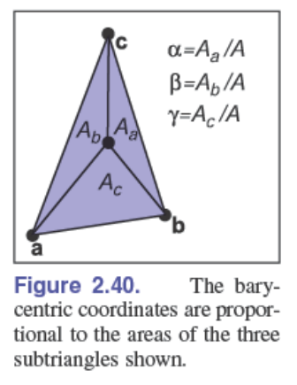

这种视角与上述的”距离“是等价的，因为面积比在同底的情况下也就是高的比。

### 2.9.2 3D Triangles

3D的情况与2D很相似，其中3D的法向量可以定义为：

面积可以定义为：

**三维的点$a,b,c$可以表示三维空间中的任意一个点，那么怎么确保点可以落在三维的三角形平面内部呢？**

仅由$0<\alpha<1,0<\beta<1,0<\gamma<1，\alpha+\beta+\gamma=1$可以判断，点会落在以$\bold o,\bold a,\bold b,\bold c$为顶点的三角锥体区域内。

通过cross product的性质可以判断点是否落在三角形平面上：

$$
\frac{n_a}{||n_a||} = \frac{n_b}{||n_b||} = \frac{n_c}{||n_c||}.
$$

其中：

当确定点位于三角形平面内部时，就可以判断其重心坐标：

## 2.10 Discrete probability

> Probability studies things that include random outcomes and discrete probability refers to when there is a finite number of random outcomes.

$E(X)$反应随机变量的平均水平

$V(X)$反应随机变量分布的集中水平

$\sqrt{V(X)}$与距离平均点的平均距离并不等价

> This is “around” the average distance from the mean of 3.5, but **is slightly different as the actual mean absolute distance**
> is 1.5. So while in practice it is almost always not dangerous intuition to think of standard deviation as average absolute deviation, it is good to keep **at least in the back of your mind they are different**.

## 2.11 Continuous probability

> a big difference: the probability of a continuous random variable taking on any particular value is zero.

## 2.12 Monte Carlo Integration

对于定积分，图形学中常用的手段是蒙特卡洛积分。

假设我们要求对于一个半球的积分，我们可以用采样的方式：

当N足够大时，平均也就越准确。

对于如何做随机采样，有一种均匀的方法：

这样我们可以得到一种平均，进而得到积分：

> So Monte Carlo integration often is an average of random points times a constant (the size of the domain– length, area, etc.).

### 2.12.1 importance Sampling

> When a function we want to take a random average of **has a wide variation in its high and low values**, it can be to our advantage to **concentrate samples in some areas** and then correct for the nonuniformity with weights. The probability density functions give us the right tool for that: if we know the **PDF of a sample**, that is a direct **measure of how “oversampled” that region is**.

重要性采样的积分形式为：

这同样在均匀随机采样中生效，因为均匀随机采样的PDF就是：

同时我们知道在重要性采样中期望为：

其中$\pi(x)$是真实分布，$p(x)$是实际的采样分布，有时候$\pi(x)$很难采样所以想要通过$p(x)$去近似，那么这时候$f(x)$就要加上修正的权重$\frac{\pi(x)}{p(x)}$。

对于上述$\frac{f()}{p()}$，可以想象$f()$就是$\pi(x)$，$p()$就是$p(x)$，而真正的$f(x)=1$。所以为什么会说重要性采样的分布与原函数的分布越接近越好，因为这样修正权重就会接近1，收敛会更快。

综上，重要性采样的步骤可以是：

> A neat thing is that **any p() can be used and you will converge to the right answer** (with the caveat that where f() is nonzero p() must be nonzero). Which p() you use merely **influences how fast your estimate converges**. So we usually start with a constant p() for debugging our code.

## 2.13 Frequently Asked Questions

- Why isn’t there vector division?

  It turns out that there is no “nice” analogy of division for vectors. However, it is possible to motivate the quaternions by examining this question in detail (see Hoffmann’s book referenced in the chapter notes).
- Is there something as clean as barycentric coordinates for polygons with more than three sides?

  Unfortunately, there is not. Even convex quadrilaterals are much more complicated. This is one reason triangles are such a common geometric primitive in graphics.

- Is there an implicit form for 3D lines?

  No. However, the intersection of two 3D planes defines a 3D line, so a 3D line can be described by two simultaneous implicit 3D equations.
- How is quasi–Monte Carlo (QMC) or blue noise sampling related to Monte Carlo sampling?

  The core idea of Monte Carlo is you can average a bunch of “fair” samples to estimate a true average. Here, fair can be framed in a statistical sense. **But some sample sets can also be shown to be “fair” even if they are not random.** One such set are quasi–Monte Carlo and have obvious deterministic structure which is not random, but is uniform in a formal sense that is not statistical, and these sets often improve convergence over random ones. Blue noise sample sets add constraints on the samples to avoid clumping, and like QMC sets can improve convergence without being fully random. In practice, **most techniques are developed using Monte Carlo formalisms because the math is more tractable**, and then, QMC or blue noise points are inserted in the code with the empirical confidence that uniformity is all that is needed in practice.

# 3. Raster Images

现在很多计算机图形图像被显示在光栅化设备上。光栅化显示设备中的最小单位被称为像素（picture element）。

光栅化设备如排列发光显示的电脑屏幕和基于扫描的打印机。

也有很多输入设备是光栅化的，如相机。相机的拍摄依赖于内部网格化的感光元件，每个小网格都能记录对应的颜色和光强。

基于设备都是光栅化的，所以图像的存储和展示也是光栅化的，但是图形并不是。因为我们有时候想改变图形的大小或者属性，并将改变后的图形显示在光栅化设备上，这就说明图形与光栅化设备必须是独立的。

> It’s best to think of a raster image as a device-independent description of the image to be displayed, and the display device as a way of approximating that ideal image.

还有一种图形显示的格式是矢量图，它存储的是图形的结构，而不是光栅化后的信息，所以它可以做到无限清晰。但是它的缺点是每一次对图形的操作都需要重新光栅化。

## 3.1 Raster Devices

### 3.1.1 Displays

LCD(液晶)显示通过电压的变化改变光的极化方向，从而决定让光穿过多少。

LED通过发光二极管实现颜色和明暗变化，一个pixel由三个不同颜色的subpixel（red，yellow，green）组成，组成的阵列也有不同方式

### 3.1.2 Hardcopy Devices

通过扫描的方式，不同颜色对应不同的喷墨方式（略）

### 3.1.3 Input Devices

相机通过棱镜成像的方式捕捉信息，并用感光元件记录

扫描仪的原理：

## 3.2 Images,Pixels,and Geometry

图像的存储，显示和获取其实都是对连续的自然或者数学表达的采样。我们始终记录的是离散的值，但是这个离散值间隙很小很紧密，让我们的眼睛误以为它就是连续的图像。通常，我们可以抽象光栅化的图像为一个函数：

其中$R\subset\mathbb{R}^2$是一个矩形化的区域，而$V$是一系列可能的像素点的值。对于灰度图像只需保存一个值，而正常(彩色)图像则需要保存三个值。对于这个函数的表达可以理解为，一个像素代表一个矩形区域，其值就是这一块矩形区域属性（颜色）的平均值。

> In both cases,the pixel value is a local average of the color of the image, and it is called a point sample of the image.

上图就是矩形区域和像素点的几何对应关系。每一个像素点向上下左右延申0.5距离的矩形就是它所代表的区域。

所以一个像素点排列为$n_x\times n_y$的图像的实际大小为：

### 3.2.1 Pixel Values

像素值取决于给每个像素点分配多大的存储量。

一般给像素值限定的范围是（0，1）。对于一个每个像素值分配1字节（8bit）的图像而言，其可能值就为$0,1/255,2/255,...,1$

以浮点数存储的图像，支持更广泛的颜色值，叫做HDR（高动态范围成像），区别于用整数格式存储的LDR

当实际亮度超过像素存储的阈值时，会进行剪裁。当高精度存储的图像转换成低精度存储时，会引起条带，伪影等各种视觉问题。

### 3.2.2 Monitor Intensities and Gamma

> if you give a monitor 0, 0.5, and 1.0 as inputs for three pixels, the intensities displayed might be 0, 0.25, and 1.0

$\href{https://blog.csdn.net/candycat1992/article/details/46228771}{[图形学]我理解的伽马校正(Gamma Correction)}$

$\href{https://www.youtube.com/watch?v=LKnqECcg6Gw}{Computer Color is Broken - YouTube}$

由于人眼对于明暗的变化是非线性的，亮度从0到10和从245到255，明显前者会让人感觉更明显。

由于自然界中存在无限的颜色，而由于存储的限制，每个像素点所能表达的颜色是有限的$(256^3种)$，所以采样是一个问题。

如果是均匀采样，由于人类在亮的地方感知不敏感，安排同样多的采样点会很浪费，所以我们希望能够在暗的地方有很多的采样点，而亮的地方有相对少的采样点，这样可以用同样的采样点表达更多的颜色信息，即采样不均匀。

在这种情况下，像素值为0.5的地方并不是视觉上白和黑的综合，真正白和黑的综合（灰色）所对应的像素值<0.5。

通过对输入图像亮度取对数并存储为像素值，就可以模拟人眼对于亮度的对数响应。

现在通用的做法是对输入进行sRGB的伽马编码（gamma encoding）：

其中$x$是实际的光照强度Luminance，$y$是经过矫正后和人眼感知类似的光照强度。

它近似于：

$$
y = x^{\frac{1}{\gamma}}
$$

其中$\gamma=2.2$

当显示器要去显示这个图像时，则需要进行伽马解码，即：

整个伽马编码解码的过程是：

在实际运算中，不用对每个像素值都去做解码运算，那会很浪费时间。对于8bit的图像，已知只有以下几种可能：

那么只需要预先对所有可能值做一次解码运算，并将结果保存起来。之后每次只需要查表即可。

## 3.3 RGB Color

大部分的图像定义在R-G-B颜色空间中

> The basis idea of RGB color space is that the color is displayed by mixing three primary lights:one red, one green and one blue.

> Actual RGB levels are often given in quantized form, just like the grayscales discussed in Section 3.2.2. Each component is specified with an integer. The most common size for these integers is one byte each, so each of the three RGB components is an integer between 0 and 255. The three integers together take up three bytes, which is 24 bits. Thus, a system that has “24-bit color” has 256 possible levels for each of the three primary colors.

伽马矫正是对每个颜色分量分别进行的。

## 3.4 Alpha Compositing

透明度，与RGB结合可以构成RGBA图像。

本质上也是对颜色的插值，来表现出前景半透明（与背景颜色混合）的效果。

其公式为：

### 3.4.1 Image Storage

为了降低存储需求，一些文件格式会对图像进行压缩，分为有损和无损压缩。

## 3.5 Frequently Asked Questions

1. Why don’t they just make monitors linear and avoid all this gamma business?

   Ideally, the 256 possible intensities of a monitor should look evenly spaced as opposed to being linearly spaced in energy. Because human perception of intensity is itself nonlinear, a gamma between 1.5 and 3 (depending on viewing conditions) will make the intensities approximately uniform in a subjective sense. In this way, gamma is a feature. Otherwise, the manufacturers would make the monitors linear.

# 4. Ray Tracing

计算机图形学的基本任务就是将在3D世界中的几何物体以某种特定的视角，在2D平面上以像素的形式渲染出来。

一般来说，渲染可以分为两种思路：

- object-order rendering

  每个object会逐个考虑，在考虑每一个object的过程中，判断哪些像素被它影响并进行更新。
- image-order rendering

  每个pixel会逐个考虑，在考虑每一个pixel的过程中，判断共有哪些物体影响这个像素，并计算这个像素最终的值。

这类似两重循环的不同的循环顺序。

相比之下，image-order rendering会更加简单粗暴，也更加灵活，只不过需要更大的计算量，但是效果也往往比较好。

ray-tracing 就是 image-order rendering中的基本思想。

## 4.1 The Basic Ray-Tracing Algorithm

光线追踪考虑从像素射出的一条光线。一个物体能被这条光线看到的前提是这个物体表面与光线有交点。

对于简单的光线追踪，我们往往需要在意光线第一次hit的物体表面，因为后面的交点都会被遮挡。

通过交点的位置，法向量，观察光线的方向，光源的类型和位置等因素，我们就可以计算这个交点的颜色，从而计算像素的颜色。

所以一个基础的光线追踪器分为三个部分：

接下来会分别介绍这三个部分，而这就能构建出基本的光线追踪器。

## 4.2 Perspective

对于绘画和计算机图形学来说，一个标准的从3D世界投影到2D平面的方式是linear perspective.

> 3D Objects are projected onto an image plane in such a way that straight lines in the scene become straight lines in the image.

最简单的方式是平行投影(parallel projection)

> 3D points are mapped to 2D by moving them along a projection direction until they hit the image plane.

投影的产生取决于投影的方向和平面的位置，如果平面位置垂直于投影方向，就叫做orthographic，如果不垂直就叫做oblique。

平行投影的优势是保留了平行于平面的线条和结构的大小形状信息，但是对于人眼来说不太真实。

因为人眼观察世界时是从一个点(眼睛)接收到来自四面八方的光线，会产生近大远小的效果，这种投影方式是透视投影(perspective projection)

> We simply project along the lines that pass through a single point, the viewpoint,rather than along parallel lines.

透视投影取决于viewpoint和平面的选择。对于透视投影，分为oblique和non-oblique，区别在于图像中心的投影方向（是否垂直于平面）

## 4.3 Computing Viewing Rays

首先需要产生光线的数学表达：

类似于上述所说的参数化的3D直线。

当$0<t<1$时，点位于e和s之间，当$t<0$时，点位于眼睛的后方。t的值决定了点距离e多远，这可以帮助我们找到最近的交点。

**如何确定光线的起点和方向？**

相机的位置就是光线的起点。

可以在光线的位置处建立一个正交的frame，其中我们已知相机的观察方向就是$-w$方向，同时我们也知道世界坐标系中正上方的方向，那么我们就可以建立出$u,v$。

### 4.3.1 Orthographic Views

起点是平面上的像素点，方向就是$-w$。

以平面中心为$e$，$lr$是$u$方向的左右边界，$tb$是$v$方向的上下边界。通常，$l<0<r$，$b<0<t$。

每个起点的坐标可以表示为：

光线就可以通过下面的方式定义：

观察方向可以跟$-w$方向分离

### 4.3.2 Perspective Views

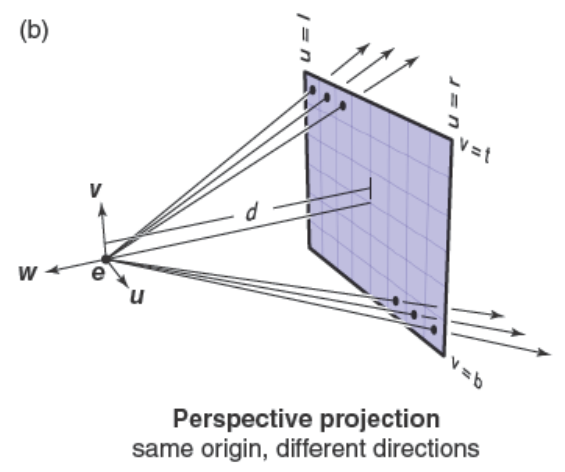

所有光线都有相同的起点viewpoint，方向分为垂直于平面的方向和在平面上的方向。

起点这时不位于平面上，而是距离平面d的距离，这个距离叫做image plane distance 或者 focal length。

这时光线的定义为：

同样，平面方向可以跟$-w$方向分离。

## 4.4 Ray-Object Intersection

通过光线的表示方程和几何表面的隐式方程，就可以找到交点：

找到$t>0$且最小的交点，就是离观察位置最近的交点。

### 4.4.1 Ray-Sphere Intersection

球面方程是：

可以将光线方程代入：

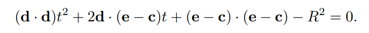

那么就可以得到关于$t$的一元二次方程：

通过判断解的存在性和唯一性就能判断光线与球体之间的相交关系。

### 4.4.2 Ray-Triangle Intersection

可以利用参数化的平面判断光线是否与之相交：

由于处于3D空间，所以可以分成3个维度分别考虑，3个未知数对应3个方程，且都是线性方程（参数化平面的函数都是线性的），因此可以求出解，再利用解判断是否位于三角形内部。

还有一种更直接的方法，就是利用重心坐标：

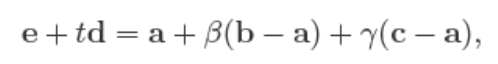

> we know the intersection is inside the triangle if and only if $\beta>0, \gamma>0,\beta+\gamma<1$.Otherwise, the ray has hit the plane outside the triangle, so it misses the triangle. If there is no solutions, either the triangle is degenerate or the ray is parallel to the plane containing the triangle.

为了求解$t,\beta,\gamma$，同样可以利用3个维度的信息：

可以写成矩阵形式：

利用克莱姆法则得到解：

光线与三角形相交的算法流程可以写做：

### 4.4.3 Ray intersection in software

可以先为所有几何表面建立一个基类Surface，并创建出三角形，球体等子类。

光线追踪程序可以建立一个对Surface引用，后续想要加入什么物体，可以将其建立为Surface的子类。

Surface类中需要包含与光线相交的方法：

HitRecord类：

如果该surface与Ray r未相交，反映出来就是$t=\infty$。

### 4.4.4 Interesting a Group of Objects

当要计算光线与一整个场景的相交情况时，可以将场景中的所有物体看作一个Group，并计算光线与Group中每一个物体的相交情况，得到最小的t作为最终的结果：

注意$t_1=t$，这会让interval的范围越来越小，所以我们最终找到的就是最小的t。

## 4.5 Shading

当知道每个像素点所对应3D空间中物体表面的位置，我们就可以开始考虑着色模型，对像素点进行上色。

不同的着色模型会带来不同的渲染效果。

目前介绍较为简单的着色模型。

### 4.5.1 Light Sources

在场景中有各式各样的光源，如：

点光源(point light)，方向光源(directional light)，环境光源(ambient light)。

在更高级的系统中，还有区域光源(area light)，环境贴图(environment light，天空盒)

在我们进行着色计算前，我们需要知道下面四种信息：

- shading point X
- surface normal n
- the light direction l
- the viewing direction v (v = -d/||d||)

如果场景中有多个光源，对于每一个shading point，对于简单的ray-tracer来说，只需要分别计算每一个光源对shader point的贡献，并将结果相加作为最终的pixel color。

### 4.5.2 Shading in software

光线追踪程序通常需要表述光照和材质的对象类。

光照类Light，需要表达完整的光照信息

材质类Material，需要表达Surface上的材质信息

对于着色，通常的做法是Light类负责总体照明计算，Material类负责对应的BRDF值

每个Surface需要保存一个其材质Material的引用，那么一个点光源照明计算就会像：

$E$就是到达$x$的光照强度，$k$就是BRDF值

对于环境光，同样可以将其BRDF作为Material类中的一个属性$k_a$：

环境光的原始亮度$I_a$是constant的，但是不同材质可以对其有不同的$k_a$，从而表现出不同的颜色和亮度。

对于整个场景的着色计算，就可以通过分别计算不同光源的着色：

通过这个方式，就可以把材质和光照的计算分开，方便后续各自加入新的材质和新的光照（Surface切换对Material的引用就可以实现不同的材质）。

到目前为止，只考虑了物体和光源之间的着色，还未考虑物体与物体之间的着色（阴影，倒影）。

### 4.5.3 Shadows

现在要对shade point是否被遮挡进行判断

在3D空间里的shade point上，如果以shade point为起点，从该点朝向光源的方向为方向，能够看到光源的话，就代表该shade point没有被shadowed，如果有物体遮挡，看不到光源，说明该物体被遮挡住了。

如上图，$x+tl$被遮挡，但是$x'+tl'$没有。

判断是否被遮挡的逻辑应该位于Light类的illuminate函数里，因为对于找到的某一个shade point，针对不同的光源要做分别的遮挡判断

t的范围是$(\epsilon,r)$，其中$\epsilon$是一个极小的数，$r$是shade point到光源的单位向量。$t$的左界不为0的原因是，如果$t$为0，那光线必然会相交于x点（因为x就是它的起点，且x就位于几何表面上），这样就导致无论如何t=0，这是这段逻辑不希望看到的。

上述算法逻辑原书出现了错误，截图已进行了修正。当shadow ray在$(\epsilon, r)$里没有跟任何物体发生hit，说明该点该光源之间并没有被阻隔，此时$t=\infty$，进行正常的着色计算；如果$t<\infty$，说明中间发生了物体的阻隔，该点处于该光源的shadow area里，此时着色为0。

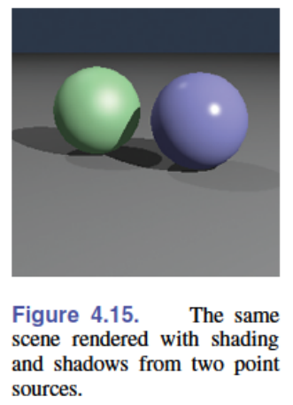

### 4.5.4 Mirror Reflection

对于理想的镜面反射：

其中反射方向$r$的计算公式是：

shade point除了会接受来自光源的影响，还会接受$r$方向来的光的影响（二次或者多次光照），所以在shade-ray函数里，当每个shade-point计算完所有光源与它的作用后，还要加上以shade-point为起点，r为方向来的光：

$\epsilon$的作用与上述一致。在实际世界中，反射会造成一定的损失，最终所看到的反射的内容不等价于直接从r方向，shade-point处放置摄像机所看到的内容。这种损失的强度因不同的颜色而异，损失掉的是我们看不到的，没损失的是我们最终能看到的颜色。而$k_m$就定义了这种损失，它实际上是镜面本身的颜色（如果镜面会发光它所带的颜色）。

> the code will be more efficient if a reflection ray is generated only if $k_m$ is not zero.

可以看出，这种计算是递归的，有无法停止的可能（比如一条shade-ray会在室内不断反射，永远不会停止，因为总能击中墙壁）。为了避免这种情况发生，可以设置最大递归深度，或者设置"俄罗斯轮盘赌"策略。

将$k_m$直接设置为镜面的颜色是一种简化做法。实际上，这种损失会随着入射角$\theta$而改变，也与Material有关。关于更好的损失计算会在第14章讲解。

## 4.6 Frequently Asked Questions

1. Why is there no perspective matrix in ray tracing?

   The perspective matrix in a z-buffer exists so that we can turn the perspective projection into a parallel projection. **This is not needed in ray tracing**, because it is easy to do the perspective projection **implicitly by fanning the rays out from the eye**.
2. Can ray tracing be made interactive?

   For sufficiently small models and images, any modern PC is sufficiently powerful for ray tracing to be interactive. In practice, multiple CPUs with a shared frame buffer are required for a full-screen implementation. Computer power is increasing much faster than screen resolution, and it is just a matter of time before conventional PCs can ray trace complex scenes at screen resolution.
3. Is ray tracing useful in a hardware graphics program?

   Ray tracing is frequently used for picking. When the user clicks the mouse on a pixel in a 3D graphics program, the program needs to determine which object is visible within that pixel. Ray tracing is an ideal way to determine that.

# 5. Surface Shading

无论是ray-tracing还是rasterization，实时或者批处理，一个很重要的任务就是针对3D场景中不同物体的形状和物体间的关系对它们进行着色。

在物理世界中，大部分的光是反射的光，而光的反射属性很大程度受到反射表面几何的影响。

针对不同的应用场景，会采用不同的shading目标，从而带来不同的视觉效果和性能消耗。

用来计算shading的公式被称为shading model。针对上述不同的应用场景会有不同的shading model。但是所有的shading model都必须包含基础的物理光反射估计。在这个基础上可以加入/修改/删除更多的功能使得shading更适用于不同的目标和风格。

shading model可以独立于其他的rendering system，同一个shading model可以分别用在ray-tracing和rasterization上。本章会介绍点光源-不透明表面的简单shading model，更多内容在第14章。

## 5.1 Point-like light sources

在现实世界中，表面接收到的光线来自四面八方。但在模型照明中，最简单的情况就是光线来自一个单一的方向。

这是一个理想化的情况，但是对于发光面积远小于光线到达物体的距离的光源来说，这很有用。

把这种光源抽象成点光源，可以有很多好处，我们可以不用关心光源的体积和几何信息，只需要知道它的位置和光线的方向。

### 5.1.1 Point source illumination

正常的点光源一般是各向同性的，即往各个方向发出的光是一样的，有些聚光灯效果的点光源则不是这样。

对于一个点光源来说，需要知道它的位置和强度（有多少光穿过一个单位面积的表面）

对于一个各向同性的点光源，我们想要知道距离点光源一段距离的单位表面会接受到多少强度的光。

假设点光源的power总共为1 watt，并且被放置在一个单位长度球体的中心。因为各向同性，点光源所有的power都会被打到球体的内壁，并且均匀分布。那么球体上单位面积接受到的power为：

$$
irradiance = \frac{P}{4\pi r^2} = \frac{P}{4\pi}
$$

随着$r$不断改变，$irradiance$也会不断变化，且与$r^2$成反比，那么任意距离的$irradiance$为：

$$
irradiance-E = \frac{P}{4\pi}\frac{1}{r^2} = \frac{I}{r^2}
$$

$I = P/(4\pi)$是光源的intensity，是光源的一种固有属性。

对于一个物体表面所接收到的irradiance，还有一个很重要的因素——(表面法向量和光线方向的)夹角

假设平面离光源很远，所有光线都是平行光，当表面倾斜一定角度，所接收到的power也会降低：

这种定量关系由平面法向量和光线方向之间的$cos$决定，这个被叫做Lambert's cosine law。

所以最终的irradiance可以表示为：

$$
irradiance-E = I\frac{cos\theta}{r^2}
$$

如果$\bold n$和$\bold l$都是单位向量，且起点都位于平面，那么：

$$
cos\theta = \bold n \cdot \bold l
$$

### 5.1.2 Directional illumination

> A directional source is a limiting case of a very bright, far-away point source.

方向平行光没有各向同性，在它所照射的方向上，面积始终恒定（不像点光源根据距离不断扩散的球体），所以power始终恒定，是一个常数H：

$$
irradiance-E = Hcos\theta
$$

## 5.2 Basic reflection models

知道如何计算几何表面的irradiance，我们就可以来考虑反射的情况：

### 5.2.1 Lambertian reflection

最简单的情况是不管平面接收到了多少从不同方向来的光，都会均匀地把光反射到各个方向。漫反射：

$$
L_r = kE
$$

它的颜色与视图无关，被一个反射系数$R$描述。因为会往半球上的任意方向均匀反射，并且根据lambert's cos law：

$$
\int_{half-unitsphere}cos\theta = \pi
$$

所以最终反射出去的颜色是：

$$
L_r = \frac{R}{\pi}E
$$

可以这么理解，E是接收到的光的能量，R是反射率，或者吸收率，代表真正会被反射的光的能量，而$\pi$代表能量会被均匀地反射出去。

R是RGB三通道，所以计算是基于RGB向量计算的。

漫反射可以描述一些没有高光，表面粗糙的物体。

### 5.2.2 Specular reflection

对于一些表面有高光的物体，当我们移动我们的观察角度，高光的情况也会有所变化，所以它是view-dependent的，区别于漫反射的view-independent。

最简单的情况对应于表面完全光滑的物体，这种情况下反射光的方向是固定的。但是现实中没有这种完全光滑的物体，所以反射光会有一定的区域范围，这种叫做glossy reflection。

最经典的光照模型叫Blinn-Phong model

由于specular reflection是view-dependent的，所以计算与v，n，l有关

Blinn-Phong考虑的是v和l的half vector，h与法向量n的重合情况，越重合，从观察者视角看到的光越亮。

half-vector h的计算：

$$
h = \frac{l+v}{||l+v||}
$$

所以h是单位向量。

所以反射模型可以表示为：

$$
(n\cdot h)^p
$$

其中$p>1$表示视野从重合到不重合时光线power衰减的速度，$p$越大，高光越集中：

将specular reflection加入lambert reflection中：

max(0,)的操作是为了防止出现负数。$k_s$决定镜面反射率，或者吸收率，同样分为RGB三个通道。

括号里的公式包括了观察v，法向量n，光线l，这其实就是BRDF：

$$
BRDF(l,v,n) = \frac{R}{\pi}+k_smax(0,n\cdot h)^p
$$

> The shading calculation then boils down to computing the irradiance(**describing how much light is available to reflect**), and the BRDF(**describing how the surface reflects it**), and then multiplying them.

### 5.2.3 Calculating shading

计算shading，需要：

- The shading point x, a 3D point on a surface
- The surface normal n perpendicular to the surface at x
- The light source position p for a point light or its direction l for a directional light
- The light source intensity I for a point light or its normal irradiance H for a directional light (these are RGB colors)

对于点光源，需要计算：

对于两种类型的光源，都需要计算cos：

$$
cos\theta = n \cdot l
$$

最终计算出的irradiance为：

当知道irradiance后，就需要知道BRDF，而计算BRDF需要：

- The light direction l, a unit vector pointing from x toward the light (already computed as part of the irradiance calculation)
- The viewing direction v, a unit vector pointing from x toward the viewer
- The parameters describing the properties of the surface material. For this chapter’s model, this includes R, ks, and p.

光追和光栅化得到上述三种信息的方式可能有所不同，但是最终计算shading的过程是相同的。

**$\bold v,\bold l,\bold n$必须都是单位向量**

## 5.3 Ambient illumination

点光源是一种局部的光源（从某点发出光线），但是另外一种光源是全局的，比如天空或者到处反射光线的室内。这种光源可以带来真实的效果，但往往计算量巨大，而我们往往需要的是这类光源的一种估计。所以我们可以把这种光源简化为在任何方向任何位置都恒定的光

这代表它是一种常量

这种常量被material-related ambient reflection系数$k_a$和light-related ambient intensity $I_a$的乘积定义：

$$
L_r = k_aI_a
$$

环境光是一种技巧，因为我们要的只是估计和近似。

一些系统把环境光当成光源类型的一种，另一些系统把环境光当成场景的一种属性。对于后者，环境光不是显式的，且一个场景里只能有一个环境光。

## 5.4 Frequently Asked Questions

1. Phong shading seems like an enormous hack. Is that true?

   Yes. It is not a very good model if you are trying to match measurements of real surfaces. **However, it is simple and has proven to produce shading that is very useful in practice.** Applications that are looking for realistic shading are moving away from Phong shading to more complex but much more accurate models based on **microfacet theory** (Walter, Marschner, Li, & Torrance, 2007). But realism also absolutely requires going beyond point-like light sources. All this is discussed in Chapter 14.
2. I hate calling pow(). Is there a way to avoid it when doing Phong lighting?

   A simple way is to only have exponents that are themselves **a power of two, i.e., 2, 4, 8, 16, . . . .** In practice, this is not a problematic restriction for most applications. **Many systems designed for fast graphics calculations** have library functions for pow() that **are much faster and slightly less accurate** than the ones found in standard math libraries

# 6. Linear Algebra

简单的线性代数回顾

## 6.1 Determinants

行列式的几何意义：

对于2D空间，$|ab|$代表以$a,b$为边围成的平行四边形的面积。这个面积是有方向的，满足右手系为正，反之为负。

旋转的方向由第一个向量按旋转最小角度的方向旋转到第二个向量。

3D空间的$|abc|$则代表以$a,b,c$为边围成的平行六面体的体积，同样带方向。

所以行列式满足下列性质：

行列式的笛卡尔正交坐标表示为：

可以发现随着维数上升，计算量急剧增加。

行列式有时候经常用来计算线性方程，如：

从上述性质2可以看出：

根据性质1可以得到：

这就是二维情况下的克莱姆法则，可以将上述线性方程向量化来进行对比：

$$
\left[\begin{matrix}c_1\\c_2\end{matrix}\right] = \left[\begin{matrix}a_1&b_1\\a_2&b_2\end{matrix}\right]\left[\begin{matrix}a_c\\b_c\end{matrix}\right]
$$

## 6.2 Matrices

矩阵是一组满足某种算术运算的数。

本节讨论矩阵算法和方阵的行列式。

### 6.2.1 Matrix Arithmetic

矩阵乘常数，矩阵加法，矩阵乘法

矩阵乘法不满足交换律和消去律，但满足以下性质：

### 6.2.2 Operations on Matrices

定义了矩阵的幺元——单位矩阵

矩阵的逆，矩阵的转置

满足以下一些性质：

### 6.2.3 Vector Operations in Matrix Form

在图形学种，利用方阵来表示一种变换：

利用列向量进行右乘是当今的标准。

点积也可以看成下面的形式：

还有一种向量乘法为外积，即column vector x row vector：

产生的矩阵中包含了两个向量分量间任意组合的乘积。

可以把矩阵看出是一组向量（行向量/列向量），所以矩阵的乘法可以拆分为向量的乘法：

可以把这种形式想象为封装，矩阵与矩阵的乘法也可以看成行向量组和列向量组之间的点积，或者看成列向量组和行向量组之间的外积。

### 6.2.4 Special Types of Matrices

单位阵就是一种对角阵（diagonal）。

> The diagonal consists of those elements whose column index equals the row index counting from the upper left.

单位阵同时也是对称阵（symmetric）。

单位阵用时也是正交阵（orthogonal）。任何正交阵的行列式都是1或者-1。同时正交阵的转置就是正交阵的逆（用外积去证明）。

orthogonal要求向量组中的每个向量是unit-vector，所以：

不是orthogonal的。

## 6.3 Computing with Matrices and Determinants

行列式的组合就是对应向量的排列：

同时行列式的转置不影响行列式的值：

因为$(a,b),(A,B)$和$(a,A),(b,B)$构成了同样面积的平行四边形。

同时理解面积、体积的几何概念可以迅速理解很多公式：

这是一个平面穿过$(x_0,y_0,z_0),(x_1,y_1,z_1),(x_2,y_2,z_2)$的表达，可以通过几何的概念知道$(x,y,z)$必须上述三个向量共面，等式才会成立

对于行列式的计算可以采用Laplace's expansion简化操作，其中的符号规律是：

如果一个行列式值为0，说明构成这个行列式的向量间存在线性依赖。

### 6.3.1 Computing Inverses

A的逆可以用以下方法求出：

其中后面的矩阵是伴随矩阵，是对应位置的余子式构成的矩阵转置得到的。

原因在于：

如果行列式中有相同的行或者列，则行列式的值为0

所以$AA^{-1} = |A|I$

这种计算方式其实非常慢，不利于大矩阵逆的运算，但在图形学中，大部分矩阵都是小矩阵。

### 6.3.2 Linear System

在图形学中，我们经常会遇到几个方程解几个未知数的情况，如三个未知数：

这可以被写成向量的形式：

即$Ax=b$的形式，其中A是一个包含已知数的方阵，x则是只包含未知数的列向量，而b是只包含已知数的列向量

在图形学中大部分矩阵的维度小于4，适用于Cramer's rule：

这种形式分为两部分，分母保持不变均为$|A|$；分子针对未知数的不同，会将不同列替换成$b$后再计算行列式

需要注意的是，如果$|A|=0$，则无解。另一种说法就是如果A是平凡的，则该线性方程组不存在解。

## 6.4 Eigenvalues and Matrix Diagonalization

方阵有对应的特征值和特征向量

特征向量是非零的，并且将方阵视作某种线性变换，对特征向量进行变换时，特征向量不会改变方向，只会改变相应的大小（长度）：

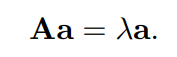

改变的幅度$\lambda$就是特征向量对应的特征值。

如何对方阵求解出它的特征值和特征向量：

一个非零的向量$a$经过某种线性变换变成了零向量，$(A-\lambda I)$一定是singular的，即它的行列式必须为0

解出$\lambda$值后将不同的值代入方程中得到对应的特征向量。

对于实对称矩阵有一些美好的性质：

- 实对称矩阵的特征值是实数
- 如果特征值不同，则其对应的特征向量之间是正交的

所以实对称矩阵可以被写成下述形式：

其中$Q$是正交阵，$D$是对角阵。这也叫做实对称阵的特征值分解。

### 6.4.1 Singular Value Decomposition(SVD)

实对称矩阵的特征值分解具有美妙的性质，但是大部分的矩阵并不是对称的，甚至不是方阵

对于这类矩阵的分解就没有那么直观和美妙，所采用的是特征值分解的一种泛化方法，SVD奇异值分解：

其中$U,V$是两个有可能不同的正交矩阵，其对应的列被称为矩阵A的左奇异向量和右奇异向量。S是对角阵，其对角线上的值被称为A的奇异值。当A是实对称的，并且所有特征值都非负，SVD和正常的特征值分解就是一样的。

当然，SVD和特征值分解之间也存在一定的联系，这帮助了SVD的计算（工业界并不这么做）：

正交阵的逆等于其转置，对角阵的转置等于自身，我们就得到的这样的结果。

可以发现无论A是否对称，M都是对称的，并且被特征分解为了上述的形式，所以我们可以发现，A的奇异值就等于$AA^T$的特征值的平方根，A的左奇异向量就等于$AA^T$的特征向量。

A的右奇异向量可以直接代数求解（因为A，A的奇异值对角阵，A的左奇异向量都已经知道），也可以通过对$A^TA$重复上述的过程得到。

## 6.5 Frequently Asked Questions

1. Why is matrix multiplication defined the way it is rather than just element by element?

   Element by element multiplication is a perfectly good way to define matrix multiplication, and indeed, it has nice properties. However, in practice it is not very useful. Ultimately, most matrices are used to transform column vectors; e.g., in 3D you might have

   $$
   \bold b = M\bold a
   $$

   where $a$ and $b$ are vectors and $M$ is a 3×3 matrix. To allow geometric operations such as rotation, combinations of all three elements of a must go into each element of $b$. That requires us to go either row-by-row or column-by-column through $M$. That choice is made based on composition of matrices having the desired property,

   $$
   M_2(M_1a) = (M_2M_1)a
   $$

   which allows us to use one composite matrix $C = M_2M_1$ to transform our vector. This is valuable when many vectors will be transformed by the same composite matrix. So, in summary, the somewhat weird rule for matrix multiplication is engineered to have these desired properties.
2. Sometimes I hear that eigenvalues and singular values are the same thing and sometimes that one is the square of the other. Which is right?

   If a real matrix $A$ is symmetric, and its eigenvalues are nonnegative, then its eigenvalues and singular values are the same. If $A$ is not symmetric, the matrix $M = AA^T$ is symmetric and has nonnegative real eignenvalues. The singular values of $A$ and $A^T$ are the same and are the square roots of the singular/eigenvalues of $M$. Thus, when the square root statement is made, it is because two different matrices (with a very particular relationship) are being talked about: $M = AA^T$.

# 7. Transformation Matrices

The machinery of linear algebra can be used to express many of the operations required to arrange objects in a 3D scene, view them with cameras, and get them onto the screen.

## 7.1 2D Linear Transformations

可以像上述图片一样，利用一个矩阵乘法把一个2维向量转换为另一个2维向量，这种变换就叫做linear transformation.

### 7.1.1 Scaling

表示的是坐标轴方向缩放的比例。

### 7.1.2 Shearing

> A shear is something that pushed things sideaways, producing something like a deck of cards across which you push your hand; the bottom card stays put and cards move more the closer they are to the top of the deck.

一个矩阵经过剪切会得到平行四边形，而一个圆形经过剪切会得到一个椭圆。

剪切还可以被看作是单个坐标轴的旋转。如：

可以看成是垂直坐标轴顺时针旋转角度$\phi$。

可以看成是水平坐标轴逆时针旋转角度$\phi$。

### 7.1.3 Rotation

- 逆时针（counterclockwise）

  向量$a$想要逆时针旋转$\phi$角度到向量$b$。

  

  向量$a$的长度为$r=\sqrt{x_a^2+y_a^2}$，因此坐标可以表示为长度在坐标轴上的分解：

  $$
  x_a = rcos\alpha,\\
  y_a = rsin\alpha.
  $$

  向量$b$拥有相同的长度$r$，但是旋转的角度为$\alpha + \phi$，所以：

  $$
  x_b = rcos(\alpha+\phi) = rcos\alpha cos\phi - rsin\alpha sin\phi,\\
  y_b = rsin(\alpha+\phi) = rsin\alpha cos\phi + rcos\alpha sin\phi.
  $$

  将$x_a=rcos\alpha,y_a=rsin\alpha$代入，可以得到：

  $$
  x_b = x_a cos\phi - y_a sin\phi,\\
  y_b = y_a cos\phi + x_a sin\phi.
  $$

  从而得到从$a$到$b$的旋转矩阵：

  
- 顺时针（clockwise）

  顺时针旋转$\phi$角度相当于逆时针旋转$-\phi$角度，所以：

  $$
  rotate_{clockwise}(\phi) = \left[\begin{matrix}cos(-\phi)&-sin(-\phi)\\sin(-\phi)&cos(-\phi)\end{matrix}\right] = \left[\begin{matrix}cos(\phi)&sin(\phi)\\-sin(\phi)&cos(\phi)\end{matrix}\right]
  $$

无论从行还是列，可以看出向量长度为1，且两个向量（行向量组，列向量组）彼此正交，所以旋转矩阵是标准正交矩阵(orthonormal)。

### 7.1.4 Reflection

当两个都取反就相当于旋转$\pi$度。

### 7.1.5 Composition and Decomposition of Transformations

通过矩阵乘法的结合律，可以将不同的变换操作进行组合，并整合成一个综合变换的矩阵。

遵循right side first原则，即先对$v_1$做S变换，再对$Sv_1$做R变换，交换S和R的顺序显然不能得到相同的结果。

### 7.1.6 Decomposition of Transformations

有些时候，我们需要把一个复杂的变换转换为基本的几何操作的组合，从而让我们更好地理解这个变换在几何上干了什么。

- Symmetric Eigenvalue Decomposition

  任何实对称矩阵都可以对角化：

  

  其中R是正交单位矩阵（可以通过正交化得到），S是对角矩阵。从上述几何意义来看，R就是旋转矩阵，S就是缩放矩阵：

  

  $R$和$R^T$互为逆变换，即旋转一定角度后又旋转回来。上述的操作可以分步为：

  （1）将$v_1$和$v_2$（R里的特征向量）经过$R^T$的变换旋转到x-y坐标轴方向

  （2）在x-y轴上经过$S$的变换分别缩放$\lambda_1$和$\lambda_2$倍（$\lambda_1$和$\lambda_2$是特征值）

  （3）将x-y轴方向经过$R$的变换又旋转回$v_1$和$v_2$方向

  这其实告诉我们，对称矩阵实际上就是一种缩放操作，尽管可能是非均匀和非轴对齐的操作。

  > This tells us something about what it means to be a symmetric matrix：symmetric matrices are just scaling operations——albeit potentially nonuniform and non-axis-aligned ones.
  >

  我们同样可以根据我们需要的标准正交轴和缩放比例构造出我们要的实对称矩阵：

  

  我们想要以x-y轴逆时针旋转$\phi$度的标准坐标轴作为缩放的基准，$\lambda_1$和$\lambda_2$是缩放的比例。上述构造的矩阵一定是对称阵，因为它就是按照矩阵分解的方式逆向构造出来的。
- Singular Value Decomposition(SVD)

  针对非对称阵，SVD也给出了分解的方案：

  

  区别于上述的矩阵分解，SVD的不同之处就在于U和V是不同的旋转矩阵，即旋转和逆旋转操作并不是互逆的。

  

  同样可以把上述操作分步为：

  （1）将$v_1$和$v_2$（V里的特征向量）经过$V^T$的变换旋转到x-y坐标轴方向

  （2）在x-y轴上经过S的变换分别缩放$\sigma_1$和$\sigma_2$倍

  （3）将x-y轴方向经过$U$的变换旋转到了$\sigma_1u_1$和$\sigma_2u_2$方向

  SVD和矩阵分解的区别也造成了一个很重要的不同：在SVD中我们可以让所有的奇异值都是正的，因为如果有奇异值是负的，我们可以对其取相反数，同时反转某一个对应的奇异向量的方向，让其变换的效果与之前完全一样。

  所以SVD一般只有正的奇异值，然而同时也代表$U,V$不止代表旋转操作，同时也包含了反射操作。

  通过$|U|$和$|V|$，我们可以很方便地知道他们对应旋转还是反射（1就是旋转，-1就是反射），并且通过对奇异值取相反数的办法，可以将反射变换转化为旋转变换，从而保证几何变换顺序是rotation-scale-rotation的（这样便于我们的理解）。这样我们就把反射的操作放进了scale里，而让旋转单纯地负责旋转。（当然这时候奇异值就不一定全是正的了）

综上，任何2D变换矩阵都可以转化为旋转和缩放操作的组合。

- Paeth Decomposition Rotations

  将旋转分解为剪切操作的组合，如：

  

  这样的好处是有利于使用剪切的方式对光栅化后的图像进行旋转。

  > it introduces some jagginess, but will leave no holes.
  >

  

  从剪切的定义可以看出：

  

  如果对$sj$进行四舍五入，剪切操作对图像来说就相当于是对不同行不同程度的平移。对于已经光栅化后的图像来说，某一行像素在x-y轴上的平移是很好实现的。这样就不需要对原始图形进行旋转后再重新光栅化。

## 7.2 3D Linear Transformations

3D情形是对2D操作的扩展。比如缩放：

旋转相对于2D来说稍显复杂，因为有3个自由度的旋转选择，但是如果给定绕某个坐标系旋转：

可以看到rotate-y($\phi$)中$sin(\phi)$的符号与其他轴不同，这是由于右手准则造成的。

同样的，任何3D变换矩阵都可以通过SVD分解成rotation-scale-rotation的形式，并且对称3D矩阵也可以通过特征值分解的方式分解成rotation-scale-inverse-rotation的方式。3D旋转矩阵也可以分解成3D剪切矩阵的组合。

### 7.2.1 Arbitrary 3D Rotations

旋转矩阵都是正交矩阵，这意味着任何旋转矩阵的行向量组或者列向量组都可以构成当前线性空间的正交基。

如上述的行向量组$u,v,w$，因为$u,v,w$都是单位向量并且他们是正交的，所以他们满足：

所以如果对于向量$u$，$R_{uvw}$的作用就相当于把$u$旋转到$x$轴的方向上：

同样的，$R_{uvw}v=y$，$R_{uvw}w=z$，所以$R_{uvw}$的作用就是把正交基$uvw$旋转到对应的$xyz$正交基上。

因为$R_{uvw}^T=R_{uvw}^{-1}$，所以$R_{uvw}^{T}$的作用就是把正交基$xyz$旋转回$uvw$上：

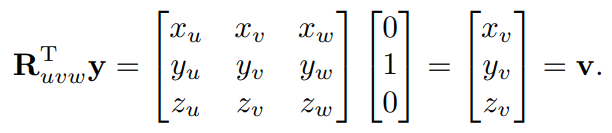

综上，把旋转矩阵看成不同的向量组可以得到不同的旋转效果：

（1）看成行向量组$[u,v,w]^T$，相当于把正交基$uvw$旋转到$xyz$

（2）看成列向量组$[u,v,w]$，相当于把正交基xyz旋转到$uvw$

至此，我们可以通过将某个正交基**归位**或者从基准上转移到某个正交基的思想，设计旋转矩阵。

如果我们希望**围绕任意向量a旋转**，就可以采用上面的思想。一个具体的想法是：

（1）将a旋转到某个坐标轴方向上

（2）绕这个坐标轴旋转（相对简单且有套路的旋转矩阵）

（3）从这个坐标轴旋转回a方向

其中（2）很简单，（1）（3）就必须利用上述的思想。将a旋转到某个坐标轴，就可以通过设计旋转矩阵的某一行就是a的坐标，另外两行必须是由a产生的一组正交基：

如上图，如果$a=w$，那么就相当于把$a$旋转到$z$方向，这时$u,v,a$是一组正交基。之后再在z轴上进行对应的旋转操作，再把整个场景旋转回来（第一个旋转矩阵的转置）。

给定一个对称旋转矩阵，如果我们想要知道这个旋转矩阵是**对应哪个轴的旋转**（不像之前对应什么角度）。我们可以将矩阵进行矩阵分解，找到特征值为1所对应的那个特征向量。该特征向量就是这个对称旋转矩阵围绕旋转的方向。因为：

$$
A = U^TSU
$$

矩阵分解类似上述所进行的围绕任意向量旋转的计算，不同点在于S是缩放，而不是旋转。所以，缩放系数为1的方向，就是在这次旋转中不发生任何改变的方向，也就是对应了旋转轴。

### 7.2.2 Transforming Normal Vectors

向量不仅可以表示位置，还可以表示方向，如光照方向，法线方向。

当对一个几何物体进行某种变换$M$后，对几何物体上的对应点的法线也经过变换$M$，所得到的结果不一定就是经过变换后物体对应点的法线：

如上述的剪切变换，对法线$n$进行同样的剪切变换，所得到的是$M_n$，而真正的法线应该为$N_n$。

为了找到能让法线变换正确的矩阵，我们假设$N$就是这个矩阵。

考虑变换前，法线应该与该点所在的切线平面垂直，所以：

$$
n^Tt=0
$$

而这个关系应该在变换后也成立，所以：

$$
(Nn)^T(Mt)=0
$$

同时可以对上述公式做如下变换：

$$
n^Tt = n^TIt=n^TM^{-1}Mt=(n^TM^{-1})(Mt)=0
$$

因为对应变换后的物体表面，某点的法线方向是唯一的，所以上述两式的左边部分必须相等（或者常数倍，但是这个常数可以被$N$消解）：

$$
(Nn)^T = n^TM^{-1},\\
Nn=(n^TM^{-1})^T=(M^{-1})^Tn,\\
N =(M^{-1})^T.
$$

至此，我们找到了能让法向量变换正确的矩阵$N$。这个$N$可能会改变变换后法向量的大小，但方向绝对是正确的。

同时我们也知道矩阵的逆等于伴随矩阵的转置除以行列式值，如果不关心大小的变化，行列式值可以忽略，所以：

可以直接展开：

## 7.3 Translation and Affine Transformations

到目前为止，我们知道任何变换矩阵可以表示成rotationg-scale-rotating的形式。但是这种形式并不能做到平移：让图形的所有点一起移动相同的方向和距离。而这正是linear transformation的缺陷。

要想做到平移，必须满足下面的式子：

有一种实现方式，就是在对point进行linear transformation后，使用一个与point相同shape的向量，负责平移的操作。但是这种实现在代码上并不简洁，因为如果采用这种实现，我们就无法做到矩阵变换的复合（破坏了变换A-变换B就是$BA$的优雅性质，而是要改成$B(Ax+a)+b$）。为了仍然保持这种优雅，我们需要一个技巧，让一个矩阵就能包含linear transformation和平移的功能：

这个向量的最后一列保持$(0,0,1)$。我们让点变为$(x,y,1)$，向量变为$(x,y,0)$，这样保证了矩阵可以乘以点或者向量，并且结果中点和向量的第三维度保持不变（点仍然是点，向量仍然是向量）：

而这个矩阵的操作就是linear transformation+平移（有顺序，先linear后平移）。这种变换就叫做affine transformation，而通过增加一维让这种affine transformation成立的trick就叫做homogeneous coordinates（齐次坐标）。这种trick让代码重新回归简洁，并且保证了复合矩阵变换的优雅性质。

同时，我们知道，向量无关于起点，所以平移应该对向量无效：

所以通过向量的最后一维置零，就可以让矩阵对向量的平移作用**失效**，同时得到的结果仍然是最后一维置零的向量。这进一步论证了位置和向量应该不同表示的合理性。这让原来的系统可以很自然的往homogeneous coodinates转换而不需要什么更改。

现在homogeneous coordinate的设计已经嵌入硬件，是绝对的主流。

对于2D的变换，完全可以由对应的3D变换并让z=1的方式来推导：

同样，3D的变换就是2D的简单推广：

需要注意的是，平移和线性变换是可以完全分离来看的：

因为矩阵的性质保证了它们互不打扰，所以我们只需在矩阵的对应位置就可以看出这个矩阵的几何操作。（比如把上述矩阵前三行前三列看作线性变换rotating-scale区，把前三行第四列看作平移translation区）

对于刚体运动，因为没有scale，所以线性变换区就是纯粹的rotate。

## 7.4 Inverses of Transformation Matrices

对于某种几何操作，求这种操作的逆操作是很简单的：

（1）对于scale，$(s_x,s_y,s_z)$就是$(\frac{1}{s_x},\frac{1}{s_y},\frac{1}{s_z})$

（2）对于rotate，$rotate(\phi)$就是$rotate(-\phi)$

（3）对于translation，$(t_x,t_y,t_z)$就是$(-t_x,-t_y,-t_z)$

（4）对于复合变换，$M_1M_2...M_n$就是$M_n^{-1}...M_2^{-1}M_1^{-1}$

基本矩阵非常容易求逆，比如旋转矩阵的逆就是它的转置。

SVD同样可以用来求一个任意矩阵的逆，因为SVD可以将其分解为基本矩阵的组合，而基本矩阵的逆都很好求：

## 7.5 Coordinate Transformations

变换矩阵可以有两种理解，一种是对点的变换，一种是对坐标的变换，但两种理解带来了相同的结果：

比如车行驶在城市道路，这种变换可以理解为车在向前移动，同时也可以理解为坐标的原点位于车上，而整个城市在向后运动。

运动是相对的，所以不管利用哪种方式理解，最终的结果都是一样的。但是这种思考往往会给整个场景带来多个坐标系，而如何准确地将一个点的坐标从某个坐标系表示转换为另一个坐标系的表示，就显得尤为重要。

一个坐标系的表示往往需要原点和对应的坐标基：

而在一个场景中，往往存在一个默认的坐标系，其中原点o和坐标基xyz是隐式表达的，这个坐标系叫做**世界坐标系**。

当然场景中也存在局部坐标系frame，其可以表达为：

在$(u_p,v_p)$中，$e$是隐式表达的；而在世界坐标系中，$e$需要显式存储。

可以通过下面的变换让点$p$从$(u_p,v_p)$转换到$(x_p,y_p)$：

**第1种理解方式**：因为对于$(u_p,v_p,1)$来说，其默认是世界坐标系表达的，而我们知道它是局部坐标系表达。所以我们需要将这个坐标送到在局部坐标系表达的而在世界坐标系中的真正位置（比如从图中的$(u_p,v_p)$送到真正的p的位置），而上述的矩阵就是这种"送"的操作。

**第2种理解方式**：坐标$(u_p,v_p)$是将uv坐标系经过变换到xy坐标系后得到的，所以如果我们想要得到$(x_p,y_p)$，我们就要把$(u_p,v_p)$经过逆变换得到。

**第3种理解方式**：我们可以把坐标表示理解为坐标基表示乘以该坐标基表示下的坐标的形式：

$$
坐标表示=坐标基表示\times该坐标基表示下的坐标
$$

因为世界坐标系是隐式表示的，所以直接表达出来的坐标都是世界坐标系的形式，因为：

$$
\left[\begin{matrix}x_p\\y_p\\1\end{matrix}\right] = \left[\begin{matrix}1&0&0\\0&1&0\\0&0&1\end{matrix}\right]\left[\begin{matrix}x_p\\y_p\\1\end{matrix}\right]
$$

总是成立的。（世界坐标的三个基就是$(1,0,0),(0,1,0),(0,0,1)$）

而其他非世界坐标系的表示，其坐标基表示就不是单位矩阵，而是自身的原点和坐标基向量信息。当然，原点和坐标基向量信息同样是由世界坐标系表示的，所以坐标基矩阵的获得就可以理解为将**世界坐标的坐标基转换到非世界坐标的坐标基的过程**：

比如上述这个矩阵的意思就是：

（1）将xy坐标轴旋转到uv坐标轴

（2）将世界坐标系原点$(0,0)$移动到$(x_e,y_e)$

得到坐标基后，$(u_p,v_p,1)$自然就是在该坐标基下的坐标表达。我们知道，p的位置是唯一的，不管我们用哪个坐标系的视角去看它：

$$
\left[\begin{matrix}1&0&0\\0&1&0\\0&0&1\end{matrix}\right]\left[\begin{matrix}x_p\\y_p\\1\end{matrix}\right]=\left[\begin{matrix}x_u&x_v&x_e\\y_u&y_v&y_e\\0&0&1\end{matrix}\right]\left[\begin{matrix}u_p\\v_p\\1\end{matrix}\right]
$$

可以将式子简化为：

这个叫做frame-to-canonical matrix，那么canonical-to-frame matrix就为：

通过第三种理解方式，这种形式也很容易理解。（把xy坐标轴看成是uv坐标轴）

三维的坐标系转换就是二维的简单推广：

## 7.6 Frequently Asked Questions

1. Can’t I just hardcode transforms rather than use the matrix formalisms?

   Yes, but in practice it is harder to derive, harder to debug, and not any more efficient. Also, all current graphics APIs use this matrix formalism so it must be understood even to use graphics libraries.
2. The bottom row of the matrix is always (0,0,0,1). Do I have to store it?

    You do not have to store it**unless you include perspective transforms** (Chapter 8).

# 8. Viewing

> The 3D to 2D mapping is called a viewing transformation, and it plays an important role in object-order rendering, in which we need to rapidly find the image-space location of each object in the scene.

像第四章ray tracing中是将射线从图像平面中延申出去到3D场景中，view transformation则是将3D场景中的点映射到2D图像平面上，是上述过程的逆过程。但是这种映射并不包含遮挡的处理。

## 8.1 Viewing Transformations

View Transformations的任务就是将3D空间中的**$(x,y,z)$坐标**转换为图像平面中的**像素坐标**。

这是一个复杂的任务，但是可以将其分解为几个相对简单的阶段：

- camera transformations(eye transformations)：这是一种刚体变换。只要摄像机与场景物体的相对位置不改变，我们从摄像机中看到的图像就是一样的。所以为了方便后续的处理，将摄像机移动到原点，并将摄像机的朝向面向$-z$的方向。场景中其他物体也跟随摄像机做相应的变换（相当于坐标系的变换）。这个变换只跟摄像机原始的位置和朝向有关。
- projection transformation：每个相机都有一个视野，包括平行投影相机和透视投影相机（平行投影相机视野是一个立方体，透视投影相机视野是一个棱台）。这次变换是将位于相机视野内的所有物体映射到$x \in (-1,1),y \in (-1,1),z \in (-1,1)$的立方体内。这个变换只跟投影类型有关。
- viewport transformation(window transformation)：这个变换将单位坐标映射到设备标准化的坐标。$[x \in (-1,1),y \in (-1,1)] \mapsto [x \in (0,w), y \in (0,h)]$。$w,h$是设备分辨率。

$world \; space\xrightarrow[]{①}camera \; space\xrightarrow[]{②}canonical \; view \; volume\xrightarrow[]{③}screen\; space$

### 8.1.1 The Viewport Transformation

视口变换是将经过上一步操作后的立方体$(-1,1)^3$变换到以图像像素为基准的长方体$(0,w)\times(0,h)\times(-1,1)$上，同时将坐标原点从中心移动至左下角。

> we project x=-1 to the left side of the screen, x=+1 to the right side of the screen, y=-1 to the bottom of the screen, and y=+1 to the top of the screen.

实际上像素并不是一个点，而是一小块单位正方形区域。一个有$(n_x,n_y)$像素的点实际包含的区域是$[-0.5,n_x-0.5]\times[-0.5,n_y-0.5]$。所以变换矩阵可以表达为：

由于view transformation并没有对z轴做变换，所以上述公式里并未出现z轴。但是在实际应用中，还是需要将z轴加上。这将在遮挡处理上起作用：

### 8.1.2 The Orthographic Projection Transformation

在进行这个变换之前，我们通常已经将摄像机朝向-z方向，头顶+y方向。这个时候我们能观察到的是任意的axis-aligned立方体，而这往往不利于处理。我们希望将其转换为统一的canonical view volume，这样才能方便后续viewport transformation的处理。

对于任意的立方体，可以表达为$[l,r]\times [b,t]\times [f,n]$。由于我们通常习惯x轴朝向右而y轴朝向上，根据右手坐标系，我们摄像机的朝向很自然是-z方向，所以$f,n$都是负的，且$n>f$，代表$n$离我们更近。

对于左手坐标系，摄像机的朝向就是+z方向。

正交投影变换的目的就是要将这个任意立方体变换为中心点在原点的$[-1,1]^3$的正方体：

可以验证，$(\frac{r+l}{2},\frac{t+b}{2},\frac{n+f}{2})$经过上述变换后得到$(0,0,0)$。

那么将viewport transformation和Orthographic Projection Transformation结合起来，我们就可以得到任意立方体视野变换到屏幕像素坐标的变换：

z轴坐标范围约束在$[-1,1]$，这将在z-buffer计算中很有用。

目前对于一个线段集合，可以将其变换描述为下述伪代码：

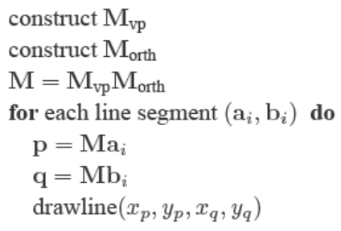

### 8.1.3 The Camera Transformation

在进行正交投影变换的上一步，摄像机位于空间中的任意一个位置，朝向任意一个方向。我们需要通过一些指标表征摄像机当前的状态：

1. the eye position e,
2. the gaze direction g,
3. the view-up vector t.

t的目的在于固定住摄像机：当我们处于固定位置，朝向固定方向时，我们仍可以“歪头”，使得摄像机状态发生变化：

> The view-up vector is any vector in the plane that both bisects the viewer's head into right and left halves and points "to the sky" for a person standing on the ground.

这些表征中只有两个vector，不能构建出相机自己的坐标系，所以我们需要构建出相机的uvw：

w取反的目的仍然是因为我们需要朝向-z方向。

这里的u并没有画好，因为它要跟gtw平面垂直。

知道摄像机的uvw坐标系后，我们还需要将world space中的场景从o-xyz坐标系转换到e-uvw坐标系中，需要用到的就是7.5中的canonical-to-basis转换：

同样对于上述的线段集合，想得到场景中任意摄像机的视野到屏幕坐标的变换：

这几乎不需要更改代码，只需要添加进$M_{cam}$，这体现了用矩阵作为变换的优越性。

## 8.2 Projective Transformations

与平行投影不同，从观察者的投影中可以看到，物体被映射到图像平面上的大小与该物体离图像平面的距离反比有关：同样大小的物体离图像平面越远，被映射到图像平面上的尺寸越小。

$$
y_s = \frac{d}{z}y,\\
x_s = \frac{d}{z}x.
$$
这种变换并不是线性的，同时由于z位于分母的位置，用affine transfomation也无法做到，那么我们需要考虑通过齐次坐标的推广机制去解决这个问题。

对于3D中的一个点，它的齐次坐标的第四维总是1，通过仿射变换矩阵的第四行$[0,0,0,1]$总能保证点的最后一维是1。然而在齐次坐标的推广中，第四维的数值并不局限于1，而是任意值$w$，$[x,y,z,w]^T$就代表了3D中的一个点$(x/w,y/w,z/w)$。这种推广显然在$w=1$时成立。

在这种推广情形下，变换矩阵的第四行就可以不再是$[0,0,0,1]$，$w$的值其实就能表示$x,y,z$的一种仿射表达。

因为我们知道线性变换和仿射变换的表达是：

$$
x\prime = ax+by+cz,\\
x\prime = ax+by+cz+d.
$$

对应到（齐次坐标）矩阵变换里的矩阵乘法就是：

$$
x\prime = \left[\begin{matrix}a&b&c&0\end{matrix}\right]\left[\begin{matrix}x\\y\\z\\1\end{matrix}\right],\\
x\prime = \left[\begin{matrix}a&b&c&d\end{matrix}\right]\left[\begin{matrix}x\\y\\z\\1\end{matrix}\right],\\
$$

而原始的$w$始终为1，且变换矩阵第四行始终为$[0,0,0,1]$，那么：

$$
w\prime = \left[\begin{matrix}0&0&0&1\end{matrix}\right]\left[\begin{matrix}x\\y\\z\\1\end{matrix}\right]=1
$$

在推广形式中，将$[0,0,0,1]$改变为$[e,f,g,h]$的形式，那么：

$$
w\prime = \left[\begin{matrix}e&f&g&h\end{matrix}\right]\left[\begin{matrix}x\\y\\z\\1\end{matrix}\right] = ex+fy+gz+h.
$$

所以经过变换后的$w\prime$就是$xyz$的一种仿射表达。

那么通过齐次坐标的推广和$[x,y,z,w] = (x/w,y/w,z/w)$，我们的变换矩阵就能表达下述的形式：

$$
\left[\begin{matrix}\frac{a_1x+b_1y+c_1z+d_1}{ex+fy+gz+h}\\\frac{a_2x+b_2y+c_2z+d_2}{ex+fy+gz+h}\\\frac{a_3x+b_3y+c_3z+d_3}{ex+fy+gz+h}\\1\end{matrix}\right] = \left[\begin{matrix}x\prime/w\prime\\y\prime/w\prime\\z\prime/w\prime\\1\end{matrix}\right] = \left[\begin{matrix}x\prime\\y\prime\\z\prime\\w\prime\end{matrix}\right]= \left[\begin{matrix}a_1&b_1&c_1&d_1\\a_2&b_2&c_2&d_2\\a_3&b_3&c_3&d_3\\e&f&g&h\end{matrix}\right]\left[\begin{matrix}x\\y\\z\\1\end{matrix}\right].
$$

this could be called a "linear rational function"。而这种形式正是透视投影所需要的。

同时从推广的齐次坐标中，我们可以知道，$k[x,y,z,1]$这条线代表的是3D空间中的同一个点$(x,y,z)$。

## 8.3 Perspective Projection

由上述的相似三角形可以得知，$x\prime = \frac{nx}{z}, y\prime = \frac{ny}{z}$，由推广的齐次坐标变换矩阵的性质就可以得到：

$$
P = \left[\begin{matrix}n&0&0&0\\0&n&0&0\\?&?&?&?\\0&0&1&0\end{matrix}\right]
$$

P的作用是将原本的透视投影变换为正交投影的效果。

这种效果可以想象为一个棱台向内挤压为立方体。其中$(z=n)$平面上的点位置没有发生改变。

上述P矩阵的第一行和第二行代表了$x\prime = nx, y\prime = ny$，第四行代表了$w\prime = z$。那么一二四行就表示出了$x\prime = \frac{nx}{z}, y\prime = \frac{ny}{z}$的意思。那么第三行应该是什么呢？是$(0,0,1,0)$吗（即代表z不发生改变）？

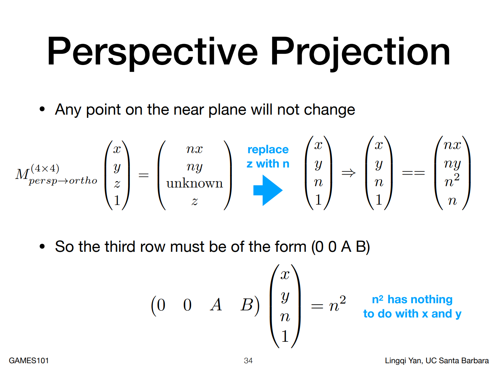

在这种挤压的变换下，棱台中任意一个位置的z值都不变是不可能的，但是我们可以限定这种变换对于近平面和远平面上的点的z值不会发生改变，并且位于棱台内的点经过这种挤压变换后仍然位于变换后的立方体内。这样可以保证这种挤压不会导致原本位于视野范围内的物体被挤出视野范围从而造成clipping。上述是games101中的推导

从而我们能够得到最终的P：

从上述式子中可以发现z值变化的规律：

这里假定$n=-5,f=-100$，x是棱台视野中z的值，y是变换后的z的值。从中可以发现，在近平面和远平面，z值经过变换后并没有发生变化（$(-100,100),(-5,-5)$），但是在中间区域，变换后的z值都变小了。由于相机朝向的是-z方向，所以可以理解为，中间区域的所有点经过变换后都离我们**"远去"**。但同时我们也看到，变换后所有点都没有离开近平面和远平面的z值范围，也就是没有任何一个点被挤压出视野。

有时候我们想从屏幕坐标空间转变回原始坐标空间，我们就需要知道P的逆：

上面第一个$P^{-1}$是严格意义上的P逆，但是第二个$P^{-1}$所能起到的效果与第一个是一样的。因为对于作用于扩展齐次坐标系的变换矩阵，乘以任何常数值都不会影响最终的效果（因为无论如何最后$w$都要归一化）。

所以对于透视投影，我们先把透视棱台视野变换为了立方体视野，再用上面所说的正交投影去解决问题：

$$
M_{persp} = M_{ortho}M_{persp\rightarrow ortho}&=& \left[\begin{matrix}\frac{2}{r-l}&0&0&-\frac{r+l}{r-l}\\0&\frac{2}{t-b}&0&-\frac{t+b}{t-b}\\0&0&\frac{2}{n-f}&-\frac{n+f}{n-f}\\0&0&0&1\end{matrix}\right]\left[\begin{matrix}n&0&0&0\\0&n&0&0\\0&0&n+f&-nf\\0&0&1&0\end{matrix}\right] \\&=& \left[\begin{matrix}\frac{2n}{r-l}&0&\frac{l+r}{l-r}&0\\0&\frac{2n}{t-b}&\frac{b+t}{b-t}&0\\0&0&\frac{f+n}{n-f}&\frac{2fn}{f-n}\\0&0&1&0\end{matrix}\right].
$$

在OpenGL的实现中，n和f都是以绝对值的形式存在，所以：

相当于对原来的矩阵乘了-1。

## 8.4 Some Properties of the Perspective Transform

> An important property of the perspective transform is that it takes lines to lines and planes to planes.

考虑一个线段：

当有一个4*4的矩阵M对它进行变换（齐次坐标）:

只有除以它的$w$分量值，才是真正表示3D中的点坐标：

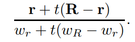

如果上述式子可以被写做：

的形式，那么就代表这是3D空间中的一条线段。可以直接找到这样的$f(t)$：

透视变换不会改变线段上不同点的相对顺序。

因为线段仍被映射到线段，那么对于一个三角形来说，三条边仍被映射为互相连接的三条边。所以透视变换会将三角形映射为三角形，平面映射为平面。

## 8.5 Field-of-View

对于近平面，我们可以任意指定左右上下边界lrbt和n$(n<0)$。但是为了方便，我们通常想要让摄影机指向图像的中央，即：

如果我们还添加了像素为正方形的约束，即图像中没有形状失真，则r与t的比率必须与水平像素数与垂直像素数的比率相同：

一旦指定了$n_x$和$n_y$，我们便只有一个自由度去设置近平面的大小（r可以表示t，或者t可以表示r，所以只需要知道r或者t，就可以知道全部的信息）。这通常利用field-of-view去设置：

上述便是vertical field-of-view，区别于“from the angle between left and right sides or from the angle between diagonal corners”。从图中可以知道：

如果$n$和$\theta$被指定，那么我们就可以确定t（或者r），从而得到近平面的大小。在一些系统中，n是被硬编码的，所以如果我们给出了$\theta$的值，我们就得到了近平面的大小。

## 8.6 Frequently Asked Questions

1. Is orthographic projection ever useful in practice?

   It is useful in applications where relative length judgements are important. It can also yield simplifications where perspective would be too expensive as occurs in some medical visualization applications.
2. The tessellated spheres I draw in perspective look like ovals. Is this a bug?

   No. It is correct behavior. If you place your eye in the same relative position to the screen as the virtual viewer has with respect to the viewport, then these ovals will look like circles because they themselves are viewed at an angle.
3. Does the perspective matrix take negative z values to positive z values with a reversed ordering? Doesn’t that cause trouble?

   Yes. The equation for transformed z is

   $$
   z\prime = n+f-\frac{fn}{z}.
   $$

   So **z = + is transformed to z = −∞ and z = − is transformed to z = ∞**.So any line segments that span z = 0 will be “torn” although all points will be projected to an appropriate screen location. This tearing is not relevant when all objects are contained in the viewing volume. This is usually assured by clipping to the view volume. However, clipping itself is made more complicated by the tearing phenomenon as is discussed in Chapter 9.
4. The perspective matrix changes the value of the homogeneous coordinate. Doesn’t that make the move and scale transformations no longer work properly?

   Applying a translation to a homogeneous point, we have：

   

   Similar effects are true for other transforms (see Exercise 5).

# 9. The Graphics Pipeline

考虑object-order的渲染方式（rasterization），这对应着一系列操作，开始于objects，结束于更新图像上的像素。这些操作就被叫做Graphics Pipeline。

Object-order rendering在速度和效率上有着很大的优势。相比于反复检索被着色像素需要的场景物体，对场景物体中的每一位只需遍历一遍的方法显然快很多。

针对图形管线有两种类型，一种是用来做交互式渲染的api（OpenGL、Direct3D）的hardware pipelines，一种是用来做电影制作的api（RenderMan）的software pipelines。前者要求的是速度快，能够为游戏或者可视化提供快速的交互；后者要求的是图像质量高，要有华丽的视觉效果，还要支持大范围的场景，但是这需要大量的渲染时间。虽然两种管线的目的不同，但是有相当多的部分是相似甚至相同的。本章将关注这些共同的部分。

object-order rendering可以被分解为：（1）栅格化（2）栅格化前的坐标变换（3）栅格化后的像素操作。

对于（2），主要应用的是矩阵变换，前面几章已经做过介绍。对于（3），最常见的就是关于遮挡的z-Buffer。其他许多操作也可以用在不同阶段，从而实现各种各样的渲染效果（pipeline是一样的）。

图形管道可以分为上述四个阶段：（1）场景物体以顶点（vertex）的形式传入VERTEX PROCESSING，然后使用这些顶点的图元被传入RASTERIZATION。（2）RASTERIZATION将这些图元分为不同的片段（fragment，像素），一个片段对应一个图元包括的像素，片段将被送到FRAGMENT PROCESSING进行处理。（3）在FRAGMENT PROCESSING中，每个片段会被并行处理，并将处理结果送入BLENDING。（4）在BLENDING中，每个片段的处理结果将被组合。

本章将从栅格化开始，然后通过举例说明几何和像素阶段的目的。

## 9.1 Rasterization

栅格化和栅格器是任何图形管道的中心。对于传入的每一个图元，栅格器会执行两个操作：

（1）列举被图元覆盖的像素

（2）往图元里的像素插入“属性值”（由顶点属性值插值得到）

栅格器的输出是一堆片段，每一个片段对应被图元覆盖的一个像素，并且带着自己的一组属性值。

本章介绍栅格化主要是用来渲染3D场景，同样的方法也可以用来绘制2D图形。现在大部分2D图形的绘制也是利用3D图形系统。

### 9.1.1 Line Drawing

对于给定两点屏幕坐标$(x_0,y_0)$和$(x_1,y_1)$，直线绘制命令需要绘制一些“reasonable”的像素来让直线看上去像直线。绘制这样的直线需要直线公式，而我们拥有两种直线公式——隐式的和参数化的。这节会介绍利用隐式直线表达的方法：

- Line Drawing Using Implicit Line Equations

  最常用的算法是**midpoint algorithm**（中点算法），该算法可以绘制出与Bresenham algorithm相同结果的线条，但是比其更加直接。

  一条直线的隐式表达是：

  

  这里假设$x_0\leq x_1$，如果假设不成立就调换两点位置使其成立。那么斜率就可以表示为：

  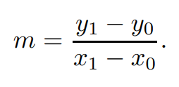

  接下来的讨论都会要求$m\in (0,1]$。类似的讨论可以延伸出$m\in (-\infty,-1],m\in(-1,0],m\in (1,\infty)$，这四种情况对应所有的可能。

  对应$m\in (0,1]$的情况，x变化的速度会比y快。在一些api中y轴的方向是朝下的，但这不影响算法（y轴朝上朝下算法的思想都是一致的），本章该算法的最终实现就是y轴朝下。

  **中点算法的核心假设就是我们会画一条尽可能瘦的线，使得连线之间没有断开（处于对角线位置的相邻像素不叫断开）：**

  

  在绘制直线的过程中，只有两种可能：（1）绘制右边的像素（2）绘制上边的像素。所以我们只需要从左到右开始绘制直线，当满足某种条件时向右上走一格，不满足时向右走一格：

  

  x,y都是整数。算法的关键就在于“某种条件”的制定。

  > keep drawing pixels from left to right and sometiones move upward in the y-direction while doing so.
  >

  可以通过**中点**去判断。假设我们当前绘制的点坐标是$(x,y)$，下一个需要绘制的候选点是$(x+1,y)$和$(x+1,y+1)$。因为坐标都是整数，但实际像素是一个单位正方形，它们以像素坐标为原点，上下左右扩充0.5长度。所以$(x+1,y)$和$(x+1,y+1)$两个像素的中点是$(x+1,y+0.5)$。如果直线在$x+1$位置的值大于$y+0.5$，则选择$(x+1,y+1)$，否则选择$(x+1,y)$：

  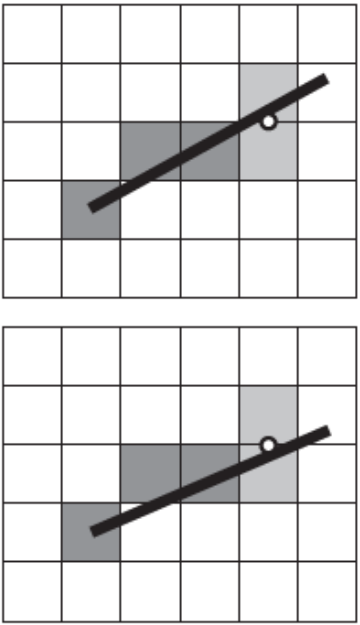

  通过查看$f(x+1,y+0.5)$的正负性可以得知中点在直线的哪一方。如果=0说明中点在直线上，但是>0和<0并不能保证点位于直线的哪一方。

  但是我们知道$x_1-x_0>0$，所以在直线方程中y的系数一定是正的。所以如果y增加（正的变大，负的变小），整个函数的值就会增加。那么考虑极限情况$f(x,+\infty)$，这时点$(x,+\infty)$肯定在直线上方，而这时函数值一定是正的，那么我们就能确定：$f(x,y)>0$，说明$(x,y)$位于直线的上方。

  至此，上述的判断条件就可以是：

  

  这是针对$m\in (0,1]$的情况，对应比较扁平的直线（x增长比y快）。对于$m\in (-1,0]$的情况一样，只不过y+1要变为y-1。对于比较垂直的直线（y增长比x快），比如$m\in (1,+\infty)$和$m\in (-\infty,-1]$，就是从下往上绘制直线。（if针对的是比较少发生的情况，对于扁平直线，往右的概率比往上大，所以是从左往右绘制直线，将往上的情况放入if）

  如果需要更高的计算性能，还可以对上述算法进行改进。当我们绘制到$(x,y)$时，我们需要知道$f(x+1,y+0.5)$的值，但是这时我们已经知道$f(x,y+0.5)$（当前这个点是被当成右边的点被选中）或者$f(x,y-0.5)$（当前这个点是被当成右上的点被选中）的值，同时我们也知道：

  

  所以这时候我们不需要重新计算$f(x+1,y+0.5)$，只需要在第一个迭代时计算函数值，在后面的迭代中只需要往以前计算的函数值中加进$(y_0-y_1)$或者$(y_0-y_1)+(x_1-x_0)$：

  

  这是一个更快的方法，但是也许会累积错误。（比如$f(x,y+0.5)$可能由许多长行相加组成），然而考虑到线条很少超过几千像素，所以这种错误不会是严重的。

  如果将$(x_1-x_0)+(y_1-y_0)$和$(y_1-y_0)$作为变量存储，计算还会更快。

### 9.1.2 Triangle Rasterization

在线绘制中，我们通常希望从顶点的属性值中进行插值得到不同点的属性值。在三角形绘制中，重心坐标就可以用来从顶点中进行插值。这种从顶点中插值得到像素属性的方法叫做高洛德（Gouraud）着色（在顶点着色器中进行计算）。

在栅格化三角形时，我们通常会去栅格化共享顶点和边的三角形，也就是相邻的三角形，这样的着色就不会出现孔洞。我们可以先用“中点算法”去绘制三角形的边，再去填充边内的像素，但是如果两个三角形共享一条边，两个三角形的绘制顺序就会对这条边最终的属性产生影响。为了消除这种绘制顺序带来的不确定性，同时不造成孔洞，有一种惯例就是：当且仅当像素的中心（坐标）位于三角形内部时，该像素才会被绘制。

对于如何判断一个点位于三角形内部，重心坐标就给出了答案（三个参数都在0-1之间）（叉乘同样也可以判断）。但是同样有个特殊情况需要考虑：如果像素中心正好位于三角形边上怎么办？下一节会给出几种解决方法。

本节的核心就是，重心坐标会告诉我们应不应该绘制一个像素（是否位于三角形内部）以及这个像素的属性值会是什么（重心坐标同样是顶点插值的权重）。因此光栅化三角形的问题就会归结为有效地找到像素中心的重心坐标。一种蛮力算法是：

上述的循环是对每一个三角形来说的。实际上我们不需要循环全部的像素，只需要循环三角形确定会在的区域内的像素即可，也就是包围盒：

这里的判断条件是$\alpha,\beta,\gamma>0$，因为如果这个条件满足的话，$\alpha+\beta+\gamma=1$必定成立（位于三角形内部的点到三边的距离比例之和必定为1）。

该算法同样可以利用增量式的思想，对于$f_{12},f_{20},f_{01}$都有$f(x,y)=Ax+By+C$的形式。那么在内层循环中，x是从小到大以整数形式递增的$x\mapsto x+1$：

$$
f(x+1,y) = f(x,y)+A
$$

在外层循环中，y是从小到大以整数形式递增的$y\mapsto y+1$：

$$
f(x,y+1) = f(x,y)+B
$$

所以在每次循环中，$\alpha \beta \gamma$都是constant值的改变，所以颜色c也是这样，比如$(x,y)\mapsto (x+1,y)$：

$$
\alpha\prime = \frac{f_{12}(x_0,y_0)+A_{12}}{f_{12}(x_0,y_0)} = \alpha + \frac{A_{12}}{f_{12}(x_0,y_0)},\\
\beta\prime = \frac{f_{20}(x_0,y_0)+A_{20}}{f_{20}(x_0,y_0)} = \beta + \frac{A_{20}}{f_{20}(x_0,y_0)},\\
\gamma\prime = \frac{f_{01}(x_0,y_0)+A_{01}}{f_{01}(x_0,y_0)} = \gamma + \frac{A_{01}}{f_{01}(x_0,y_0)},\\
c\prime = \alpha\prime c_0 + \beta\prime c_1 + \gamma \prime c_2 = c + (\frac{A_{12}}{f_{12}(x_0,y_0)}c_0+\frac{A_{20}}{f_{20}(x_0,y_0)}c_1+\frac{A_{01}}{f_{01}(x_0,y_0)}c_2).
$$

可以看到，无论是从行还是从列还是从线条，插值颜色的变化都是线性的。

- Dealing with Pixels on Triangle Edges

  如果像素中心正好位于三角形的边上，那么这个像素必然也正好位于另一条三角形的边上（如果这个三角形有相邻的三角形的话）。所以把这个像素分配给哪个三角形是一个问题：如果直接丢弃，那么相邻三角形之间就会有一条黑线；如果同时分配给两个三角形，就会导致双重绘制（double-coloring），这对于一些透明物体来说会有极其不好的影响。

  所以我们只能把这个像素分配给其中一个三角形。这就需要制定一个简单的规则来给像素做分配，而且“triangle is chosen does not matter as long as the choice is well defined”。

  在说这个规则之前，首先需要说明一个常识：**任何一个点，如果不经过某条线，一定会被这条线分到其中一端，而且对于所有的线集合，这种分配的概率是1/2的。**所以如果我们能选择一个锚点，让所有位于边上的像素点都能通过某种方式与之进行测试，判断是否绘制，就能以1/2的概率决定绘制，并且同一条线上的点是一致的。

  

  这个锚点不能是在像素坐标系第一象限的点，所以可以选择一个不可能被用到的点(-1,-1)作为锚点。上述说的某种方式就是：**判断边的对点与锚点(-1,-1)是否在同一侧**。由于相邻三角形同一边的对点一定在边的两侧（如上图），所以这种方式也能保证位于边上的像素只会分配给相邻三角形中的一个。

  

  

  是否在同一侧的判断就用隐式方程所能表达的符号距离的乘积表示。

  

  这里有两种情况：像素在边上、像素在顶点上，对应的情况就在上图。

  这种解决方案仍然不完美，因为如果某条边穿过了锚点，那么这条边上的像素点仍然面临着如何分配的问题，然而上述的算法选择是将它们直接丢弃。然而正好穿过锚点的边比较少，对于画面来说影响不大（至少相对于之前来说）。

  要想保证上述算法是准确的，必须保证共享顶点和边的相邻三角形的三条直线公式必须是一致的。如果对直线公式取反并不影响其本身，但是会对符号距离的正负造成影响：

  

  比如对每个三角形的顶点都采用逆时针的顺序构成边，那么共享边的正负在两个三角形中就是相反的。所以必须确保在图像空间中两个固定的顶点连成的边具有一致的直线表达（也许可以通过保证让x值小的当$x_0$，x值大的当$x_1$）。

  在包围盒的计算中，也要小心三角形顶点正好位于像素中心的情况（这种情况该像素应该算入包围盒中）。

  当三角形退化成直线时，上述的算法会被除0，更鲁棒的代码应该对这种情况有所考虑。浮点误差条件应得到适当考虑，否则需要进行另一次测试。

### 9.1.3 Perspective Correct Interpolation

在透视投影中进行插值计算（比如纹理映射）会很自然的引出一个问题：

如上图的左图右侧所示，对于一个均匀分布的网格，在已经经过透视投影的变换后，针对每个顶点的uv属性进行插值，就会得到一个同样均匀的uv分布（垂直线之间的间隔是相等的），这是因为插值无论在线段还是三角形上都是线性的。但是我们知道，透视投影满足的是近大远小，所以不同深度的属性插值是不均匀的。所以如果直接用最终的屏幕坐标进行纹理映射的插值，就会导致不正确的插值结果，不符合正常的视觉效果。

**上述这种不正确插值的本质就在于不一致。**在3D世界中的图形经过投影变换后，其边缘形状已经满足近大远小；而此时对图形表面像素进行顶点的插值并没有近大远小的功能（因为它是线性的），这种不一致造成了透视效果的不正确。如果在图形还未经过投影变换就进行插值，并将顶点和插值的结果一起经过投影变换转换到屏幕坐标，这时候就是一致的，不会产生异常的视觉效果。但是图形渲染管线是 坐标变换->顶点处理->图元装配->图元栅格化->片段处理->混合 的顺序，在我们还在顶点处理的时候，所有顶点都已经转到屏幕坐标了，更别提在这个阶段还不清楚每个图元所覆盖的片段。

但是我们知道两件事情：

**（1）透视变换会保留线段和平面**

**（2）透视变换不会改变线段上某一点在插值中对应的权重(齐次坐标未归一化的时候)**

可以理解为，透视变换是一种映射，这种映射满足映射前是线段的映射后也是，映射前是平面的映射后也是，并且映射前后的点是一种双射，有着一一对应的关系。对于一个三角形来说：

$$
M(\alpha p_1 + \beta p_2 + \gamma p_3) = \alpha M p_1 + \beta M p_2 + \gamma M p_3
$$

M是透视变换，$\alpha \beta \gamma$是重心坐标，$p_1p_2p_3$是三角形的三个顶点。在齐次坐标系未做归一化（即w不强制为1）的时候，对三角形上一点做透视变换，就等于分别对三个顶点做透视变换，再用相同的重心坐标加权求和。

当然，只有对齐次坐标做归一化才能完成透视的效果，但这个归一化可以放在后面做。

因为投影变换前后的线段/平面保持着双射的关系，也就是任何屏幕坐标上的一点，就能找到相机坐标系下对应的一点。那么为了解决上述说的不一致性，**对于需要着色的屏幕坐标的任何一点，都可以映射回相机坐标上的一点，而相机坐标上的点到顶点之间的相对关系就是准确的，那么这时候的插值就是准确的，这就是透视矫正！**

比如对于一个线段来说：

$q$和$Q$是3D坐标世界中的点，$s$和$S$是屏幕坐标中的点，其中$q\mapsto s$，$Q\mapsto S$，虽然它们的顶点坐标经过变换发生了改变，但是它们对应的纹理坐标uv是一致的，**所以在透视矫正中，我们只需要知道正确的权重：我们需要通过不准确的$\alpha$找到准确的$t$，通过$t$对顶点uv进行插值，这就是我们要做的唯一的事。**

重头捋一遍透视变换与齐次坐标相互配合的过程，我们就能得到答案：

（1）对于相机坐标系中的一个点$(x_c,y_c,z_z,1)^T$，它可以表示为:

$$
\alpha (x_a,y_a,z_a,1)^T + \beta (x_b,y_b,z_b,1)^T + \gamma (x_c,y_c,z_c,1)^T = \alpha A + \beta B + \gamma C
$$

    其中A,B,C是这个点所在图元的相机坐标系三角形顶点。

（2）这个点经过投影变换矩阵左乘后得到$(x_q,y_q,z_q,w_q)$：

$$
M(\alpha A + \beta B + \gamma C) = \alpha MA + \beta MB + \gamma MC
$$

（3）将点除以w分量，使其真正成为屏幕坐标下一点$(x_q/w_q,y_q/w_q, z_q/w_q, 1) = (x_n, y_n,z_n,1)$：

$$
\frac{\alpha MA + \beta MB + \gamma MC}{\alpha w_{MA}+\beta w_{MB}+\gamma w_{MC}} = \frac{\alpha P + \beta Q + \gamma R}{\alpha w_P + \beta w_Q + \gamma w_R}
$$

    其中$PQR$是$ABC$经过投影矩阵变换但还未齐次标准化的向量。

（4）我们希望找到一个形式，使其满足：

$$
\frac{\alpha P + \beta Q + \gamma R}{\alpha w_P + \beta w_Q + \gamma w_R} = \alpha\prime \frac{P}{w_P} + \beta\prime \frac{Q}{w_Q} + \gamma\prime \frac{R}{w_R}
$$

    $\frac{P}{w_P}$，$\frac{Q}{w_Q}$，$\frac{R}{w_R}$是真正的屏幕坐标下的顶点坐标，$\alpha \prime,\beta\prime,\gamma\prime$是屏幕坐标下的重心坐标。

（5）用构造性的方法可以得到：

$$
\alpha\prime = \frac{w_P\alpha}{\alpha w_P + \beta w_Q + \gamma w_R},\\
\beta\prime = \frac{w_Q\beta}{\alpha w_P + \beta w_Q + \gamma w_R},\\
\gamma\prime = \frac{w_R\gamma}{\alpha w_P + \beta w_Q + \gamma w_R}.
$$

    但公式的右边是相机坐标下的重心坐标，是$f(\alpha, \beta, \gamma)$形式的；而我们想通过屏幕坐标的重心坐标得到相机空间的，是$f(\alpha\prime, \beta\prime, \gamma\prime)$形式的，所以：

$$
w_Qw_R\alpha\prime+w_Pw_R\beta\prime+w_Pw_Q\gamma\prime = \frac{\alpha w_Pw_Qw_R + \beta w_Pw_Qw_R + \gamma w_Pw_Qw_R}{\alpha w_P + \beta w_Q + \gamma w_R},\\
\mapsto \frac{\alpha\prime}{w_P} + \frac{\beta\prime}{w_Q} + \frac{\gamma\prime}{w_R} = \frac{\alpha + \beta + \gamma}{\alpha w_P + \beta w_Q + \gamma w_R}.\\ 
\alpha = \frac{\alpha\prime(\alpha w_P + \beta w_Q + \gamma  w_R)}{w_P} = \frac{\frac{\alpha\prime}{w_P}(\alpha w_P + \beta w_Q + \gamma  w_R)}{\alpha + \beta + \gamma}\\
=\frac{\frac{\alpha\prime}{w_P}}{\frac{\alpha+\beta+\gamma}{\alpha w_P + \beta w_Q + \gamma w_R}} = \frac{\frac{\alpha\prime}{w_P}}{\frac{\alpha\prime}{w_P}+\frac{\beta\prime}{w_Q}+\frac{\gamma\prime}{w_R}}.
$$

同理可得：

$$
\beta = \frac{\frac{\beta\prime}{w_Q}}{\frac{\alpha\prime}{w_P}+\frac{\beta\prime}{w_Q}+\frac{\gamma\prime}{w_R}},\\
\gamma = \frac{\frac{\gamma\prime}{w_R}}{\frac{\alpha\prime}{w_P}+\frac{\beta\prime}{w_Q}+\frac{\gamma\prime}{w_R}}.
$$

这里的$w_P,w_Q,w_R$实际上就是$z_A,z_B,z_C$，这是根据透视变换矩阵得到的。

这样我们就得到了$f(\alpha\prime, \beta\prime, \gamma\prime)$的形式，所以我们就能通过以下流程得到正确的插值：

（1）在屏幕空间遍历像素，得到一个在三角图元内像素

（2）计算像素在屏幕空间下的重心坐标$(\alpha\prime, \beta\prime, \gamma\prime)$

（3）通过未标准化的齐次w分量和（2）的重心坐标，经过上述公式得到相机坐标下的重心坐标$(\alpha, \beta, \gamma)$

（4）利用相机坐标系的重心坐标对顶点纹理坐标进行插值，并将结果放入像素属性值

上述的计算有些繁琐，可以利用齐次坐标的性质：

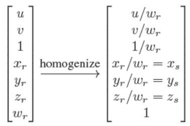

在相机坐标系顶点经过透视变换，但还未标准化时，往向量中加入$u,v,1$。后面就正常地进行标准化和重心坐标计算，后面我们利用计算出的重心坐标对顶点向量进行加权求和，并将结果的第一维/第二维除以第三维，就可以得到正确的插值。原因通过下面的式子可以一目了然：

$$
u_{true} = \frac{\alpha\prime\frac{u_P}{w_P} + \beta\prime\frac{u_Q}{w_Q} + \gamma\prime\frac{u_R}{w_R}}{\alpha\prime\frac{1}{w_P} + \beta\prime\frac{1}{w_Q} + \gamma\prime\frac{1}{w_R}},\\
v_{true} = \frac{\alpha\prime\frac{v_P}{w_P} + \beta\prime\frac{v_Q}{w_Q} + \gamma\prime\frac{v_R}{w_R}}{\alpha\prime\frac{1}{w_P} + \beta\prime\frac{1}{w_Q} + \gamma\prime\frac{1}{w_R}}
$$

上面的许多表达式会在循环外预先计算，以提高速度。

实际上，现代系统会对所有必要的属性进行透视矫正后再进行插值。

### 9.1.4 Clipping

对于在视野范围外的物体，需要进行裁剪，不然会造成错误的栅格化效果。

最安全的做法是将视野六面体外的所有物体进行裁剪，但是大多数系统只对近平面进行裁剪。

有两种常见的裁剪途径：

（1）在世界坐标系利用视野的六个平面进行裁剪

（2）利用4D变换矩阵左乘后但还未齐次标准化的向量

两种途径都可以用下面的流程解决（针对每个图元三角形）：

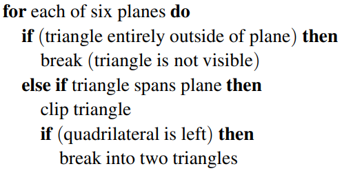

对于第一种途径则十分直接，问题就在于：视野的六个平面在哪？我们可以反转变换，并将其应用于变换后的视图体积的八个顶点：

这样就可以得到3D世界坐标下的视野范围的八个顶点，从而得到六个平面。

但是最常用的是第二种途径，这里视野体积是4D表示，用3D超平面进行限定：

这种平面更加的简单（坐标轴对齐），所以比第一种途径更加的有效率。

- Clipping against a plane

  不管选择哪一条途径，我们都会通过平面去裁剪。在3D中一个平面（穿过q点，单位向量是n）的隐式表示是：

  $$
  f(p) = n\cdot(p-q) = 0.\\
  f(p) = n\cdot p + D = 0.
  $$

  上述的第二个式子是通用的，表达的是在n维空间中在n-1维中的限定。比如3D中就可以表示平面，在2D中表示线，在4D中表示体积。

  考虑一个线段ab如果被平面穿过，那么$f(a)f(b)<0$，为了剪裁，我们就要找到ab与平面相交的点，这个点可以通过直线方程与平面方程联立得到：

  $$
  n\cdot(a+t(b-a))+D=0.\\
  t = \frac{n\cdot a+D}{n\cdot(a-b)}.
  $$

  我们可以选择a-交点还是b-交点对线段进行裁剪。

## 9.2 Operations Before and After Rasterization

在进行栅格化之前，顶点必须确保位于屏幕坐标空间里，并且顶点的颜色和其他需要用来插值的属性必须已知。这部分的操作位于vertex-processing中，通过mvp将每个顶点从世界坐标映射到屏幕坐标，同时其他的信息，比如颜色、表面法线、纹理坐标也会根据需要变换。

在栅格化之后，会计算每个片段（像素）的颜色和深度，这种计算可以很简单，比如通过顶点颜色插值；也可以比较复杂，比如一些复杂的光照着色模型。但无论如何每个片段执行的操作是一样的，所以可以通过GPU加速。

片段处理之后，就会根据每个片段的深度信息进行混合，得到最后的颜色信息。（不同图元由于所处深度不同，其中的片段可能会覆盖同一像素）

### 9.2.1 Simple 2D Drawing

最简单的管线不在顶点处理和片段处理做操作，在栅格化阶段就完成了几乎全部的操作，而在混合阶段也仅是将当前值覆盖位于同一位置，上一个片段的像素值。位于图元内的像素颜色，被简单地赋值为与顶点相同的颜色（图元的顶点颜色也是相同的）。这种简单的操作是许多古老的绘制图形界面和2D图形接口的基础。

### 9.2.2 A Minimal 3D Pipeline

要想绘制3D的物体，对上述的2D操作只需要加入一些矩阵的变换——modeling、camera、projection、viewport，使得这些三角图元位于屏幕坐标内，然后再利用上述的操作进行2D的绘制，仿佛它们本来就在2D里一样。

但是这会带来一个问题——如何生成正确的遮挡关系？为了让近处的物体可以遮挡住远处的物体，可以利用画家算法（painter’s algorithm）——先绘制远处的物体，再绘制近处的物体。但是这在一些交叉和彼此遮挡的物体之间无法实现：

同时这种算法需要利用深度对场景中的所有物体排序，这种速度是很低的，尤其是对于大型场景来说。所以画家算法并不是一个好的方案。

### 9.2.3 Using a z-Buffer for Hidden Surfaces

z-Buffer则是一个简单且高效的办法：

> at each pixel, we keep track of the distance to the closest surface that has been drawn so far, and we throw away fragments that are farther away than that distance.

每个像素都要留出一个存储深度的空间，以构成深度缓存。这可以跟每个像素的RGB一起存储，构成第四通道。

对于当前需要绘制的片段，都要去比较自身的深度与同样位置像素的目前深度缓存的深度，如果自身的比较近，就rewrite这个位置像素的颜色缓存和深度缓存；如果自身比较远，则直接不用考虑。为了保证在混合阶段的第一个像素一定能rewrite，初始状态下的深度缓存每一个位置都是无穷大。利用z-Buffer，无论用什么样的顺序混合片段，得到的图像都是相同的。

为了在片段处理时能够获得深度信息，需要将顶点的z值也作为属性进行插值。（同样需要透视矫正）

z-Buffer是object-order的普遍做法，已经被硬件图形管线普遍支持。

- Precision Issues

  在实践上，在buffer的z-values一般为非负整数，而不是浮点数，这是为了高速存储成本的考虑。但是使用整数也许会导致精度问题。

  如果我们使用$\{0,1,...,B-1\}$，B个整数值来代表不同的深度，我们可以将0表示为近平面，而B-1代表远平面。那么我们就需要将$z=n$和$z=f$之间进行B等分，其中每一部分叫做Bins:

  $$
  \bigtriangleup z = \frac{f-n}{B}.
  $$

  处于同一个Bin的两个像素，z-value将表示为同一个整数，即使这两个像素实际上有微小的深度差别，这就带来了误差。如果用b位去存储，那么$B=2^b$，如果能保证每一个不同深度的片段都能映射到不同的Bin，那么误差就不会出现，这需要B相同的情况下n与f之间尽可能小，或者n与f之间距离相等时B尽可能大（一些API和硬件平台是前者）。

  根据透视矩阵可以知道，经过透视变换（还未经过视口变换）后的z值是：

  $$
  z = n + f - \frac{fn}{z_w}.
  $$

  可以发现Bin的大小与$z_w$有关，也就是该点在世界坐标系的z值。经过一些变换：

  $$
  \bigtriangleup z \approx \frac{fn\bigtriangleup z_w}{z_w^2}
  $$

  可以发现Bin的大小随深度的变化而变化，在世界空间的Bin大小是：

  $$
  \bigtriangleup z_w \approx \frac{z_w^2 \bigtriangleup z}{fn},\\
  \bigtriangleup z_w^{max} \approx \frac{f\bigtriangleup z}{n}.
  $$

  因为$\bigtriangleup z$是不变的（B等分），所以在世界坐标系中，深度越大，Bin的大小越大（越远越疏）。

  如果n=0，世界坐标系中的最大Bin会趋于无穷大，这是错误的。为了让世界坐标系中的Bin变小（最大Bin变小代表整体的Bin变小），应该努力让n变大、f变小。**所以n和f的选择会影响深度的误差。**

### 9.2.4 Per-vertex Shading

对于比较复杂的渲染技术，就不单单是在栅格化阶段进行插值。对于第4章所提到的渲染技术（Blinn-PHong Shading），有两种实现方式，其中一种就是本节所说的Per-vertex Shading：

在vertex processing阶段计算渲染。每个顶点都会有一个法向量属性，并且光照的方向和颜色会被单独提供（因为是一个固定值）。在顶点处理阶段会根据摄像机的方向，顶点的位置和法向量，光源方向计算这个顶点的着色，并将其作为顶点的颜色送入栅格化器。Per-vertex Shading也被叫做Gouraud Shading（高洛德着色）。

应该在哪个坐标系进行顶点着色的计算是比较重要的，因为夹角的计算依赖于一个单位正交的坐标系。所以世界坐标系和相机坐标系是比较合适的，而透视投影之后的夹角就不再保持顶点之间的原始关系。在相机坐标系进行着色的好处是我们不用关注相机的位置（因为就在原点），也不用关注相机的朝向（一定朝向-z）。

但是Per-vertex Shading的缺点就是无法展现比图元更小的细节。因为它仅仅计算顶点的着色，顶点间的着色采用的是插值的方法。这同样会导致不真实的问题，比如一个房间的地板（矩形，仅由两个图元组成）和一个处于房间正上方的灯，Per-vertex Shading只会计算房间边缘四个角的着色，再通过插值计算中间地板的着色，由于边缘四角跟灯的夹角较大，亮度较小，这就会导致地板中心区域的亮度比真实值低。

所以在Per-vertex Shading中，必须使用足够小的图元绘制使用镜面反射高光着色的曲面，以解决高光问题。

可以看到Per-vertex Shading同样导致了interpolation artifacts

### 9.2.5 Per-fragment Shading

为了解决interpolation artifacts，我们可以不直接对着色进行插值，而是将着色的计算推迟到插值之后，插值阶段是插值**计算着色的必要属性**，比如法向量。这就是Per-fragment Shading（Phong Shading）。

Per-fragment Shading的计算过程跟上面的Per-vertex Shading是一样的，只不过计算的对象由顶点变成了像素。在像素上进行着色计算所采用的属性正是插值之后的，区别于Per-vertex Shading采用的是原始的属性。

正是因为如此，在顶点处理阶段就要准备好像素着色需要的属性，以放入栅格化器中进行插值。一种方法就是准备法向量和顶点自身的位置。

### 9.2.6 Texture Mapping

纹理就是一张图片，用于增加着色平面的细节，以避免平面看上去非常均匀化和人造化。

采用纹理的想法很简单：在计算像素着色的时候，我们不再通过属性计算漫反射的颜色，而是直接从纹理图像中取值。这个操作被称作纹理查找（texture lookup）：纹理坐标同样作为像素的一种属性（由顶点插值而来），可以被拿来找到纹理图像域中的一个点，返回这个点的某个属性（不一定是颜色，可以返回任何需要被查找的东西）。

如果返回的是颜色，这个颜色值就会作为漫反射值参加后面的着色计算。

如何建立这种映射关系？最通常的做法是将纹理坐标作为顶点的另一种属性，然后通过插值将这个属性弥漫到所有像素。

### 9.2.7 Shading Frequency

将着色计算放在顶点处理还是放在像素处理，取决于颜色变化的剧烈程度。对大范围的特征进行着色，比如曲面上的漫反射着色，就可以采用低频的着色方法（顶点着色）然后再用插值的方法完成整个曲面的着色。对小范围的特征进行着色，比如锐利的高光或者细节的纹理，就需要采用高频的着色方法（像素着色）。对于需要在图像中看起来清晰的细节，至少需要使用像素着色。

所以对于颜色变化频率较低的区域，可以采用低频着色。如果需要提高着色频率，可以采用高频着色（片段着色），也可以采用顶点着色（如果顶点本身就分布紧密的话）

## 9.3 Simple Antialiasing

在栅格化的过程中，对像素是否在图元内部的一致判断会导致“锯齿”现象。**这种锯齿现象产生的原因就是像素被当成了整体看待，也就是采样频率不够高。**

在光线追踪中，这种现象仍然存在，其解决的方法就是允许像素部分被图元覆盖。在实践中，这会导致一种比较模糊的效果，但这带来了良好的视觉效果：

在栅格化应用中，有许多抗锯齿的方法。比如我们可以不再将像素看作一个统一的整体，而是一个正方形的图像区域，而这个像素的颜色应该是正方形图像区域中所有颜色的平均，这种方法叫做盒过滤（box filtering）。这就意味我们必须认为所有绘制实体都具有一定的“面积”，比如上面这条直线在数学表达中不存在面积，但我们必须认为它是近似一个像素宽的矩形。

实现盒过滤的最简单方式就是**超采样（supersampling）**：创建分辨率特别高的图像，然后向下采样。比如我们的目标是一条宽度为1像素的256x256图像中的直线，我们可以在1024x1024的屏幕上对宽度为4像素的直线矩形版本进行光栅化，然后对4x4组像素进行平均，以获得缩小图像（256x256）中每个像素的颜色。这实际上是box-filtering的近似，因为我们无法做到频率无限高的采样。

在实际代码实现中，就是将像素分为了四个小像素，每个小像素按照正常流程进行着色，最终像素的颜色就是四个小像素着色的平均。

超采样一般非常昂贵，因为锯齿产生的范围一般就是物体的边缘，而不是物体内部。因此广泛使用的优化是对可见的物体的采样频率大于着色频率。（采样的密度比像素的密度还大）如果每个像素内的几个采样点存储了深度和覆盖的信息，就可以得到非常好的抗锯齿的效果。

在RenderMan软件中，采用per-vertex shading，所以它会用非常高的分辨率进行栅格化。这实际的代价是比较低的，因为对于每个像素来说，着色其实就是简单的插值。在per-fragment shading，比如硬件管线中，多采样抗锯齿（multisample antialiasing）的实现通常是为每一个片段存储颜色+coverage mask+a set of depth values。

## 9.4 Culling Primitives for Efficiency

object-order rendering会将场景中的所有物体逐个处理，这对于复杂场景来说是一种缺陷。比如一个大范围的城市，我们能看到的只是城市的冰山一角。object-order rendering在这种情况下对所有物体进行扫描固然可以得到正确的图像，但是这样会让计算设备花费大量的时间去计算我们根本看不到的部分，而这些对我们最终的画面没有任何的影响。

所以，我们需要丢弃那些我们看不到的物体来提高渲染的速度，这就是剔除（culling）。三种常用的剔除策略是：

（1）view volume culling：剔除位于视野体积范围外的物体

（2）occlusion culling：剔除虽然在视野体积内，但是被其他物体遮挡的物体

> Akenine-M ¨oller, Haines, and Hoffman (2008) for a complete discussion and for information about occlusion culling.

（3）backface culling：剔除背对相机的图元

### 9.4.1 View Volume Culling

如果一个图元完全位于视野范围之外，就可以直接剔除，因为它在栅格化的时候不会产生任何片段。如果我们能很快的判断一组图元是否应该被剔除，我们的绘制速度就会得到很大的提升。另一方面，单独测试图元以确定需要绘制哪些图元可能比让光栅化器消除图元花费更多。

视野体积剔除，同时也被叫做**视锥截平头体剔除（view frustum culling）**，对于一些很多三角形被组织成具有关联的包围体积的对象很有作用。如果这个大对象能够确定被剔除，那么这个对象里所有的三角形都可以一次性被剔除。举个例子，如果一个球体对象内部包围了1000个三角形，这个球体中心是c，半径是r，那么我们就能确认这个球体是否跟截平面有接触，如果毫无接触且球体在视野范围外，那么就可以将其中的1000个三角形图元全部剔除。判断的公式是：

$$
(p-a)\cdot n =0
$$

a可以是平面上的任何一个点，n是平面的单位法向量，p是要查询的变量。这个公式的几何意义就是p点到平面的距离是多少，所以如果:

$$
\frac{(c-a)\cdot n}{||n||}>r
$$

那我们就可以知道这个球体跟截平面不相交，这时候球心如果也在视野范围外，那我们就能确认这个球体可以被剔除。但是如果球体跟平面有相交，并不代表其中的1000个三角形会与截平面相交，因为球体只是这些三角形的“包围”。因此，这是一个保守的测试，测试的保守程度取决于球体与物体的界限。

如果场景中的所有物体能够以层级的结构组织起上述说的对象，那么就可以利用上面的思想在数据结构中做快速的测试，详细参见第12章。

[(109条消息) OpenGL 视椎体剔除算法__luna的博客-CSDN博客_视锥剔除算法](https://blog.csdn.net/u011760195/article/details/100862408)

上述博客讲述了视锥截平头体剔除算法的具体流程，还提出了一些优化，比如将视锥截平头体扩充为球和圆锥，让场景物体与以球、圆锥、视锥截平头体的顺序进行检测，因为frustum的检测相对比较慢，而球和圆锥的检测较快，所以可以用球和圆锥先剔除掉大部分的场景物体，再让剩余的物体与frustum检测。

http://www.cs.otago.ac.nz/postgrads/alexis/planeExtraction.pdf

Fast Extraction of Viewing Frustum Planes from the WorldView-Projection Matrix

http://wenku.baidu.com/view/6388b482e53a580216fcfe9c

Intersection of a Sphere and a Cone

### 9.4.2 Backface Culling

当多边形模型是封闭的时候，通常假设其每一个图元都具有朝外的法向量。对于这样的模型，法向量方向背离相机的（即法向方向与相机朝向夹角小于90度）肯定会被法向量方向面向相机的图元所覆盖。因此在管道开始之前，可以把这些背离的图元都剔除。

## 9.5 Frequently Asked Questions

1. I’ve often seen clipping discussed at length, and it is a much more involved process than that described in this chapter. What is going on here?

   The clipping described in this chapter works, but lacks optimizations that an
   industrial-strength clipper would have. These optimizations are discussed in detail in Blinn’s definitive work listed in the chapter notes.

2. How are polygons that are not triangles rasterized?

   These can either be done directly scan-line by scan-line, or they can be broken down into triangles. The latter appears to be the more popular technique.

3. Is it always better to antialias?

   No. Some images look crisper without antialiasing. Many programs use unantialiased “screen fonts” because they are easier to read.

4. The documentation for my API talks about “scene graphs” and “matrix stacks.” Are these part of the graphics pipeline?

   The graphics pipeline is certainly designed with these in mind, and whether we define them as part of the pipeline is a matter of taste. This book delays their discussion until Chapter 12.

5.  Is a uniform distance z-buffer better than the standard one that includes perspective matrix nonlinearities?

   It depends. One “feature” of the nonlinearities is that the z-buffer has more resolution near the eye and less in the distance. If a level-of-detail system is used, then geometry in the distance is coarser and the “unfairness” of the z-buffer can be a good thing.

6. Is a software z-buffer ever useful?

   Yes. Most of the movies that use 3D computer graphics have used a variant of the software z-buffer developed by Pixar (Cook, Carpenter, & Catmull, 1987).

# 10. Signal Processing

在图形学中，我们经常需要处理连续变量的函数，比如自然界中的图像。但是连续往往意味着无穷，在有穷的计算机存储的条件下，我们必须将这种连续函数表示为有穷位数的集合，也就是离散的。我们通常通过**采样（sample）**的方法，捕捉连续函数中足够多的点，存储这些点的值，并把这些值的集合代表这个连续函数。在我们需要的时候，我们还可以通过这些点重建出当初未采样位置的点的值（比如插值），进而更加完整地还原出连续函数的面貌（当然相对于真正的连续函数，这只是一种近似）。

比如相机拍摄自然界图像的时候，就是一种采样。相机将2D图像平面上连续的色彩变化记录为二维的网格值（grid value）。这就将原始的连续函数$\mathbb{R}^2\mapsto C$转变为了离散函数$\mathbb{Z}^2\mapsto C$。还有像平板电脑的手写笔书写，也是将手写笔在屏幕上的连续运动$\mathbb{R}\mapsto \mathbb{R}^2$转变为不同时间戳下手写笔所处屏幕位置的序列集合$\mathbb{Z}\mapsto \mathbb{R}^2$。运动捕捉系统也是同样的道理，只不过是记录三维的位置信息：$\mathbb{R}\mapsto \mathbb{R}^3$变为$\mathbb{R}\mapsto \mathbb{R}^3$。医学CT装置要记录人体不同位置的密度信息，是将连续的3D位置转变为微小的体素网格：$\mathbb{R}^3\mapsto \mathbb{R}$变为$\mathbb{Z}^3 \mapsto \mathbb{R}$。

从上述这些例子可以看到，很多地方都需要用到采样这样的技巧：

> In all cases, a function is being sampled at the points of a **lattice** in one or more dimensions, and in all cases, we need to be able to reconstruct that original continuous function **from the array of samples**.

可能有人会觉得如果采样的点足够多，我们就可以完全用采样去取代连续函数，但这是错误的。因为从采样的定义来说，我们永远只是得到了一个近似。对于图像来说，放大和缩小它就会导致aliasing。明白aliasing如何产生，以及明白如何预防aliasing的产生，就需要知道采样的数学原理。

## 10.1 Digital Audio: Sample in 1D

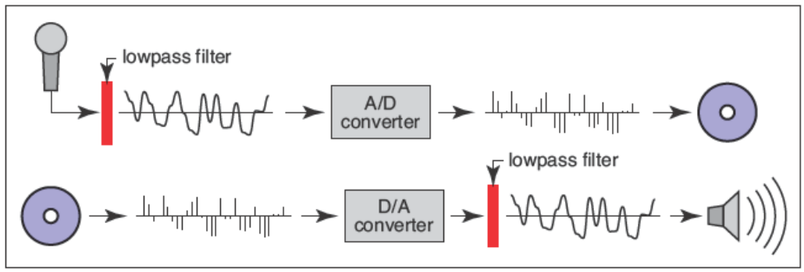

上图是音频记录和重现的全过程。

音频接收器将音波送到模数转换器（A/D or ADC），ADC以每秒几千次的采样频率将其转换为离散的电压信号（这是一个值），送入到存储器。

当需要播放声音时，存储器将离散的电压信号取出，送入到数模转换器（D/A or DAC），产生相应的电压，电压会使得发声单元的鼓膜产生相应的移动，进而复现声音。

"每秒几千次的采样频率"被称为采样率，采样率的高低取决于想要录制的声音的高频程度。比如想要录制短笛的声音，一个低频的采样频率就会导致奇怪的结果，而高频的采样率就可以很好地记录并再现。为了避免因采样不足造成的问题，音频接收器会对ADC的输入进行低通过滤，以去除可能导致问题的高频。

在输出方面会有同样的问题。DAC产生的电压只会在新样本进入时变化，而在下一个样本进入之前都会保持稳定。这就导致DAC输出的电压曲线实际是一种阶梯状的，这种阶梯意味着一种高频，依赖于采样率的，一种嗡嗡的声音。为了消除这种高频，DAC的输出通常也会经过低通滤波，降低高频，平滑电压曲线。

### 10.1.1 Sampling Artifacts and Aliasing

上述音频记录和重现的采样思想也被用于图形学相关领域中。采样不足（undersampling）的问题同样也会出现，而解决方法也是一致的：

> filtering before sampling and filtering again during reconstruction.

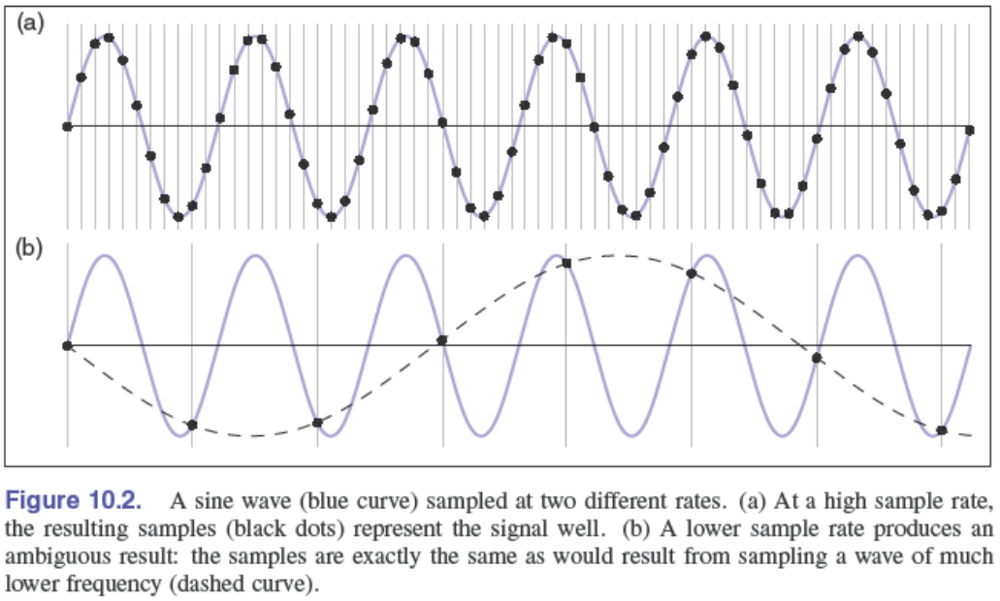

上述就是一个具体的例子。对于一个正弦波（sin)，采用较高的采样率可以很好的表达原始信号，但是采用较低的采样率，就仿佛我们是在一个原始的低频信号上进行的采样。这两种不同频率的采样，它们得到的值都是正确的，但是却产生了仿佛是在不同频率的原始信号上进行采样的结果。假如我们采用了第二种采样方式，通过得到的采样值，我们无法分辨原始信号是（b）中采样值拟合出的低频信号还是（a）中的高频信号，而我们往往倾向于它是低频的。**所以，如果对一个高频原始信号采用低频采样，高频原始信号就会伪装成低频信号，这种现象就叫做aliasing。**

在图像中，这种aliasing会以上述的形式出现（moire模式），原因在于采样网格（像素矩阵）与图像常规特征的交互。

采样和重建的基本问题可以简单地基于太大或者太小的特征来理解，但一些更定量的问题很难回答：

- 多高的采样率可以确保得到良好的结果？
- 什么样的滤波器适合于采样和重建？
- 需要多大程度的平滑才能避免aliasing?

要想知道这些问题的可靠答案，我们得等到10.5节。

## 10.2 Convolution

卷积是一个简单的数学概念，是用于采样、滤波和重建算法的基础。

卷积是对函数的一种运算：**它取两个函数，并将它们组合起来产生一个新函数。**本书中用$\star$代表卷积，$f\star g$代表$f$与$g$卷积，而$f\star g$就是卷积的结果。

卷积可以用于连续函数$f(x)$，也可以用于离散函数$a[i]$，可以运用于低维，也可以运用于高维。首先介绍一维的离散函数的卷积，然后介绍连续函数以及二维和三维的情况。

### 10.2.1 Moving Averages

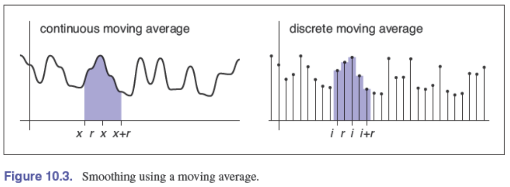

想得到一个基础的图像卷积，先考虑利用移动平均对1D函数进行平滑。为了得到函数中每个点的平滑值，我们计算以这个点为中心，左右半径为r的范围内的所有值的平均，并把平均值作为该点的平滑值。r是我们可以调节的参数，代表平滑的程度。

将上述思想利用数学表达：

- 连续函数$g(x)$：
  $$
  h(x) = \frac{1}{2r}\int_{x-r}^{x+r}g(t)dt.
  $$
  
- 离散函数$a[i]$：
  $$
  c[i] = \frac{1}{2r+1}\sum_{j=i-r}^{i+r}a[j].
  $$
  这里$2r+1$是因为$[i-r, ..., i-1, i, i+1, ..., i+r]$中一共有$2r+1$个点。

移动平均是卷积的基础。这两者的唯一区别就是，卷积是移动的加权平均，而移动平均是等权平均。

### 10.2.2 Discrete Convolution

离散卷积就是处理离散序列$a[i]$与另一个离散序列$b[i]$的卷积，它们的结果是$(a\star b)[i]$。这个过程就像是通过移动平均对$a[i]$进行平滑，但不同的地方在于，我们不再是平等地对移动窗口（左右半径为r）内的所有值求均值，而是通过$b[i]$对移动窗口内的每个采样值赋予权重，加权求均值。

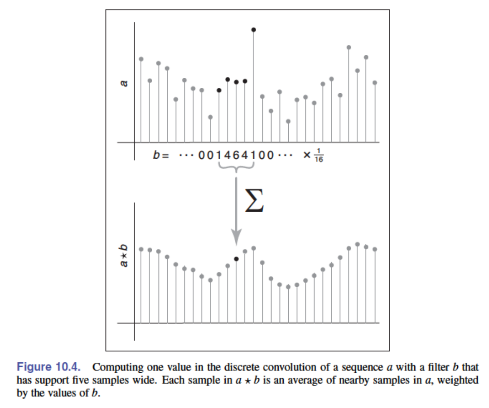

上述的这个过程中，$b[i]$就像一个滤波器，对$a[i]$的平滑结果进行影响。我们假设$a[i]$是移动窗口的中心值，$a[j]$是移动窗口中的任意一个值，那么对于一个$a[j]$，所得到的权重是$b[i-j]$，$i-j$所代表的是当前这个位置到移动窗口中心位置的有符号距离。

所以我们可以将离散卷积表示为：
$$
(a\star b)[i] = \sum_j a[j]b[i-j].
$$
如果忽略$j$的边界，我们就假设是对整个序列进行加权求平均，而处于移动窗口之外的位置，权重为0。即$b[i]$的表示为：$\frac{1}{16}[...,0,1,4,6,4,1,0,...]$。注意，$b[i]$的标号起点位于序列中央，即$b[0]=\frac{6}{16},b[\pm1]=\frac{4}{16},...$。

在图形中，$a[i]$和$b[i]$中的某一个通常具有有限的支持（比如$b[i]$），也就是只在一定区间内是非0的，而其他位置全是0，在本例中：
$$
b[k]=0,whenever\ |k|>r
$$
代表只在滑动窗口内是非0的。

所以我们可以重写上述的和式：
$$
(a\star b)[i]=\sum_{j=i-r}^{i+r}a[j]b[i-j].
$$
代码：

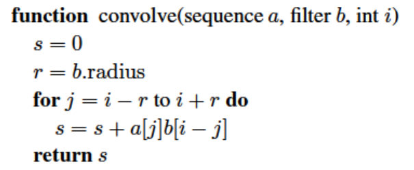

- Convolution Filters

  卷积的一个重要意义就是可以用来表达filtering。通过上述离散卷积的介绍，我们就可以把移动平均用另一个视角去解释：

  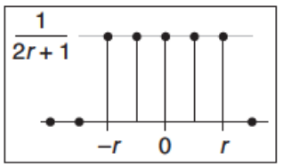

  $a[i]$通过对某个固定长度的区间求平均时，由于每个采样值的权重都是$\frac{1}{2r+1}$，所以我们可以想象$b[i]$只有在$[-r,r]$区间非0，且都为$\frac{1}{2r+1}$，其他地方都为0：

  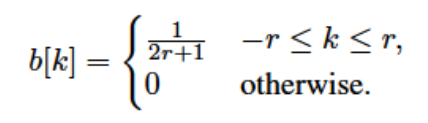

  这样的$b[i]$，把它叫做box filter（盒过滤，因为是矩形的）。而$a[i]$的移动平均就等价于$a[i]$与上述$b[i]$的卷积运算$(a\star b)[i]$。通常filter被设计成和为1的形式。

  举个例子：

  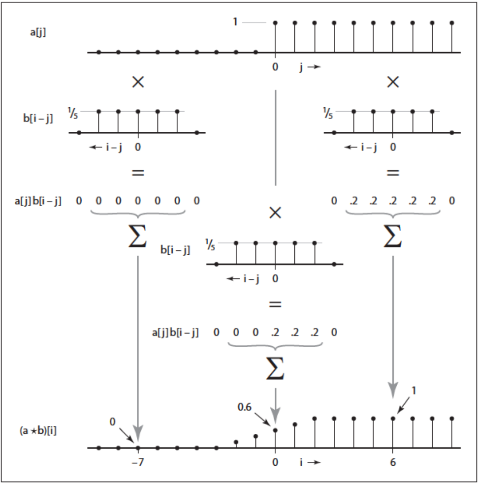

  $a[i]$是一个0-1阶跃函数，$b[i]$是长度为5的box filter，最终卷积的结果是线性斜坡（频率变低了）。

- Properties Convolution

  到目前为止，我们都把$a[i]$当成需要平滑的序列，而$b[i]$用来提供权重，这彷佛让卷积变成一种非对称的函数。但实际上，卷积是对称的，对于上述卷积的和式，如果我们考虑以$b[i]$的起点开始记数而不是$a[i]$的话（即用$i-k$代替$j$）：
  $$
  (a\star b)[i] = \sum_ka[i-k]b[i-(i-k)] = \sum_kb[k]a[i-k].
  $$
  这同样是$(a\star b)[i]$，但是此时是$b[i]$需要smooth，而$a[i]$充当filter。所以对于任意的序列$a[i]$和$b[i]$，$(a\star b)=(b\star a)$。**所以卷积满足交换律。**

  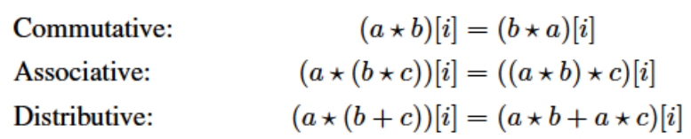

  **同样，卷积运算还满足结合律和分配律。**

  一个很简单的filter，充当着离散卷积单位元的角色：

  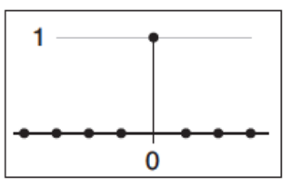

  $d[i] = [...,0,0,1,0,0,...]$，那么$(a\star d)[i]$：
  $$
  (a\star d)[i] = \sum_{j=i}^{j=i}a[j]d[i-j] = a[i].
  $$
  就等于$a[i]$本身。filter d被叫做discrete impluse（离散脉冲）。**这通常在一种情况下很有用：我们想知道一个序列减去它被滤波的部分长什么样：**
  $$
  c = a - a\star b = a\star d - a\star b = a\star (d-b).
  $$

### 10.2.3 Convolution as a Sum of Shifted Filters

对于定义卷积的和式，有另外一种更为奇特的视角。如果我们只看$a\star b$的某一个采样值，也就是$(a\star b)[i]$，我们已经知道这是以i为中心，以r为半径的区间范围内的加权平均。

但是如果我们忽略$[i]$，将重点放在整个序列，我们就可以把和看作是整个序列的相加。

我们首先需要知道一个概念：$b[i]$是一个序列，那么将$b[i]$向右移动$j$个单位，就会变成$b_{\to j}[i]$：
$$
b_{\to j}[i] = b[i-j].
$$
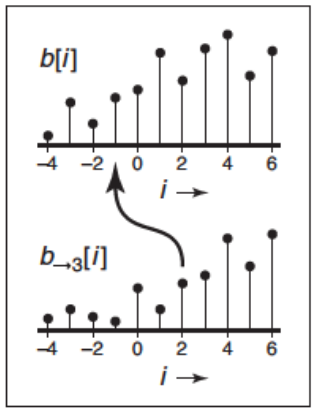

这时，我们可以重写上述的和式，以整个序列的视角，而不是element-by-element：
$$
(a\star b) = \sum_{j}a[j]b_{\to j}.
$$
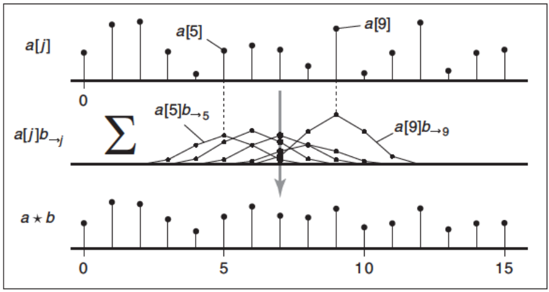

这等价于以$a[j]$为权重，以不同位移的副本$b_{\to j}$的加权和。因为卷积是可交换的，所以我们可以选择a或者b作为滤波器，而如果我们选择b，那么就是在输入中为每个样本加一个滤波器的副本。**离散卷积是滤波器移位副本的和。**

### 10.2.4 Convolution with Continuous Functions

虽然离散序列是计算机程序所用到的，但是我们有时候也希望对连续函数运用卷积，来推理出准确的结论。因此，定义连续函数之间以及连续函数与离散函数之间的卷积是很有用的。

两个连续函数的卷积是对离散形式的推广：
$$
(f\star g)(x) = \int_{-\infty}^{+\infty}f(t)g(x-t)dt.
$$
我们可以这样解释这个公式：$f$和$g$的卷积，在$x$处，我们移动$g$使得$g(0)$与$f(t)$对齐，两个函数乘积曲线下的面积。就像在离散的情况一样，卷积是移动平均，滤波器提供平均值的权重：

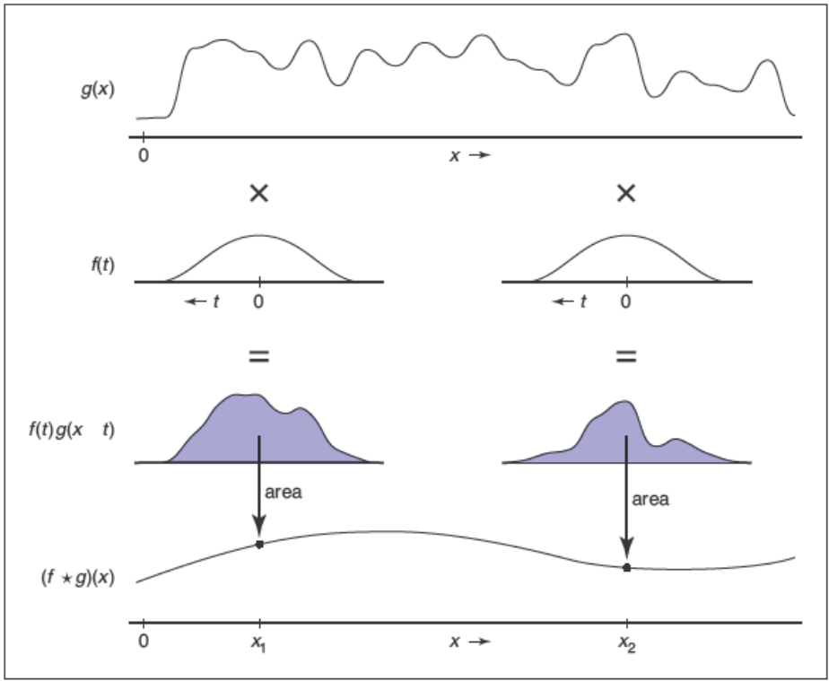

（这张图更像是把$f(0)$对齐到$g(x)$，利用$f(t)$当滤波器对$x$周围的区域进行加权平均...）

与离散的一致，连续函数的卷积同样具有结合律、交换律、分配律。连续函数卷积同样可以看作是一系列移位滤波器副本的加权求和：

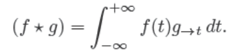

- The Dirac Delta Function

  与离散卷积的单位元——离散脉冲d相似，连续函数卷积也存在单位元——Dirac impulse（狄拉克脉冲、狄拉克函数）$\delta(x)$：

  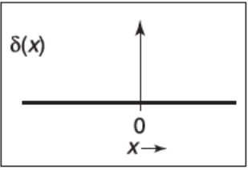

  外观上是无限窄，很尖的高塔，拥有无限小的宽度但是面积为1。这个函数的核心性质是：

  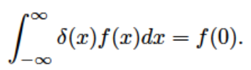

  所以我们可以通过狄拉克函数，从$f(x)$中挑选出某一处的值。狄拉克函数在$\delta(0)$处的值并不确定，可以粗略认为是无穷大，但是其他位置一定是0。通过上述的性质，就可以将狄拉克函数作为连续函数卷积的单位元：

  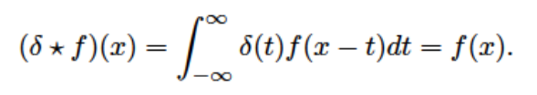

  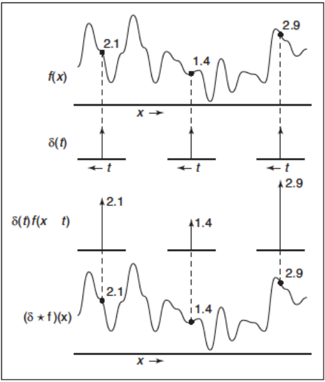

  同样，$\delta\star f = f \star \delta = f$。

### 10.2.5 Discrete-Continuous Convolution

有两种办法，连接离散和连续的世界：

一种是将连续函数表示为离散的，通过对连续函数采样的方式：
$$
a[i] = f(i).
$$
一种是将离散函数表示成连续的，通过reconstruction，即通过连续函数滤波器$f(x)$对离散序列$a[i]$滤波：

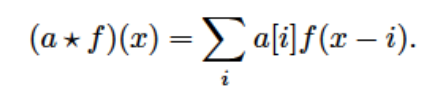

重建函数$a\star f$的值是对序列靠近$x$的那部分区间的加权和，权重在$f(x)$中。

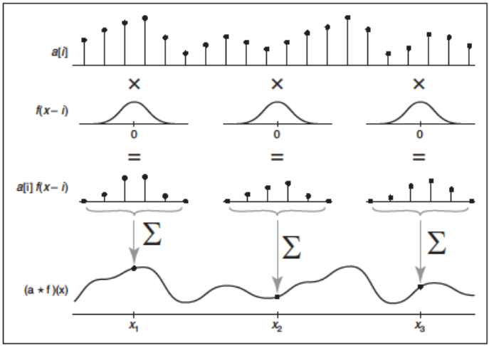

同样的，如果我们知道滤波器的半径r，我们就可以改写上述的式子：

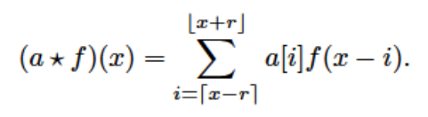

注意，如果一个点正好位于距离x为r的位置，它将被排除在和之外。这区别于离散形式（在离散形式中，$x-r$和$x+r$是包括在和式中的）。

代码：

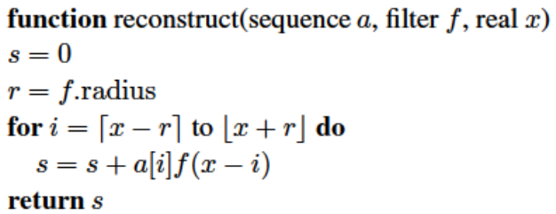

与其他形式的卷积一样，离散-连续卷积也可以被看作是对移位滤波器副本的加权求和：

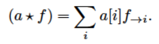

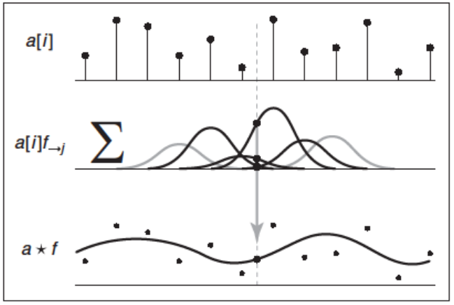

连续-离散卷积与样条曲线密切相关。对于均匀样条（例如均匀b样条），样条的参数化曲线恰好是样条的基函数和控制点序列的卷积。（15.6.2节）

### 10.2.6 Convolution in More Than One Dimension

上述所说的所有情况都是在1D的情况下讨论的，但是在图形学中，很多的卷积是2D、3D的。所以需要对上述的公式针对维度进行扩展。

从离散卷积开始，2D的离散卷积是：

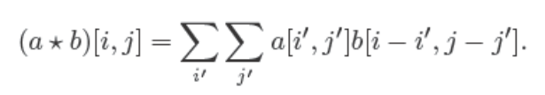

如果$b$是在有限范围内支持的filter（半径为r，说明共有$(2r+1)^2$个权重值），那么我们就能重写上述公式：

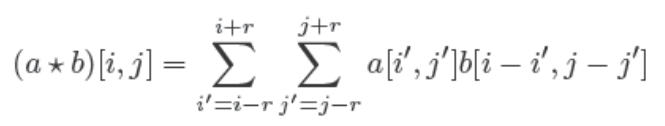

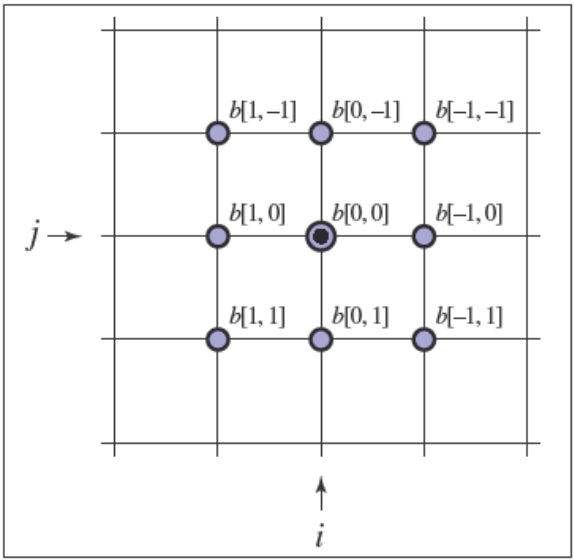

上图是半径r=1的情况。

代码：

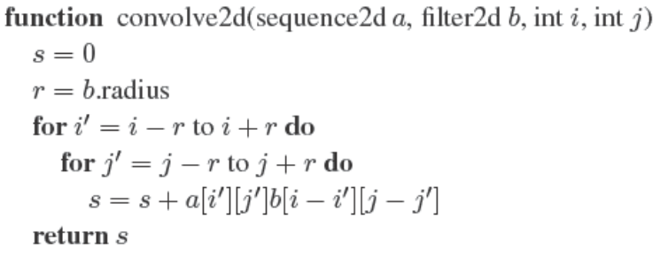

上述公式的理解与1D情况一模一样：每一个输出的采样值都是输入区域的加权和，利用2D的filter作为mask，给予那个区域不同采样点的加权权重。

同样可以写出2D情况下的连续-连续卷积和离散-连续卷积：

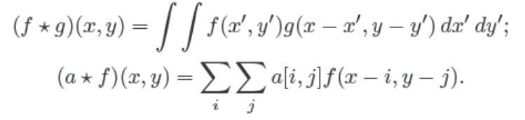

每一个情况中，每一个特定点的结果都是这个点附近区域的加权和。对于连续-连续卷积的情况，它是以特定点为中心的区域面积的加权积分；对于离散-连续卷积的情况，它是以特定点为中心附近所有采样点的加权和。

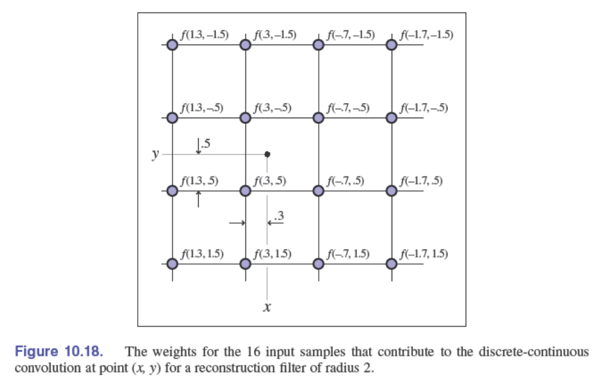

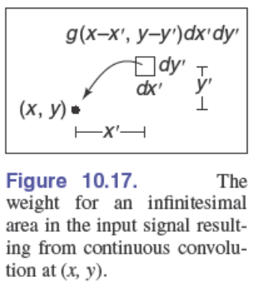

通过1D-2D的扩展示范，3D的情况就很好推导了。

## 10.3 Convolution Filters

接下来探讨的所有的滤波器都有一个默认的半径，比如box filter的默认半径是1/2，cubic filter的默认半径是2。同样要求每个滤波器的积分面积是1：$\int_{x=0}^{\infin}f(x)dx=1$，因为这可以保证采样和重建不会改变信号的平均值。

一些场景需要不同尺寸的滤波器，这可以通过对基本滤波器的缩放来实现，比如对于滤波器$f(x)$，可以定义缩放s：
$$
f_s(x)=\frac{f(x/s)}{s}.
$$
$f_s(x)$在水平方向上拉伸了s倍，在垂直方向上压扁了s倍，所以总体的面积没有发生改变。一个默认半径是**r**的滤波器经过上述变换后半径变为**sr**。

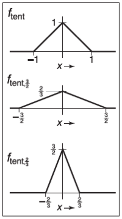

### 10.3.1 A Gallery of Convolution Filters

**box filter**

盒滤波器是一种分段常数函数，积分面积是1。对于离散滤波器，box filter可以写作：

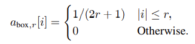

对于连续滤波器，box filter可以写作：

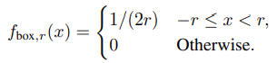

box filter是不连续的函数，所以需要注意边界的情况。离散情况下box filter包含了两端的端点，但是连续情况下只包含其中一端。

**The Tent Filter**

帐篷滤波器，又叫做线性滤波器，是连续的分段线性函数：

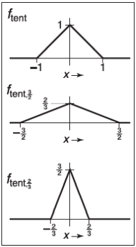

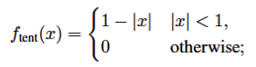

该滤波器的值不会像box filter那样突然跳变，所以不需要定义离散和连续的两个版本。离散滤波器就是连续滤波器在整数值上的采样。

**The Gaussian Filter**

高斯滤波器，又叫做正态分布（normal distribution），是无论在理论还是实践上都很重要的滤波器：

$\sigma$是标准差，高斯滤波器的优点在于其十分平滑。高斯滤波器并没有具体的自然半径，范围的大小靠$\sigma$的放缩来实现。因为高斯滤波器的值是按指数速度下降的，所以其数值会非常快地收敛到0，以至于可以被忽略。当需要的时候，可以对高斯滤波器进行剪切，对半径r以外的区域全部设置为0，这叫trimmed Gaussian。这意味着滤波器的宽度和自然半径可以根据实际场景灵活更改，一个经过s尺寸放缩的trimmed Gaussian可以等同于标准差为$s\sigma$，自然半径为$sr$的未经尺寸放缩的trimmed Gaussian。一般对于高斯滤波器的做法是将$\sigma$和$r$看作其属性值，必要时将其固定，也可以根据尺寸s对其进行放缩。

**The B-Spline Cubic Filter**

很多滤波器被定义为分段的多项式的形式，而分成4段的三次滤波器（自然半径为2）经常用作重建滤波器。其中一个就叫做B-样条滤波器，它的名字来源于样条曲线的混合函数：

在分段三次函数中，b样条是特殊的，因为它有连续的一阶导数和二阶导数——也就是$C^2$。定义这个滤波器有更简洁的形式：
$$
f_B = f_{box} \star f_{box} \star f_{box} \star f_{box}.
$$
在Exercise 3中会见到上述的证明。

**The Catmull-Rom Cubic Filter**

另一个以样条命名的分段三次滤波器，Catmull-Rom Filter，在x=-2、-1、1、2处值为0：

这意味着当作为重建滤波器时，它将会对样本进行插值（见10.3.2）

**The Mitchell-Netravali Cubic Filter**

作为重采样图像的重要应用，Mitchell和Netravali（1988）针对三次滤波函数进行研究，推荐了介于前两种滤波器之间的一个滤波器作为最终的选择：

它是前两种滤波器的简单加权组合。

### 10.3.2 Properties of Filters

滤波器拥有一些传统术语，使得我们可以描述这些滤波器，并将它们进行比较。

**脉冲响应**就是在描述一个函数：一个滤波器对只含一个脉冲的信号的响应（输入：脉冲信号；输出：脉冲响应）。（回忆一下，与脉冲进行卷积会返回滤波器自身）

如果一个连续滤波器被用作从一个离散序列重建一个连续函数时，每一个离散序列上的点都能被重建函数精准经过，那么就说这个连续滤波器是插值（interpolating）的。（与拟合的概念区别）

能被用作插值重建的滤波器必须满足下述的性质：$f(0)=1$，$f(i)=0$，$i$是所有非零整数。

如果一个滤波器拥有负值，就会拥有ringing或者overshoot的现象：将会对被滤波函数的不连续（尖锐）的部分造成额外的震荡：

比如上图，是Catmull-Rom滤波器对step function滤波的结果。因为Catmull-Rom滤波器在两端拥有负数的部分，导致滤波的结果在0值末尾出现了undershoot，在1值开头出现了overshoot。

如果一个用作重建的连续滤波器，面对常数序列，能够重建出常数连续函数，我们就说这个连续滤波器是**ripple free**（无波纹）的：

比如上图的第一行，就是ripple free的，而第二行的高斯滤波器，面对常数序列的滤波结果并不是常数函数，而是带着一丝波纹，所以高斯滤波器不是ripple free的。

要想满足ripple free的性质，必须满足滤波器任意一个位置并且与这个位置相差所有整数间距的滤波器值的和是常数，也就是1：
$$
\sum_i f(x+i)=1,for\ all \ x,i是所有满足的整数.
$$
在10.3.1中，除了高斯滤波器，其他滤波器都是ripple free的，但是在非整数尺度上，10.3.1的滤波器都不一定是ripple free的。如果想要消除在离散-连续滤波过程中的ripple（波动），可以通过下面的形式：

这里的$\sum_i a[i]$不是对所有的离散序列值求和，而是在滤波器半径内的所有序列值。

连续滤波器还有一个很重要的属性——**连续性程度（degree of continuity）**，这定义了滤波器函数各处的最高阶导数的连续性。像box filter，存在一个突然的跳跃，这肯定不是连续的；有的连续滤波器如tent filter，虽然连续，但是在一阶导上并不连续，我们就称它是第0程度的连续，简称$C^0$；有的连续滤波器在一阶导上连续（没有尖锐的拐角），如piecewise cubic filters，就称它为第1程度的连续，简称$C^1$；如果滤波器在二阶导上也连续，比如B-spline filter，就称它为第2程度的连续，简称$C^2$。对于重建滤波器，连续性程度是十分重要的，因为被重建函数的连续性程度是继承滤波器的连续性程度（如果滤波器是$C^2$的，被重建出的函数也是$C^2$的）。

**Separable Filters**

现在我们讨论的都是1D卷积，但是对于图像或者更高维的信号来说，我们同样需要滤波器。一般情况下，任何2D函数都可以是2D的滤波器，有些时候用2D的形式表示它们是有用的。但是在绝大多数情况下，我们可以从已知的1D滤波器构建出合适的2D（或者ND）滤波器。

最有用的构建方式是使用separable filter（可分离滤波器）：
$$
f_2(x,y)=f_1(x)f_1(y).
$$
离散形式是：
$$
b_2[i,j]=b_1[i]b_1[j].
$$
$f_2$的任何垂直或者水平的切片都是$f_1$的缩放副本，对$f_2$的积分是对$f_1$积分的平方。如果$f_1$是normalized的，那么$f_2$也是。

如果选择tent filter作为$f_1$，得到的$f_2$就是下面的分段双线性函数：

沿着坐标轴方向的轮廓是tent filter，但是沿着对角线方向的轮廓是二次函数。比如在第一象限的x=y方向，可以看到二次函数$(1-x)^2$。

如果选择Gaussian filter作为$f_1$，得到的$f_2$就是如下的2D函数：

这个函数是关于原点对称的。既是原点对称，又是可分离，是二维高斯滤波器的独特之处，沿任何方向的轮廓都是高斯函数。

可分离滤波器相较于其他2D滤波器的优点在于拥有较高的实现效率。以离散卷积为例，将可分离滤波器代入公式：

因为$b_1[i-i\prime]$与$j\prime$无关，所以可以从$\sum_{j\prime}$中提取出来：

将内和简化为$S[i\prime]$：

最后公式的形式可以简化计算。我们可以遍历每一个$i\prime$，计算并存储$S[i\prime]$的值，然后利用这些存储的值计算最终的结果（动态规划的思想）。对于单个滤波结果，乍一看好像仍然需要同样的计算量；但是对于相邻的多个滤波结果，就可以大大地简化计算过程：

假设我们要计算$[2,2]$处和$[3,2]$处的滤波结果$a\star b_2$，对于不可分离的（a），需要在每个滤波器范围内对每个值都进行求和，这里一共要进行50次求和计算。对于可分离的（b），如果i对应沿着列的方向，对于$[2,2]$，我们可以计算$S[0],S[1],S[2],S[3],S[4]$，然后把这5个值加起来；对于$[3,2]$，我们可以计算$S[1],S[2],S[3],S[4],S[5]$，然后把这5个值加起来。可以发现中间过程$S[1],S[2],S[3],S[4]$是共享的，所以实际上只要计算$S[0],S[1],S[2],S[3],S[4],S[5]$这6列的值，然后再做分别的相加，就可以得到最终结果，这里一共进行32次求和计算。

这种节省对于大滤波器是很重要的。对于一般情况，滤波器半径为r，需要$(2r+1)^2\times像素个数$次计算，但是利用可分离滤波器对同样大小的图像进行滤波只需要$2(2r+1)\times像素个数$次计算（存储中间结果需要额外存储空间），计算复杂度从$O(r^2)$降到$O(r)$，这种优化可以让我们使用更大半径的滤波器。

简单起见，这个函数为了避免各种因边界而产生的问题，将输出图像的尺寸在四边都修剪了r个像素。实际上，处理边界有很多种方法，详情可到10.4.3节。

##10.4 Signal Processing for Images

到目前为止，我们讨论了采样、滤波和重建，使用的例子都是1D信号。但是正如我们一开始所说的，信号处理在图形中的最重要的应用是处理图像（2D），所以接下来将讨论上述知识在图像中的具体应用。

### 10.4.1 Image Filtering Using Discrete Filters

关于卷积的处理图像的最简单应用就是利用离散卷积。一些使用最为广泛的图像处理功能都是使用简单的离散卷积。比如图像模糊，可以使用一些基本的低通滤波器，比如box、Gaussian等等，Gaussian滤波器能创造非常平滑的模糊效果，所以经常被用于图像模糊：

图像模糊的另一个方面是图像锐化，这个方面的思路是“模糊遮罩”，简单来说是首先对图像进行模糊，然后让原始图像减去模糊的部分，就会得到更加锐利的图像。因为对图像进行模糊是一个低通滤波的过程，所以用原始图像减去模糊图像就会留下更高比例的高频信息，从而让图像中物体边缘更加明显。但是减去模糊图像不能是全部，而是需要加入一定的比例（不然低频信息会损失太多），同时为了保证减去后图像的亮度能保持不变，还需要对原始图像进行颜色的rescaling：

$f_{g,\sigma}$是高斯滤波器，利用单位元（离散脉冲）d和分配律，上述过程就可以变成原始图像与一个"锐化"滤波器的卷积，该滤波器有两个参数，一个控制高斯滤波器的大小$\sigma$，一个控制锐化的程度$\alpha$。

另一个组合两种离散滤波器的例子是drop shadow。通常是创造一个偏移且模糊的物体轮廓副本来制作soft drop shadow。可以通过off-center impulse作为卷积滤波器来表示偏移操作：

这里的$i,j$表示离滤波中心坐标的偏移。

接着通过高斯模糊对偏移的图像进行模糊，得到shadow：

通过结合律让两个离散滤波器组合成一个单独的shadow滤波器。其中$m,n$代表偏移的程度，$\sigma$代表模糊的程度。$I_{shadow}$只是shadow的图像，要想实现下图的效果，还需要覆盖上原始图像：

### 10.4.2 Antialiasing in Image Sampling

在图像合成上，我们通常需要对一个连续的图像空间进行采样表达（知道任何一个位置图像的色彩，而不仅仅是整数的像素值）。Ray Tracing就是一个普遍的例子。从信号处理的视角来看，我们拥有一个连续的2D信号（图像），而我们需要将其采样到规整的2D网格上。但如果直接去做采样的话，会遇到各种混叠的问题：

如上图的（a），在一个具有重复模式的区域，会出现宽条纹，比如(a)中百叶窗具有的周期性纹理，导致了波浪状的混叠效应，这个问题被称作莫列波纹（moire pattern）【奈奎斯特采样定律：采样频率至少是模拟信号中最高频率的两倍，否则会发生混叠】：

如上上图的（b），在图像物体的锐利边缘，会产生阶梯状的锯齿（jaggies），比如（b）中的直线，就发生了锯齿现象。

这种混叠现象发生的原因在于图像包含了太多小尺度的特征（太多的高频），在采样之前需要先用卷积将这些特征smooth掉，将信号的最高频率降低。在前面也提到过，连续卷积是对像素周围区域的平均，而不是取某个位置的值。像box filter这种简单的滤波器可以提高物体尖锐边缘的表现，但是其依旧会产生莫列波纹；高斯滤波器由于其更加平滑，所以在对抗莫列波纹上表现更好，但是代价是会让图像更加模糊。上面两个例子说明了锐度和混叠是“鱼和熊掌不可兼得”的问题，这也是选择抗锯齿滤波器的基础。

上图就是三种不同滤波器对困难样本的抗锯齿处理。困难样本中的圆圈随着其增大而间隔越来越近。

### 10.4.3 Reconstruction and Resampling

还有一种很重要的图像操作是**重采样（resampling）**——改变采样率或者改变图像的大小。

假设现在我们有一张由数码相机拍摄的$3000\times2000$的图像，我们希望将其显示在$1280\times1024$分辨率的显示屏上。为了完成这种调整，同时保持3:2的纵横比，我们需要将其重采样到$1278\times 852$。那么具体应该怎么做呢？

有一种解决该问题的办法是将其想象成削减像素的过程：3000/1278=2.35，缩小比介于2到3之间，所以只要我们分别在横向和纵向每隔1个像素或者2个像素删除1个像素，就可以实现等纵横比的减小。这种方法是完全可行的，但是得到的图像质量非常低，实际上上面百叶窗那张图就是使用的这种方法。削减像素的方法是很快的，所以其适用于一些交互式应用在resized图像上的预览图。

更改图像大小就是一种重采样的操作：我们想要获得这个图像在新的维度（尺寸）上的采样，我们首先会利用输入维度的采样，重构出表达这个图像的连续函数，再对这个连续函数进行采样：

这个过程很显然被分为两个阶段：（1）利用输入采样重构出连续函数（2）对连续函数进行新维度的采样。为了避免出现混叠的问题，每个阶段合适滤波器的选择是很重要的。

下图是一个具体的例子：

原始图像的分辨率是$12\times9$，新图像的分辨率是$8\times6$，两者之间的大小比例是2/3，所以像素点之间间隔的比例是3/2。为了得到每个输出样本的值，我们需要以某种方式计算样本之间的值。pixel-dropping算法提供了一个思路：取输入图像中最靠近输出样本位置的样本值，并将其作为输出样本的值。这等价于使用1像素宽（半径是1/2像素）的box filter重建图像，然后使用点采样得到的结果。

但是如果是以性能角度来考虑pixel-dropping或者其他简单的滤波器，这种方法不可能被选择为通用的重建-重采样过程的特殊例子。实际上，因为box filter的不连续性，很难使其能够在一般情况下管用（比如恰好位于两个box filter的边界）。但是对于高质量重采样而言，重建-重采样框架实际上提供了很宽泛的灵活性。

要说清楚算法框架的细节，一种简单的方式是先从2D降至1D，所以我们先来讨论1D的序列。10.2.5已经提到了1D序列重建卷积的应用：

参数$x_0$代表新序列的第一个采样点位于旧序列的相对位置，比如新序列第1个采样点位于旧序列第3个采样点和第4个采样点中间，那么$x_0$的值为3.5。$\triangle x$代表新序列之间的间隔（量化单位仍然以旧序列为标准）。$n$代表新序列的长度。

上述的算法自然遵循之前所说的逻辑顺序：利用连续滤波器从输入序列得到连续域的图像，然后对连续图像进行点采样。但是算法的实现上并不是按照这样的顺序进行的，新序列值的生成之前，算法并不会计算整张图像的连续表达，图像的连续函数实际上只是原则上存在，这只会在新序列值计算时在局部出现。具体来说，算法只会计算新序列位置周围所有滤波器半径内的旧序列处的滤波器缩放副本在新序列位置的值，并把这些值加起来。但是从数学角度，算法确实是在连续函数$a\star f$上做的点采样。

这个点采样听上去是错误的，因为之前提到一个信号在被采样之前需要被smooth，不然可能产生混叠的问题。所以在$a\star f$的基础上，需要一个对信号进行smooth的滤波器$g$，然后算法对$g\star (f\star a)$进行点采样。根据卷积的结合律，这与$(g\star f)\star a$等价。所以整个过程只需要一次卷积，滤波器是$g\star f$，这被叫做重采样滤波器：

当重采样图像时，我们通常会定义source rectangle（定义在旧图像中），来表示希望在新图像中保留的区域。比如在第3章所提到的，旧图像的矩阵区域是$(-0.5,n_x^{old}-0.5)\times(-0.5,n_y^{old}-0.5)$（左下角第一个像素点位于原点）。给定source rectangle是$(x_l,x_h)\times(y_l,y_h)$，一般认为source rectangle的区域要比旧图像的区域小。那么新图像的采样间隔就为$\triangle x=(x_h-x_l)/n_x^{new}$，$\triangle y=(y_h-y_l)/n_y^{new}$。左下角第一个采样点的位置为$(x_l+\triangle x/2, y_l+\triangle y/2)$。

使用上面source rectangle的思想写出完整的resample算法：

上述包含resample的所有基本内容，最后一个需要解决的问题是如何处理图像的边缘。一种简单的方式是访问超出序列的边界。我们可以做这几件事：

- 正常执行上述算法流程，直到循环结束。这等价于在图像的四周填充0。
- 将所有超过图像边界的访问“剪辑”到图像边界。比如想要访问a[-1]，就会返回a[0]。这等价于重复用图像的边界行列扩充图像。
- 当滤波器靠近图像边界的时候调整滤波器，使其不会超出图像的边界。

当我们重采样整张图像时，第一个选项会使得图像边缘较暗，这是不太好的。第二个选项很好实现，第三个选项可以达到最好的效果。调整靠近图像边缘的滤波器最好的方式是renormalize：将整个滤波器除以在图像内部的滤波器覆盖部分的值的和，这样被调整的滤波器值的和加起来仍为1，从而保持了图像的强度。为了性能的需要，通常要将需要renormalize的部分（从图像边界出发滤波器半径内的所有像素）和不需要renormalize的部分分开计算。

在resample中，对滤波器的选择是很重要的。这里一般会有两个要素：滤波器的形状（shape）和滤波器的大小（radius）。因为我们实际的滤波器为$g\star f$，既要完成reconstruction，又要完成sampling，所以这两个任务的需求都会影响滤波器的最终选择。对于reconstruction而言，当扩大图像时，我们希望滤波器能够足够平滑（smooth）从而避免混叠的问题；同时滤波器应该是ripple-free的。对于sampling而言，滤波器应该足够大从而避免欠采样；滤波器应该足够平滑从而避免莫列波纹。下图展现了这两种不同的需求：

通常情况下，我们会选择一个滤波器的shape，然后针对输入和输出不同的分辨率，针对性对滤波器进行缩放（scale）。输入和输出中较低分辨率的图像决定了滤波器的大小：当输出比输入粗糙（下采样）时，sampling对于平滑的需求大于reconstruction，所以我们根据输出图像的像素间隔来决定滤波器大小（上图的radius3）；当输出比输入精细（上采样）时，reconstruction对于平滑的要求占据了主导地位（使用足够平滑的重建滤波器后可以采用更高的采样率），所以滤波器的大小就由输入图像的像素间距决定（上图的radius1）。

选择滤波器本身就是在速度和质量之间做权衡。常见的滤波器有box filter（当速度是最重要时），tent filter（中等质量），piecewise cubic（优异质量）。在piecewise cubic filter的情况下，平滑的程度可以由$f_B$和$f_C$之间的插值实现。Mitchell-Netravali滤波器就是一个很好的选择。

可分离滤波器自然可以为图像的resampling加速。核心思想就是先对图像的所有行做resample，产生一个宽度改变但高度不变的中间图像。产生对中间图像的所有列做resample，产生最终图像：

根据上述的核心思想，可以很容易对上述的伪代码进行改造，从而实现可分离滤波器的resample加速。

## 10.5 Sampling Theory

如果只关注应用，本节可以跳过。使用上述的理论和推荐，我们已经可以在采样和重建上实现优异的性能。但是关于采样，有着更加深层的数学原理，可以追溯到首次采样电信号的时期。采样理论解决了许多问题，这些问题很难用严格基于尺度论证的推理来回答。

但是更加重要的，在采样和重建的应用中，采样理论可以给予我们很多有价值的观点。这为正在学习它们的学生提供了有力的工具，这可以让我们知道如何用最有效的代码得到最有用的采样结果。

### 10.5.1 The Fourier Transform

傅里叶变换是采样理论中最为重要的数学概念。可以在任何分析相关的书籍中找到它。傅里叶变换的核心思想是用所有频率的正弦波相加来表达任何函数。通过给不同频率的正弦波设置不同的相加权重，我们就可以用其表达任何我们想要的合理函数。

比如，下图的方波可以被表达为一系列正弦波的组合：

傅里叶序列以正弦波$sin2\pi x$开始，频率为1（频率与方波相同）。其余的项会往其加入越来越小的修正，减小正弦波的波纹，使其在极限条件能够精准再现方波。注意，求和中所有项的频率都是方波频率的整数倍，因为不是整数倍的正弦波会导致不同于给定方波的周期结果。

令人惊讶的是，为了让函数表达为正弦波的和，这个函数并不一定得是周期性的：非周期性的信号需要更多的正弦波。并不是使用正弦波的离散序列和，我们将用连续域下的正弦波积分来替代。比如box信号可以用连续域频率的余弦波积分来表示：

这个积分对应无限的不同频率余弦波的和，每个余弦波都拥有自己的权重$(sin\pi u)/\pi u$，其中$u$表示余弦波的频率。当我们加入越来越高频率的余弦波后，整个函数将会收敛至box function，从图中的1234可以看到这种收敛的趋势。当一个函数$f$被表达为这种形式，使用以频率$u$为自变量的函数作为权重，我们就将其称为$f$的傅里叶变换，标记为$\hat f$。函数$\hat f$告诉我们应该如何构建出函数$f$——对连续域频率的正弦波进行积分。

上式被称为逆向傅里叶变换（IFT），因为其开始于$\hat f$，并最后得到$f$。

https://zhuanlan.zhihu.com/p/38100173?from=singlemessage&utm_id=0

狄利克雷条件(Dirichlet Conditions)

（1 ）在一周期内，连续或只有有限个[第一类间断点](https://baike.baidu.com/item/第一类间断点/5014967?fromModule=lemma_inlink)；

（2）在一周期内，极大值和极小值的数目应是有限个；

（3）在一周期内，信号是绝对可积的

一般我们遇到的周期信号都能满足狄利克雷条件。

狄利克雷条件是一个信号存在傅里叶变换的**充分不必要**条件。

[傅里叶变换 - 知乎 (zhihu.com)](https://zhuanlan.zhihu.com/p/104079068)

这个是关于傅里叶级数和傅里叶变换的文章，解释得比较通俗易懂。但其中有一个公式比较跳步：

**这里对其进行详细地推导：**

根据傅里叶级数的推导可知：
$$
a_n=\frac{2}{T}\int_{x_0}^{x_0+T}f(x)cos\frac{2\pi nx}{T}dx,\\
b_n=\frac{2}{T}\int_{x_0}^{x_0+T}f(x)sin\frac{2\pi nx}{T}dx.
$$
又根据欧拉公式可知：
$$
cos\phi=\frac{e^{i\phi}+e^{-i\phi}}{2},\\
sin\phi=\frac{e^{i\phi}-e^{-i\phi}}{2i}.
$$
将级数系数代入公式，并通过欧拉公式，可以得到$(i^2=-1)$：
$$
f(x)=a_0+\sum_{n=1}^{\infty}(a_ncos\frac{2\pi nx}{T}+b_nsin\frac{2\pi nx}{T})\\
\mapsto f(x)=a_0+\sum_{n=1}^{\infty}(\frac{a_n}{2}(e^{i\frac{2\pi nx}{T}}+e^{-i\frac{2\pi nx}{T}})+\frac{b_n}{2i}(e^{i\frac{2\pi nx}{T}}-e^{-i\frac{2\pi nx}{T}}))\\
\mapsto f(x)=a_0+\sum_{n=1}^{\infty}(\frac{e^{i\frac{2\pi nx}{T}}+e^{-i\frac{2\pi nx}{T}}}{T}\int_{x_0}^{x_0+T}f(x)cos\frac{2\pi nx}{T}dx+\frac{e^{i\frac{2\pi nx}{T}}-e^{-i\frac{2\pi nx}{T}}}{Ti}\int_{x_0}^{x_0+T}f(x)sin\frac{2\pi nx}{T}dx)\\
\mapsto f(x)=a_0+\sum_{n=1}^{\infty}(\frac{e^{i\frac{2\pi nx}{T}}+e^{-i\frac{2\pi nx}{T}}}{2T}\int_{x_0}^{x_0+T}f(x)(e^{i\frac{2\pi nx}{T}}+e^{-i\frac{2\pi nx}{T}})dx-\frac{e^{i\frac{2\pi nx}{T}}-e^{-i\frac{2\pi nx}{T}}}{2T}\int_{x_0}^{x_0+T}f(x)(e^{i\frac{2\pi nx}{T}}-e^{-i\frac{2\pi nx}{T}})dx)
$$
令：
$$
e^{i\frac{2\pi nx}{T}}=\Box,\\e^{-i\frac{2\pi nx}{T}}=\triangle.
$$
所以原式为：
$$
f(x)=a_0+\sum_{n=1}^{\infty}(\frac{\Box+\triangle}{2T}\int_{x_0}^{x_0+T}f(x)(\Box+\triangle)-\frac{\Box-\triangle}{2T}\int_{x_0}^{x_0+T}f(x)(\Box-\triangle))\\
\mapsto f(x)=a_0+\sum_{n=1}^{\infty}(\frac{\triangle}{T}\int_{x_0}^{x_0+T}f(x)\Box dx+\frac{\Box}{T}\int_{x_0}^{x_0+T}f(x)\triangle dx)\\
\mapsto f(x)=a_0+\sum_{n=1}^{\infty}(\frac{\triangle}{T}\int_{x_0}^{x_0+T}f(x)\Box dx)+\sum_{n=1}^{\infty}(\frac{\Box}{T}\int_{x_0}^{x_0+T}f(x)\triangle dx)\\
\mapsto f(x)=a_0+\sum_{n=-1}^{-\infty}(\frac{\Box}{T}\int_{x_0}^{x_0+T}f(x)\triangle dx)+\sum_{n=1}^{\infty}(\frac{\Box}{T}\int_{x_0}^{x_0+T}f(x)\triangle dx)
$$
因为当$n=0$时：
$$
\frac{\Box}{T}\int_{x_0}^{x_0+T}f(x)\triangle dx=\frac{1}{T}\int_{x_0}^{x_0+T}f(x)dx=a_0
$$
所以上式为：
$$
f(x)=\sum_{n=-\infty}^{\infty}\frac{\Box}{T}\int_{x_0}^{x_0+T}f(x)\triangle dx=\sum_{n=-\infty}^{\infty}\frac{1}{T}\int_{x_0}^{x_0+T}f(x)\triangle dx \Box=\sum_{n=-\infty}^{\infty}c_n\Box.
$$
推导完毕，回到书本。

逆傅里叶变换中的指数项$e^{2\pi iux}$取代了之前的三角函数，同样$\hat{f}$也是一个复值函数。复数的原理被用来控制正弦波的相位和频率，这对于任何不是中心对称的函数来说都是必要的。$\hat{f}$的大小被叫做傅里叶谱（Fourier spectrum），而这些信息对于我们来说就已足够——我们不用担心波的相位或者任何与复数相关的信息。

从时域$f$转换到频域$\hat{f}$的方式与从频域$\hat{f}$转到时域$f$的方法非常相近：

上述式子被称作傅里叶变换（FT）。与逆傅里叶变换的唯一不同是指数上的符号，而这也仅仅是技术上的细节，FT和IFT完全可以认为是相同的操作。

有些时候，$f-\hat{f}$的记号并不方便，所以我们定义f的傅里叶变换为$\mathcal{F}(f)$，而$\hat{f}$的逆傅里叶变换为$\mathcal{F}^{-1}(\hat{f})$。一些函数和它的傅里叶变换在很多方面都相关，一些我们将会用到的事实（很容易验证）包括：

- 函数和它的傅里叶变换之间，平方积分相等（Parseval定理）：

  

  **证明：**
  $$
  \int_{-\infty}^{\infty}(f(t))^2dt &=& \int_{-\infty}^{\infty} f(t)f(t)dt\\
  &=& \int_{-\infty}^{\infty} f(t)[\int_{-\infty}^{\infty}F(w)e^{2\pi iwt}dw]dt\\
  &=& \int_{-\infty}^{\infty} F(w)[\int_{-\infty}^{\infty}f(t)e^{2\pi iwt}dt]dw\\
  &=& \int_{-\infty}^{\infty} F(w)F(w)dw\\
  &=& \int_{-\infty}^{\infty}(F(w))^2dw
  $$
  物理学的解释是，这两个函数之间拥有相同的能量（energy）：

  

  特别的，对函数倍增a倍也等同于对函数的傅里叶变换倍增a倍：
  $$
  \mathcal{F}(af)=a\mathcal{F}(f).
  $$

- Plancheral定理
  $$
  f(x)\star f(x)=\int|F(w)|^2e^{2\pi iwt}dw
  $$
  **证明：**
  $$
  f(t)\star f(t)&=&\int_{-\infty}^{\infty}f(\tau)f(t-\tau)d\tau\\
  &=&\int_{-\infty}^{\infty}f(\tau)[\int_{-\infty}^{\infty}F(w)e^{2\pi iw(t-\tau)}dw]d\tau\\
  &=&\int_{-\infty}^{\infty}F(w)[\int_{-\infty}^{\infty}f(\tau)e^{2\pi iw(t-\tau)}d\tau]dw\\
  &=&\int_{-\infty}^{\infty}F(w)e^{2\pi iwt}[\int_{-\infty}^{\infty}f(\tau)e^{-2\pi iw\tau}d\tau]dw\\
  &=&\int_{-\infty}^{\infty}(F(w)))^2e^{2\pi iwt}dw
  $$
  当$t=0$时，该定理与Parseval定理等价。

- 沿着x轴拉伸一个函数，它的傅里叶变换会沿着u轴压缩相同的因子：

  

  傅里叶变换前乘上b是为了保证能量的一致性。这意味着如果我们对一组高度和宽度都不同的函数感兴趣（比如所有以0为中心的box function），那么我们只需要知道其中一个正则函数的傅里叶变换（比如宽度和高度都为1），我们就很容易知道该函数所有拉伸和压缩版本的傅里叶变换。比如之前对于box function的傅里叶变换为：

  

  现在我们想要一个宽b高a的box function的傅里叶变换，则其为：
  $$
  \int_{-\infty}^{\infty}ab\frac{sin\pi bu}{\pi bu}cos2\pi bux\ du.
  $$
  

  **证明：**
  $$
  \mathcal{F}[f(\frac{t}{b})]=\int_{-\infty}^{\infty}f(\frac{t}{b})e^{-2\pi iut}dt
  $$
  令$\frac{t}{b}=x$：

  当b大于0时：
  $$
  \mathcal{F}[f(\frac{t}{b})]=b\int_{-\infty}^{\infty}f(x)e^{-2\pi iubx}dx=b\hat{f}(bu).
  $$
  当b小于0时：
  $$
  \mathcal{F}[f(\frac{t}{b})]=-b\int_{-\infty}^{\infty}f(x)e^{-2\pi iubx}dx=-b\hat{f}(bu).
  $$

- 函数f的平均值为$\hat{f}(0)$。这通常是有意义的，因为$\hat{f}(0)$被认为是信号中的零频率分量（如果我们考虑的是电压，其就为直流分量）。
- 如果函数f是实数函数（对于我们而言通常如此），$\hat{f}$就为偶函数——$\hat{f}(u)=\hat{f}(-u)$。类似的，如果f是偶函数，$\hat{f}$就为实数函数（这对于我们来说并不常见，但是要注意到我们始终关心的是$\hat{f}$的大小）。

### 10.5.2 Convolution and the Fourier Transform

最后一个需要提及的傅里叶变换的性质是它与卷积之间的关系。简单来说：

**证明：**
$$
\mathcal{F}[f(t)\star g(t)]&=&\int_{-\infty}^{\infty}[\int_{-\infty}^{\infty}f(\tau)g(t-\tau)d\tau]e^{-2\pi iut}dt\\
&=&\int_{-\infty}^{\infty}f(\tau)[\int_{-\infty}^{\infty}g(t-\tau)e^{-2\pi iut}dt]d\tau\\
&=&\int_{-\infty}^{\infty}f(\tau)[\int_{-\infty}^{\infty}g(t-\tau)e^{-2\pi iu(t-\tau)}e^{-2\pi iu\tau}d(t-\tau)]d\tau\\
&=&\int_{-\infty}^{\infty}f(\tau)e^{-2\pi iu\tau}[\int_{-\infty}^{\infty}g(t-\tau)e^{-2\pi iu(t-\tau)}d(t-\tau)]d\tau\\
&=&\int_{-\infty}^{\infty}f(\tau)e^{-2\pi iu\tau}[\int_{-\infty}^{\infty}g(x)e^{-2\pi iux}dx]d\tau\\
&=&\int_{-\infty}^{\infty}\mathcal{F}(g(x))f(\tau)e^{-2\pi iu\tau}d\tau\\
&=&\mathcal{F}(g(x))\int_{-\infty}^{\infty}f(\tau)e^{-2\pi iu\tau}d\tau\\
&=&\mathcal{F}(g(x))\mathcal{F}(f(x))\\
&=&\hat{f}\hat{g}
$$
两个函数卷积的傅里叶变换等于其对应的傅里叶变换的乘积。相应的还有类似的对称性质：

**证明：**
$$
\mathcal{F}[f(t)]\star\mathcal{F}[g(t)]&=&F(w)\star G(w)=\int_{-\infty}^{\infty}F(\mu)G(w-\mu)d\mu\\
\mathcal{F}^{-1}\{\mathcal{F}[f(t)]\star\mathcal{F}[g(t)]\}&=&\int_{-\infty}^{\infty}[\int_{-\infty}^{\infty}F(\mu)G(w-\mu)d\mu]e^{2\pi iwt}dw\\
&=&\int_{-\infty}^{\infty}[\int_{-\infty}^{\infty}F(\mu)G(w-\mu)d\mu]e^{2\pi i\mu t}e^{2\pi i(w-\mu) t}dw\\
&=&\int_{-\infty}^{\infty}F(\mu)e^{2\pi i\mu t}[\int_{-\infty}^{\infty}G(w-\mu)e^{2\pi i(w-\mu) t}dw]d\mu\\
&=&\int_{-\infty}^{\infty}F(\mu)e^{2\pi i\mu t}[\int_{-\infty}^{\infty}G(w-\mu)e^{2\pi i(w-\mu) t}d(w-\mu)]d\mu\\
&=&g(t)\int_{-\infty}^{\infty}F(\mu)e^{2\pi i\mu t}d\mu\\
&=&f(t)g(t)=fg\\
\mathcal{F}[f(t)]\star\mathcal{F}[g(t)]&=&\mathcal{F}(fg)
$$
两个函数对应傅里叶变换的卷积等于两个函数乘积的傅里叶变换。

卷积与傅里叶变换之间的关系是傅里叶变换在研究采样和重建过程中如此有用的主要原因。我们已经看到采样、滤波、重建过程中卷积的作用。现在傅里叶变换给予了我们新的领域——频域，而在这个领域下卷积运算会变为简单的乘积。

### 10.5.3 A Gallery of Fourier Transforms

现在我们了解了傅里叶变换的一些性质，接下来展示其在一些具体函数上的例子。本节会回到10.3.1，观察常用函数的傅里叶变换是什么样的：

**box function：**
$$
\mathcal{F}(f_{box})=\frac{sin\pi u}{\pi u}=sinc\ \pi u.
$$
sinc函数的定义就是sinx/x。可以注意到当u等于0时，这个函数没有意义，但是这里人为规定当u=0时，函数值为1。

**tent function：**

tent function是两个box function的卷积，根据上述的性质：
$$
\mathcal{F}(f_{tent})=\mathcal{F}(f_{box}\star f_{box})=(\mathcal{F}(f_{box}))^2=sinc^2\pi u.
$$
**B-spline function：**

B-spline function是四个box function的卷积，根据上述的性质：
$$
\mathcal{F}(f_{tent})=\mathcal{F}(f_{box}\star f_{box}\star f_{box}\star f_{box})=(\mathcal{F}(f_{box}))^4=sinc^4\pi u.
$$
**Gaussian：**
$$
\mathcal{F}(f_G) = e^{-\frac{(2\pi u)^2}{2}}
$$
上述是标准差为$\frac{1}{2\pi}$的Gaussian，从上图也可以发现，高斯函数的傅里叶变换仍然是一个高斯函数。

### 10.5.4 Dirac Impulses in Sampling Theory

脉冲在采样理论中有用的原因是我们可以用它来讨论连续函数和傅里叶变换中的样本。我们用一个脉冲来表示一个样本，它有一个位置和一个值。脉冲会平移到这个位置并按这个值缩放。一个在位置a，拥有值b的样本，可以用脉冲$b\delta(x-a)$表示。通过这种方式，我们就可以表示$f(x)$在位置a处的采样——$f(a)\delta(x-a)$。

对一个函数进行等间隔采样等价于这个函数乘以一系列等间隔脉冲的和，这系列的脉冲被称为脉冲序列（impulse train）。原因周期T的脉冲序列，是表示每两个脉冲之间相隔T的距离：

注意脉冲是只在原点有非零值，所以上述求和结果不是一个值，而且一个拥有等间隔序列的函数：

上图中脉冲序列$s_1$的傅里叶变换仍然是$s_1$——在所有整数频率上的脉冲序列。可以想象将无限个频率各异的正弦波与$s_1$相乘并求和的结果来考虑上述的结论。对于非整数频率，这个和将完全抵消为0；而对于整数频率，它将发散为$+\infty$。

对于一般情况：
$$
\sum_{n=-\infty}^{\infty}\delta(t-n\triangle T)\mapsto \frac{1}{\triangle T}\sum_{n=-\infty}^{\infty}\delta(\mu-\frac{n}{\triangle T}).
$$
所以对于上图可以看到，对$s(x)$周期的改变，会引起$s(u)$的逆向的改变。又由于$s_1(x)$与$s_1(u)$在周期间隔上对于横坐标单位来说是一致的（都是1），所以可以猜测周期为T的脉冲序列的傅里叶变换是周期为$\frac{1}{T}$的脉冲序列。**在空间域上更细的采样，可以使得脉冲在频域上的间隔更远。**

### 10.5.5 Sampling and Aliasing

现在我们已经建立了相关的数学原理，现在我们需要从频域的角度来理解采样和重建过程。引入傅里叶变换的关键优点在于它使得卷积滤波对信号的影响更加清晰，并且为我们在采样和重建时为什么需要滤波提供了更精细的解释。

现在从原始且连续的信号开始下面的过程。一般来说它的傅里叶变换可以包含任何频率的分量，但是对于大部分信号来说（尤其图像），我们估计当频率越来越高时，其对应的信号内容也要越来越少。图像在零频率往往拥有很大的分量值——零频率（DC）是对整个图像的积分（根据傅里叶变换可以知道，每个频率分量值的计算都是对原始整个时域信号的加权积分），而图像的像素值全是正值，这就导致了其在零频率上拥有很大的分量值。

我们来看看在采样和重建过程中，如果不做特殊的滤波，其对应的傅里叶变换会发生什么：

当我们采样信号时，我们将这个操作建模为图像与脉冲序列的乘积。采样的信号被称作$fs_T$。由于傅里叶变换的乘积-卷积性质，对采样信号进行傅里叶变换：
$$
\mathcal{F}(fs_{T})=\hat{f}\star \hat{s_T}=\hat{f}\star s_{\frac{1}{T}}
$$
回忆一下，$\delta$是卷积的单位元，这意味着：
$$
(\hat{f}\star s_{\frac{1}{T}})(u)=\sum_{i=-\infty}^{\infty}\hat{f}(u-\frac{i}{T})
$$
与脉冲序列卷积得到一系列等间隔的f的频谱副本。对于这样的结果，一个很好的直观解释是，就像在10.1.1中所说的一样，对于所有频率是采样频率整数倍的信号，我们对它们进行同样频率的采样，得到的采样结果是一样的，所以在频域上相隔一定距离会出现相同的波峰。原始的频谱叫做base spectrum，而原始频谱的副本被叫做alias spectra。

如果像上图那样将原始频谱重叠起来，就可能会发生问题。如果原始频谱在离中央波峰1/2个采样频率之外仍然有着比较重要的内容（比较大的权重），那么将副本进行叠加的时候，这些边缘频率之外的信息就会不可逆的混合起来，扭曲了原本的信号内容，这就是aliasing出现的原因之一。如果aliasing是因为这个原因产生的，就代表采样频率太低了，解决方法就是——减少T，增大1/T，使得要叠加的副本彼此“拉远”。

假设我们使用最近邻来重建信号，这等价于与宽度为1的方框进行卷积。（用来做这件事的离散-连续卷积与表示样本的脉冲序列的连续卷积是一样的）傅里叶变换的卷积-乘积性质意味着重建信号的频谱可以变为采样信号频谱与box function频谱的乘积。所得到的重建傅里叶变换包含base frustrum（尽管在较高频率下有所衰减），加上alias spectra的衰减副本。因为box function拥有相当宽的傅里叶变换，所以即使alias spectra是衰减的，这些最终仍然会影响频谱。这便是第二种类型的aliasing，源于一个并不充分的重建滤波器。

**防止采样中的aliasing**

为了进行高质量的采样和重建，我们需要适当地选择采样和重建滤波器。站在频域的角度，采样时采用低通滤波的目的就是限制信号的频率范围，使得多个频谱的混叠不那么严重。下图展示了采样率对采样信号的傅里叶变换的影响，可以看到，采样率越高，alias spectra相隔越远。当两个频谱相隔足够远时，混叠效应就不明显了。

这其中，**关键的准则是频谱的宽度必须小于副本之间的距离——也就是说，信号中出现的最高频率必须小于采样频率的一半。这被称作奈奎斯特准则（Nyquist criterion），允许的最高频率被称作奈奎斯特频率或者奈奎斯特极限。**奈奎斯特-香农采样定理指出，频率不超过奈奎斯特极限的信号，原则上可以精确地从样本中重建。

对于一个特定的信号来说，如果拥有足够高的采样率，我们就不需要使用采样滤波器。但是如果我们遇到的信号包含了很宽的频率范围（比如图像中有尖锐的边缘），我们必须使用采样滤波器对信号进行带宽限制，然后才能对其进行采样。下图展示了三个不同程度的低通滤波在频域上的效果：

下图展示了采样时使用上述低通滤波，在相同采样频率下的效果：

可以看到，如果没有低通滤波，频谱之间会发生很大程度的重叠，而用低通滤波对信号进行卷积可以将频谱缩小到足够消除重叠，从而产生良好的信号表示。当然，我们会因此失去高频信号，但这总比它们被信号打乱成伪影要好。

**在重建中防止aliasing**

从频域的角度来看，重建滤波器的工作是在保留base spectrum的同时重新移动alias spectru。在上面box function那张图来看，最粗糙的重建滤波器box，确实衰减了alias spectra。最重要的是，它完全阻隔了所有alias spectra的零频率（DC）上的峰值。这是所有合理的重构滤波器的特征：它们在频率空间中采样频率的所有倍数处都为0（重温一下box的频谱图）：

卷积-乘积性质使得上图跟混叠频谱相乘，这样混叠频谱中alias spectra的DC峰值都会归零。这等价于空间域中的ripple-free性质。

所以一个好的重建滤波器需要是一个好的低通滤波器，并增加了能够在采样频率的所有倍数（不包括1倍）上完全阻断DC峰值的要求。

使用不同于box的重建滤波器的目的是更加彻底地消除alias specta，减少高频伪影泄露到重建信号中，并且尽可能少地干扰base spectrum。下图展示了在重建过程中使用不同重建滤波器的效果：

正如我们所看到，box的重建效果是相当“漏”的，即使采样率足够高，也会产生大量的伪影。tent导致了线性插值，衰减高频更多，导致温和的伪影；B-spline非常平滑，控制混叠谱非常有效。但是B-spline同时平滑了base spectrum，没有满足尽可能维持base spactrum不变的要求——这是我们之前说的平滑与混叠之间的权衡。

**防止重采样过程中的aliasing**

当重建和采样操作在重采样中结合使用时，同样的原理也适用，但这时候是使用一个滤波器进行重建和采样的工作。下图说明了重采样滤波器必须去除混叠谱，并使基谱窄到足以满足新采样率的要求（带宽小于等于新采样频率）进行采样：

### 10.5.6 Ideal Filters vs. Useful Filters

从频域分析到逻辑结论，在频域恰好是一个box的滤波器会是采样和重建的理想选择。这样的滤波器可以在两个阶段都防止混叠，并且不会改变低于奈奎斯特极限频率的基谱的任何内容。

回忆一下，傅里叶变换和傅里叶逆变换本质上是同样的过程，所以在频域是box的信号在空间域就是$sin\pi x/\pi x=sinc \ \pi x$。

然而，$sinc$滤波器并没有作为实践的选择，因为它是不切实际的，还有因为即使根据频域准则是最优的，它也不能在许多应用中产生最好的结果。

在采样中，$sinc$滤波器的无限范围，以及远离中心的过程中较慢的下降速率，会导致大量的计算，这是很不好的一点。还有对于一些采样，滤波器的负值是有问题的。高斯滤波器反而会是更优的选择，因为它的下降速率是指数级的，在高频上也很好的阻隔了泄露，即使是在必须去除高频信号的困难情况下，其也能表现出优秀的结果。对于不怎么困难的情况，一般tent就已经可以满足了。

在重建中，$sinc$滤波器的范围同样会引起计算量的问题。但更重要的是，$sinc$函数的频繁抖动，会导致重建信号的“ringing”伪影：

在灰度剧烈变化处产生的震荡，就好像钟被敲击后产生的空气震荡，所以叫做 ringing。这通常是频域的陡峭变化导致的，比如上面的box，就会导致空域的波纹sinc，进而造成ringing。

如果频域没有如此陡峭的变化，则空域就不会产生那么剧烈的波纹：

高斯的空域仍然是高斯，所以没有波纹，也就不会产生ringing。

