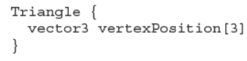
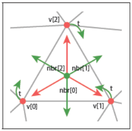

# Texture Mapping

当试图复制现实世界的外观时，人们很快就会意识到几乎没有任何表面是没有特征的。所有的材料放入现实世界后，必定会很快布满痕迹、凹痕、污渍、划痕、指纹和污垢。

在计算机图形学中，我们把这种现象称为“spatially varying”的表面属性，也就是这种表面属性因地而异，但并没有改变这个表面的真正的形状。为了实现这些效果，各种建模和渲染系统都提供了一些纹理映射的方法：使用一张图像，被称作texture map 或者 texture image。或者就只是一个texture，去存储想要在表面上实现的细节，然后使用数学的方法将图像或者纹理**映射（mapping）**到物体表面上。

事实证明，一旦将图像映射到物体表面的机制存在，纹理映射还能做远远不止创造表面细节的事情，比如创造阴影和反射、提供照明、甚至可以定义出物体的形状。在复杂的交互程序中，纹理被用来存储各种数据，这些数据甚至与图片无关!

本章讨论使用纹理来表示表面细节、阴影和反射。虽然基本思想很简单，但是一些实践性的问题会让纹理的使用复杂化。首先，纹理很容易变形，所以这种映射会很有挑战性。其次，texture映射是一个resample的过程，就像重新缩放图像一样，正如在上一章提到，resample会带来混叠的问题。纹理映射和动画的一起使用很容易会带来混叠的问题，所以大部分纹理系统之所以复杂就是为了antialiasing。

## 11.1 Looking Up Texture Values

从简单的场景开始考虑——一个木质地板。我们希望用显示木地板木纹的图像控制地板的漫反射颜色。不管是光追还是光栅化（前者需要计算光线与物体交点的颜色，后者需要计算光栅化后的片段颜色），我们都需要知道在这个shading point上纹理的颜色，将其作为漫反射颜色，以便于使用第5章提到的Lambertian渲染模型。

为了得到这个颜色，着色器执行纹理查找：它在纹理图像的坐标系统中找出与shading point对应的location，并读取图像中该点的颜色，从而得到纹理样本。不同的像素对应图像中不同的位置，从而得到不同的颜色，代码如下：

在这段代码中，着色器要求物体表面中的shadepoint能够提供坐标给texture查询，并且希望每个使用这个texture的表面都能够给出这个坐标。这带来了纹理映射的第一个关键要素：需要一个从表面映射到纹理的函数，使得我们可以很容易计算出每个像素。这被叫做纹理坐标函数（texture coordinate function）:

上图左侧部分是viewing projection的过程，是将S映射到图像上的任何一个位置（这时候还未光栅化），右侧是texture mapping的过程，是将S映射到纹理图上。

纹理坐标函数为物体表面上的每一个点都提供了纹理坐标。从数学角度，这是一个从3D域S到2D域T的映射：

集合T，通常被叫做“纹理空间”，只是一个包含纹理图像的矩形。普遍地，我们会使用单位正方形$(u,v)\in [0,1]^2$（在这本书中，我们使用$u$和$v$来表示纹理坐标）。这跟第8章提及的viewing projection（在本章被称作$\pi$过程）很相似，它将场景中的物体表面映射到了图像上的点。这两个过程都是3D to 2D的过程，也都是被渲染所需要的——一个需要知道怎么拿到纹理的值，一个需要知道怎么拿到图像像素的着色结果。但是这两个过程也有着重要的不同：$\pi$通常只包括投影变换和正交变换，而$\phi$可以有很多不同的形式；$\pi$只需要在整个场景中执行一次，而对于场景中不同的物体，可能需要执行不同的$\phi$。

有些人也许会感到惊讶，$\phi$是一个从表面到纹理图像的映射，而我们最终的目标是将纹理“贴”到物体表面上，但这就是我们需要的函数。

对于上述木制地板的情况，如果地板的z值恒定，并且长宽与xy轴都对齐，那么我们就可以简单地使用下面的mapping：
$$
u=ax;v=by,
$$
对于a、b的合适选择，可以为每个$(x,y,z)_{floor}$提供纹理坐标$(u,v)$，之后我们就可以使用纹理中位于这个位置的值，或者，**texel（texture image中的pixel）**，即最接近$(u,v)$的像素值来作为$(x,y)$处的纹理值。最终我们可以得到下图：

但是这种方式是非常有限的，比如表面需要xy轴对齐，比如物体表面并不是平面，而是曲面，该怎么办？这让我们需要找到一些更好的方法来计算表面上的纹理坐标。

从上述的最简单的纹理映射方式还会造成另外一个问题，这个问题会在下述场景被戏剧性地暴露出来：从一个瞭望的角度（类似从很低的位置瞭望地平线，grazing angle）渲染一张低分辨率的图像，但是所用到的纹理是高分辨率的图像，或者是高对比度的内容。比如下图展示的：

一个巨大的网格贴图，并且是以一种瞭望的角度。从中可以看到相当严重的混叠伪影（近处是清晰的网格，但是远处变成了波浪和闪烁），这特别像第10章resample的时候没有选择合适滤波器的结果。尽管这只是打印在书本上的一种极端情况，但是在动画中，这种情况哪怕只是出现一瞬也会严重影响观感。

现在我们看到了两个问题：

- 如何更好定义纹理坐标函数
- 如何在查询纹理时避免出现太多的混叠

这两个关注点是所有类型的纹理映射(tmap)的基础，将在11.2节和11.3节中讨论。一旦你理解了它们和它们的一些解决方案，你就理解了纹理映射。剩下的就是如何应用基本的纹理机制来实现各种不同的目的，这将在第11.4节中讨论。

## 11.2 Texture Coordinate Functions

设计一个好的纹理坐标函数$\phi$是获得良好纹理映射效果的关键要求。你可以认为这是决定如何变形一个平面，矩形图像，使它符合你想要绘制的3D表面。或者，对于物体表面，轻轻地将其压平，不让其起皱、撕裂或折叠，使其平躺在图像上。有时候，这很简单:也许3D曲面已经是一个平坦的矩形！在其他情况下，这是非常棘手的：3D形状可能非常复杂，就像角色身体的表面。

定义纹理坐标函数的问题对于计算机图形学来说并不新鲜。同样，制图师在设计覆盖地球表面的地图时也会遇到这样的问题。从曲面地球到平面地图的映射不可避免地会导致区域、角度和/或距离的失真，这很容易使地图产生误导。在过去的几个世纪里，已经提出了许多地图投影，它们都平衡了在纹理映射中面临的相同的棘手问题——在覆盖一个连续的大片区域的同时，尽量最小化各种各样的失真。

在一些应用程序中(一些例子在11.2.1节中)，使用特定的映射是有明确理由的。但在大多数情况下，设计纹理坐标映射是一项微妙的任务，需要平衡图中不同位置的失真点（有些失真是此消彼长的），熟练的建模师需要付出相当大的努力。

你可以用任何你能想到的方式定义$\phi$。但有几个彼此权衡的目标需要考虑：

- **双射性（Bijectivity）**。在大多数情况下，你希望$\phi$是双射的(参见章节2.1.1)，这样表面上的每个点映射到纹理空间中的一个不同的点。如果多个点映射到同一个纹理空间点，纹理中一个点的值将影响表面上的多个点。在您希望纹理在表面上重复的情况下(想想具有重复图案的壁纸或地毯)，有意地引入从表面点到纹理点的多对一映射是有意义的，但您不希望这种情况意外发生。
- **变形/失真尺度（Size distortion）**。纹理的尺度应该在整个表面上近似恒定。也就是说，表面上任何距离相同的紧密点都应该映射到纹理中距离相同的点。就函数$\phi$而言，$\phi$的导数的大小不宜变化太大。
- **变形/失真形状（Shape distortion）**。纹理不应该很扭曲。也就是说，在表面绘制的一个小圆应该映射到纹理空间中的一个合理的圆形，而不是一个极度压扁或拉长的形状。在$\phi$方面，$\phi$的导数在不同方向上不能相差太大。
- **连续性（Continuity）**。不应该有太多的接缝：表面上的相邻点应该映射到纹理中的相邻点。也就是说，φ应该是连续的或具有尽可能少的不连续。在大多数情况下，一些不连续是不可避免的，我们想把它们放在不显眼的位置。

通过参数方程(章节2.7.8)定义的曲面有一个固定的纹理坐标函数的选择：对定义曲面的函数求反，并使用表面的两个参数作为纹理坐标：
$$
f(p_1,p_2)=a \ point \ on \ the \ surface\\
\mapsto f^{-1}(a \ point \ on \ the \ surface)=(p_1,p_2)
$$
这些纹理坐标可能有也可能没有理想的属性，这取决于表面，但它们确实提供了映射。

但是对于隐式定义的曲面，或者只是由三角形网格定义的曲面，我们需要一些其他的方法来定义纹理坐标，而不依赖于现有的参数化。广义上讲，定义纹理坐标的两种方法是从几何上计算它们，从表面点的空间坐标，或者对于网格表面，在顶点存储纹理的值，并在整个表面上进行插值。让我们一个一个地看看这些选项。

### 11.2.1  Geometrically Determined Coordinates

几何确定的纹理坐标用于简单的形状或特殊情况，作为快速解决方案，或作为设计手工调整纹理坐标贴图的起点。我们将通过以下测试图像映射到物体表面来说明各种纹理坐标函数。图像中的数字可以让你从渲染的图像中读出近似的（u, v）坐标，而网格可以让你看到映射的失真程度：

**平面投影（Planar Projection）**

很可能，从3D到2D的最简单映射是平行投影，与用于正交视图的映射相同。我们已经推导的用于视图的机制（第8.1节）可以直接用于定义几何坐标：正如正交视图归结为乘以矩阵并丢弃z分量一样，通过平面投影生成纹理坐标可以通过简单的矩阵乘法来完成：

其中纹理矩阵$M_t$表示仿射变换，星号表示我们不关心第三坐标中的结果。这对于大多数平坦的表面非常有效，表面法线没有太大的变化，并且通过取平均法线可以找到良好的投影方向。对于一个封闭图形来说，这种平面投影并不是单射的：前面和后面的点将映射到纹理空间中的同一点。

可以看到，与投影平面相切的物体表面会发生极度扭曲，因为它们都被投影到纹理中非常相近的位置。通过简单地用透视投影代替正交投影，我们得到了投影纹理坐标：

现在4×4矩阵$P_t$表示投影（不一定是仿射）变换，即最后一行可能不是$[0，0，0，1]$。

投影纹理坐标在阴影映射技术（shadow mapping）中非常重要，如第11.4.4节所述。

**球形坐标（Spherical Coordinates）**

对于球体，纬度/经度参数化是熟悉且广泛使用的。它在极点附近会发生很多变形，这可能会导致困难，但它确实覆盖了球体，仅仅在一条纬度线上展现了不连续性。

形状大致为球形的曲面可以使用径向投影（radial projection）将曲面上的点映射到球体上的点：从球体中心穿过曲面上的一条线，然后找到与球体的交点。该交点的球面坐标就是曲面这个shading point的纹理坐标。

上述方法的另一种表示方式是，用球面坐标（ρ，θ，φ）表示表面点，然后丢弃ρ坐标，将θ和φ映射到范围[0，1]。该公式取决于球坐标计算的惯例；使用第2.7.8节的惯例：

如果从中心点可以看到整个表面，则球坐标图在除极点以外的任何地方都是双射的（不是极点的地方都对应着一个截切圆，而极点处对应的是点）。它在两极附近继承了与球体上的经纬度图相同的失真。下图显示了一个对象，球坐标为其提供了合适的纹理坐标函数：

对于上图模糊的球状物体，将每个点投影到以物体中心点为中心的球体上提供了单射映射，此处用于放置与地球图像相同的地图纹理。请注意，表面远离中心的区域会放大（表面点在纹理空间中挤在一起），而表面离中心较近的区域会缩小。（放大和缩小的比例由球坐标对应半径和点到物体中心距离的比例决定）。

**圆柱坐标（Cylindrical Coordinates）**

对于比较柱状的物体，将物体表面投影到圆柱上比球状更好：

上图的左边采用的是球状投影，可以看到出现了大量的失真（中心小两端大），而右边的圆柱形投影在外表面产生了非常好的效果。类似于球面投影，这相当于转换为圆柱坐标并丢弃半径：

圆柱坐标系是$(\rho,\theta,z)$，其中$\rho$是点M距离z轴的垂直距离，$\theta$是OM在x-y平面的投影与x轴正方向的夹角，$z$就是xyz坐标系中的z。xyz坐标系与圆柱坐标系之间的关系是：
$$
x=\rho cos\theta,\\
y=\rho sin\theta,\\
z=z.
$$
**立方体贴图（Cubemaps）**

使用球坐标来参数化球形或类球形形状会导致形状和极点附近区域的高度失真，这通常会导致可见的伪影，表明物体表面会有两个特殊点纹理出现问题。一种流行的替代方案更加统一失真比较少，但是代价是具有更多不连续性。这个想法是将物体表面投射到一个立方体上，而不是一个球体上，然后为立方体的六个面使用六个独立的正方形纹理。这六个面的纹理集合被称作立方体贴图，这会在所有的立方体边缘引入不连续性，但是它可以带来较低的形状和面积的失真。

计算Cubemaps纹理坐标比球面坐标更容易，因为投影到平面只需要一个除法——本质上与透视投影相同。比如对于投影到立方体+z面上的点：
$$
(x,y,z)\mapsto(\frac{x}{z},\frac{y}{z}).
$$
可以用等比的知识去理解，+z面上的z值是1，所以$(x,y,z)$对应着$(u,v,1)$。

Cubemaps的一大难点是如何在六个面上定义u-v的方向，任何定义都可以，但选择的定义会影响纹理的质量，因此标准化很重要。因为Cubemaps经常被用在从内部往外观察的场景中（比如11.4.5的环境贴图），所以通常的定义会指定u-v轴的朝向，从而在里面往外观察，每个面的u都在v的顺时针方向。OpenGL的定义是：

公式的下标代表着投影所对应的面。比如$\phi_{-x}$代表将点投影到x=1的面**（为什么不是x=-1?）** **（上面公式里的坐标符号也不能完全对上）**。可以通过坐标里最大的绝对值来判断应该把点投影到哪个面：比如$|x|$比$|y|$和$|z|$大，那么点就将被投影到+x或者-x面，进而如果x是正值，那么就是+x面，反之-x面，正如上图左图所示。

使用Cubemaps的纹理拥有六个正方形，它们通常是打包在一张图像中，就像立方体被打开了一样。

### 11.2.2 Interpolated Texture Coordinates

为了对三角形网格表面的纹理坐标函数进行更细粒度的控制，我们可以显式地存储每个顶点的纹理坐标，并使用重心插值在三角形上对它们进行插值(9.1.2节)。其他同样的属性（只要在三角上平滑变化）也可以这样操作，例如颜色、法线，甚至3D位置本身。

看只有一个三角形的例子：

从左图可以看到，三个顶点的位置是$(0.2,0.2)、(0.8、0.4)、(0.4,0.8)$。正如上一节中几何确定的映射一样，我们通过提供从表面到纹理域的映射来控制纹理在曲面上的位置，而在这一节我们只需要确定顶点到纹理域的映射。一旦确定了顶点的映射，剩下的部分就由重心坐标插值来完成。

下图展示了在整个网格上可视化纹理坐标：

可以看到，就是先确定顶点在纹理图像中的位置，然后简单地画出三角形就行了。这种可视化让我们看到纹理的哪部分对应于哪个三角形，这让我们很容易进行纹理坐标的评估和纹理映射代码的调试。

由顶点坐标定义的纹理坐标映射的质量取决于分配给顶点的坐标——也就是说，网格是如何在纹理空间中布局的。无论分配什么坐标，只要网格中的三角形顶点是共享的（12.1节），纹理坐标映射总是连续的，因为相邻的三角形在他们共享边的点上的纹理坐标是一致的。单射性保证了三角形在纹理空间中不会重叠——如果重叠，就代表一个在纹理空间中的点会出现在物体表面的多个地方。

当纹理空间中三角形的面积与其在3D中的面积成比例时，尺寸失真比较低。比如用连续的纹理映射函数表示一个人物的脸，通常会将鼻子压缩至纹理空间中一个相对较小的区域：

虽然在3D空间中，鼻子上的三角形比脸颊上的小，但是在纹理空间中，尺度的比例更加极端（鼻子附近的纹理坐标顶点更小更密集），这在一定程度上扩大了鼻子的纹理，因为纹理上的一小部分区域，因为纹理坐标的密集，会占据物体表面的更大区域。同样的，比较前额和太阳穴，两者的三角形在3D区域中大小相似，但是太阳穴附近的三角形在纹理空间中更大，导致了太阳穴的纹理在3D中看起来更小。

同样的，当三角形的形状在3D和纹理空间中相似时，纹理的形状失真也会比较小。上面人脸的例子已经实现了相当低的失真，但是11.5中的球体在极点附近就有非常大的形状畸变：

### 11.2.3 Tiling,Wrapping Modes,and Texture Transformations

允许纹理坐标超出纹理图像的范围通常是有用的。有时候，这恰巧是一个计算上的细节：对于一个本来精确落在纹理图像边界上的点，由于计算的舍入误差，这个点可能会落在图像稍外一点点。纹理坐标的映射机制必须保证这种情况不会发生取值的失败。

如果一个纹理只覆盖到表面的一部分，但是纹理坐标被设置成将整个表面映射到单位正方形，那么这时会有两个选项：（1）准备一个大部分是空白的纹理图像，内容只在其中的一个小区域。这需要一个超高分辨率的图像来获得相关区域的足够细节。（2）缩放所有纹理坐标，让他们覆盖更大的范围——比如$[-4.5,5.5]\times[-4.5,5.5]$，这时候单位正方形就位于这个更大范围的中心，同时大小是这个范围的1/10。有内容的区域这时同样被放大，位于单位正方形内，这时候对图像分辨率的要求就降低了。

对于上述第二种选项，当纹理查找位于单位正方形外，又位于纹理图像（就是上述的更大范围）内时，应该返回一个恒定的背景色。实现这一点的一种方法是设置一个背景色，当纹理查找在上述的范围内时，直接返回该背景色；如果纹理图像已经自带恒定的背景色（比如白色背景上的logo），则在扩展的纹理上自动计算背景色的方法是——返回距离该点最近的边缘点的纹理图像的颜色，这通常是对u-v坐标值进行clamp获得的。

有时，我们需要重复的图案，例如棋盘、瓷砖地板或砖墙。如果图案在矩形网格上重复，则创建具有相同数据的多个副本的图像将是浪费的。相反，当查找点离开纹理图像的右边缘时，我们可以使用环绕索引处理纹理图像外部的纹理查找，它环绕到左边缘。这是非常简单地使用像素坐标上的整数余数操作来处理的：

这两种处理越界查找的方式之间的选择是通过从列表中选择一种环绕模式来指定的，该列表包括tiling、clamping以及两者的组合或变体。有了环绕模式，我们可以自由地将纹理想象成一个函数，它返回无限二维平面中任何点的颜色：

当我们指定一个图像作为纹理时，环绕模式可以让我们知道如何利用这张有限的图像去定义上述的函数。在 11.5 节中，我们将看到程序纹理（procedural texture）可以自然地延伸到无限平面，因为它们不受有限图像数据的限制。由于两者在逻辑上都是无限的，因此这两种类型的纹理可以互换。

当调整纹理的比例和位置时，并不需要实际改变生成纹理坐标的函数，也不需要改变存储在网格顶点的纹理坐标值，只需要在纹理取值前对纹理坐标进行矩阵变换：

$\phi_{model}(x)$是纹理坐标函数。$M_T$是使用齐次坐标的3*3仿射或者投影矩阵，针对的是2D纹理坐标。这种变换有时候被限制在缩放/旋转两种，被使用纹理映射的大部分渲染器所支持。

### 11.2.4 Continuity and Seams

尽管低失真和连续性是纹理坐标函数中非常好的属性，但是不连续有时候在所难免。对于任何3D闭合曲面，拓扑学的一个基本结果是不存在一种双射函数将整个3D曲面映射到2D纹理图像中。所以我们必须引入接缝（seams）——在物体表面上的一条曲线，该曲线左右两侧的纹理坐标值会发生不连续的改变（跳变）。在除了接缝的地方，我们可以保证纹理映射的低失真。上面讨论的许多几何确定的纹理映射都包含了接缝：在球形和柱形坐标中，接缝是由atan2计算的角度从$-\pi$到$\pi$的地方；在cubemaps中，接缝就在立方体的边缘，在那里纹理映射会转换成不同面的uv坐标。

对于插值纹理坐标，接缝需要特别考虑，因为它不是自然发生的。我们之前观察到，在顶点共享的网格中，插值纹理坐标一定是连续的。但这意味这如果一个三角形跨越了一条接缝，其中一些顶点在一边，另一些顶点在另一边，插值机制会很愉快地提供一个连续的映射，但它可能会高度扭曲或者折叠，这使得其不是“注入式”的（不是单射）。下图在球面坐标映射的球体上说明了这个问题：

在地球底部有一个三角形，它的一个顶点位于新西兰南岛的顶端，另一个顶点在北岛东北约400公里的太平洋上。一个明智的飞行员会在这些点之间飞行会飞越新西兰，但是路径从东经167度开始，到西经179度结束，所以线性插值选择了一条途中穿越南美洲的路线。这会导致纹理被压缩成跨越180经线的三角形带。解决方案是用等价的东经181度来标记第二个顶点（这是一个虚拟的点），但这只会把问题推给下一个三角形。（下一个三角形仍要跨越经线）

**要想在接缝附近创建一个干净的过渡过程，就要避免在接缝处共享纹理坐标。**穿过新西兰的三角形需要插值到经度181，而太平洋的下一个三角形需要从经度-179开始。为了做到这一点，我们复制接缝处的顶点：对于每个顶点，我们添加第二个具有等效经度的顶点（只不过相差360度，比如经度180的对面是经度-179，-179+360=181还是同一个点，但是这时不再跨越整张地图），并且接缝对面不使用相同的顶点。这个解决方法如上图的右半边所示，其中纹理空间最左边和最右边的顶点是重复的，具有相同的3D位置。

### 11.2.5 Texture coordinates in rendering systems

纹理用于各种渲染系统，虽然基本原理相同，但光线追踪和光栅化系统的细节不同。

纹理坐标是正在渲染的模型的一部分，场景描述需要包含足够的信息来定义它们是什么。大多数情况下，这意味着将纹理坐标存储为将与纹理一起使用的所有三角形网格的逐顶点属性。如果渲染系统直接支持网格以外的几何图元，这些图元通常具有预定义的纹理坐标（例如，球体上的纬度-经度坐标），可能为每个图元类型选择映射方案。

在光线追踪渲染器中，支持光线相交的每种表面类型不仅必须能够计算交点和表面法线，还必须能够计算交点的纹理坐标。与有关相交的其他信息一样，纹理坐标可以存储在命中记录（hit record）中（参见第 4.4.3 节）。在三角形网格表示的几何体的常见情况下，光线-三角形相交代码将通过重心插值从存储在顶点处的纹理坐标计算纹理坐标，对于其他类型的几何体，相交代码必须要直接地计算出纹理坐标。

在基于光栅化的系统中，三角形通常是唯一受支持的几何类型，因此所有表面都必须转换为这种形式。纹理坐标可以与模型一起读入（常见情况），或者对于在代码中生成的三角形网格，可以在创建网格时计算和存储它们。或者，对于可以从其他顶点数据计算的纹理坐标（例如，纹理坐标是从 3D 位置计算的），纹理坐标也可以在顶点着色器中计算并传递给光栅化器。纹理坐标然后由光栅化器进行插值，这样片段着色器的每次调用都有适合其片段的纹理坐标。

## 11.3 Antialiasing Texture Lookups

纹理映射的第二个基本问题是抗锯齿。纹理映射图像是一个采样过程：将纹理映射到表面上，然后将表面投影到图像中，在图像平面上产生一个二维函数，我们以像素为单位对其进行采样。就如第10章所提，当图像包含细节或者锐边时，使用点采样会产生混叠伪影——而纹理的重点是为了引入细节，所以它们成为了我们在下图看到的混叠问题的主要根源：

正如直线或三角形的抗锯齿光栅化（第 9.3 节）、抗锯齿光线追踪或下采样图像（第 10.4 节）一样，解决方案是使每个像素不再是对某个点的采样，而是图像的区域平均值，这个区域的大小与像素相似。

使用supersampling（正如在光栅化或者光线追踪里使用的那些技术），拥有足够多的样本，就能在不改变纹理贴图机制的前提下获得出色的结果：一个像素区域内的许多样本，会对应到纹理图像的不同位置，而最终这个像素区域的颜色就是这些不同位置查询到的纹理值的平均，这就符合了上述所说的观点。

但是对于一个拥有许多细节的纹理，就需要非常多的采样，这通常是很慢的。在表面存在纹理的情况下如何有效地计算该区域平均值是纹理抗锯齿的第一个关键主题。

纹理图像通常也是一个被光栅化的图像（同样拥有像素），因此还需要考虑重建问题，就如上采样图像一样。对于纹理而言，解决办法跟10.4节是类似的，就是使用重建滤波器在texel（区别于正常图像的pixel）之间进行插值。

我们将在以下部分详细介绍这些主题中的每一个：

### 11.3.1 The Footprint of a pixel

使得纹理的抗锯齿与其他类型的抗锯齿更复杂的是，渲染图像与纹理之间的关系是不断变化的。每个像素值都应该计算为自己像素区域的平均颜色，如果这个像素区域恰好位于同一个表面内，就对应于表面上区域的平均。如果表面颜色来自纹理，这就反过来相当于对纹理的对应区域进行平均，称为像素的纹理空间覆盖区（texture space footprint）。下图说明了正方形区域（可能是低分辨率图像中的像素区域）的覆盖区如何映射到地板纹理空间中大小和形状截然不同的区域：

回想一下涉及纹理渲染的三个空间：将3D映射到2D图像的映射$\pi$、将3D映射到2D纹理图像的映射$\phi$。要找到图像像素在纹理空间的覆盖区，就需要知道这两种映射的使用过程：（1）使用$\pi$的逆变换从图像到达3D物体表面。（2）从3D物体表面使用$\phi$到达纹理空间。这组成$\psi=\phi\pi^{-1}$，决定了像素区域在纹理空间的覆盖区。

纹理抗锯齿的核心问题是如何计算覆盖区的平均值。想要解决任何情况的平均计算问题是一个很复杂的工作：对于一个拥有复杂平面形状的远处物体，其像素区域在纹理空间的覆盖区可能是一个复杂形状的大区域，或者干脆被分为了不连通的几个单独区域。但是在典型情况中，一个像素区域一般会落在较为平滑的物体表面上，这时其在纹理空间的覆盖区也会是一个单独的区域。

因为$\psi$是两种映射的组合，所以覆盖区的大小和形状受视角情况和纹理坐标函数的影响。当表面靠近摄影机时，像素的覆盖区就会比较小；当表面拉远后，覆盖区就会变大。当以一个比较倾斜的角度观察表面时，像素在物体表面的覆盖区就会拉长，这意味着其在纹理空间的覆盖区也会被拉长。即使是一个固定的视角，纹理坐标函数也会造成覆盖区的变化：如果它扭曲了区域，覆盖区的大小也会变化；如果它扭曲了形状，即使是在一个正面的表面视图，覆盖区也会被拉长。

然而，为了找到抗锯齿纹理查找的有效算法，将需要一些实质性的近似。如果一个函数是光滑的，那么线性逼近通常是有用的。在纹理抗锯齿的情况下，这意味着从图像空间到纹理空间的映射$\psi$可以被近似为2D到2D线性映射：
$$
\psi(x)=\psi(x_0)+J(x-x_0),
$$
其中$J$是2x2的矩阵，代表$\psi$的导数的近似。这个矩阵一共有四个元素，如果我们将图像空间的位置表示为$\bold x=(x,y)$，将纹理空间的位置表示为$\bold u=(u,v)$，那么：

矩阵元素中的这四个导数描述了当我们改变$x、y$时，$(x,y)$处的纹理坐标$(u,v)$是如何变化的。

这种近似的几何解释是：

图中以$\bold x$为中心的单位大小正方形像素区域将近似映射到纹理空间中的平行四边形，以$\psi(\bold x)$为中心，其边缘平行于向量$\bold u_x=(du/dx,dv/dx)$和$\bold u_y=(du/dy,dv/dy)$。图中的蓝线就代表当x或者y变化时，其纹理坐标的相应变化。黑色框线代表像素区域覆盖区和对应的纹理空间覆盖区，而灰色代表了一种近似。

导数矩阵$J$很有用，因为它告诉了我们在（近似的）纹理空间内，覆盖区在整个图像中变化的完整情况。导数的值越大表示纹理空间的覆盖区越大，导数向量$\bold u_x$和$\bold u_y$的关系决定了覆盖区的形状。当它们是正交并且长度相等时，覆盖区是正方形的；当它们彼此倾斜或者在长度上非常不同时，覆盖区会被拉长。

这里使用了box filter对图像进行采样，一些系统采用了高斯像素滤波器，这在纹理空间中会形成椭圆高斯。这就是椭圆加权平均（elliptical weighted averaging，EWA）。

我们现在已经达到了通常被认为是"正确答案"的问题形式：**在特定图像区域的滤波纹理采样值应该是在纹理空间对应的平行四边形覆盖区的平均值，该平行四边形覆盖区由该点的纹理坐标对图像坐标的偏导定义。**上述的这种定义需要一些前提假设——比如从图像到纹理的映射应该是平滑的。虽说这是一种近似，也需要一定的前提假设，但是这种方法对于优秀的图像质量来说已经足够准确。然而，计算纹理空间的平行四边形覆盖区平均值太昂贵，无法进行精确计算，所以我们仍然需要用到更多的近似。纹理抗锯齿的方法在近似查找的速度/质量上有所不同，我们将在下面几节中讨论这个问题：

### 11.3.2 Reconstruction

当覆盖区面积小于texel时，我们将”放大“纹理，因为我们最终要在这个小面积里面取到值。这种情况类似于对图像进行上采样，需要考虑的问题是如何在texel之间插值，使得产生一张平滑的图像，texel的网格不会那么明显。就像图像上采样一样，这个平滑的过程由重建滤波器定义，用于计算在纹理空间里任何位置的纹理值：

覆盖区的大小不同，所面临的问题也会不同。对于小面积（左边），需要在像素之间插值以避免块状的伪影；对于大面积（右边），挑战是高效地找到区域内像素的平均值。

对于小面积的插值，考虑因素与图像重采样几乎相同，但有一个重要的区别。在图像重采样中，任务是在规则网络上计算输出样本，而这种规则在可分离重建滤波器的情况下实现了重要的优化。在纹理滤波中，查找的模式是不规则的，所以需要单独计算样本。这意味着大型的、高质量的重建滤波器使用起来的代价是很大的，因此，通常用于纹理的最高质量滤波器就是双线性插值。

双线性插值的计算跟图像中的双线性插值是一样的。首先我们用texel表示纹理空间的样本点，然后我们读取四个相邻的texel并对它们进行平均。纹理通常会被限制在$[0,1]$的正方形内，texel的定位方式与任何图像的pixel相同：在$u$方向上间隔$1/n_u$，在$v$方向上间隔$1/n_v$。texel的原点$(0,0)$位于从边缘向内半个texel，从而实现对称。（完整解释见第10章）

在许多系统中，此操作成为一个重要的性能瓶颈，主要是因为从纹理数据中获取四个纹素值所涉及的内存延迟。纹理样本点的模式是不规则的，因为从图像到纹理空间的映射是任意的，但通常是连贯的，因为互相靠近的图像采样倾向于映射到可能读取相同纹素的相互靠近的纹理采样。出于这个原因，高性能系统具有专门用于纹理采样的特殊硬件，用于处理插值和管理最近使用的纹理数据的缓存，以最大限度地减少从存储纹理数据的内存中获取慢速数据的次数。

有可能会抱怨线性插值对于某些要求苛刻的应用程序可能不够平滑。但是，始终可以通过使用更好的滤波器将纹理重新采样到更高的分辨率来使其足够好，这样纹理就足够平滑，这种情况下双线性插值效果就会很好。

### 11.3.3 Mipmapping

插值工作只适用于覆盖区相较于纹理元素间距很小的情况。当覆盖区覆盖了很多texel，为了保证抗锯齿的效果，就要计算这些texel的平均值，从而平滑信号，保证采样不会出现伪影。

计算平均值的一种非常准确的方法是找到覆盖区内所有texel并将它们相加。然鹅，当占用空间很大时，所付出的代价可能会非常大——可能读取数千个texel才能进行一次查找。更好的方法是预先计算和存储不同大小和位置的各个区域的纹理平均值。

这个方法有着非常著名的名字——Mipmapping。mipmap是一系列纹理，它们都包含相同的图像，但分辨率越来越低。原始的全分辨率纹理图像称为 mipmap 的基础级别或级别 0，级别 1 是在该图像每个维度上按因子 2 进行下采样生成的，所以产生的图像大小是级别0的1/4。粗略地说，该图像中的纹素是 0 级图像中大小为 2 x 2 纹素的方形区域的平均值。

这个过程可以继续定义任意多的 mipmap 层级：层级$k$的图像是通过将层级$k-1$的图像下采样2倍来得到的。级别$k$的纹素对应于原始纹理中$2^k\times 2^k$纹素的正方形区域。例如，从一张 $1024×1024$ 的纹理图像开始，我们可以生成一个有 11 个级别的 mipmap：级别 0 是$1024 × 1024$；第 1 级是 $512 × 512$，依此类推直到第 10 级，它只有一个纹素。这种结构以一系列越来越低的采样率表示相同内容的图像被称为图像金字塔，基于将所有较小的图像堆叠在原始图像之上的视觉隐喻。

### 11.3.4 Basic Texture Filtering with Mipmaps

使用mipmap，纹理滤波（求平均）可以更有效率地完成。当我们需要在大面积上平均纹理值时，我们只需使用来自 mipmap 更高级别的值，这些值已经是图像大面积上的平均值。最简单和最快的方法是从 mipmap 中查找单个值，选择级别，以便该级别的texel覆盖的大小与像素区域对应的纹理覆盖区的整体大小大致相同。当然，纹理覆盖区的形状可能与texel表示的（始终为正方形）区域有很大不同，所以在这个地方估计会产生一些伪影。（从平行四边形到正方形，又一次近似）（不一定是正方形，也可以是长方形，比如长宽的缩放因子不相同）

暂时不管当纹理覆盖区具有细长形状时该怎么做的问题，假设覆盖区是一个宽度为D的正方形，D这个测量值来自完全分辨率（级别0）的纹理图像。什么级别的 mipmap 适合采样？由于第 k 层的texel覆盖宽度为 $2^k$ 的正方形，因此选择这样的 k 似乎是合适的：
$$
2^k\approx D
$$
所以我们让$k=log_2D$。当然，这可能使得k不是整数，但是我们存储的都是整数级别的mipmap图像。对于这种情况，有两种解决方案：（1）找到离k最近的整数，作为要查询的级别。（这个方法很快，但是在两个级别正中间左右会对应到两个不同级别的mipmap图像，从而产生接缝）（2）找到离k最近的两个整数，这两个整数级别分别查询纹理值，最终的结果是在这两个纹理值之间进行插值。（需要做两次查询，但是结果会更加平滑）。

在我们写出利用mipmap做采样的算法之前，我们需要决定D的值，当覆盖区实际上不是正方形时。一些可能的方法是使用覆盖区面积的平方根，或者使用最长的轴作为D的值。一个易于计算的实用折衷方案是使用最长边的长度：
$$
D=max\{||u_x||,||u_y||\}.
$$

这里其实可以看出u、v都是$[0,1]$范围的好处，对于不同大小的mipmap图像，uv都可以映射到图像中的某四个像素（双线性插值），从而取到纹理值。

基本 mipmap 可以很好地消除锯齿，但由于它无法处理拉长或各向异性的覆盖区，因此在以掠射角查看表面时效果不佳。这在代表观察者所站立的表面的大平面上最常见。地板上距离很远的点会以非常陡峭的角度进行观察，从而导致非常各向异性的足迹，mipmapping 近似于更大的方形区域。生成的图像在水平方向上会显得模糊。

### 11.3.5 Anisotropic Filtering

mipmap可以通过多次查询，更好地估计被拉长的覆盖区的平均值。思想就是通过选择较短的轴作为选择mipmap层级的基础，而不是较长的轴，然后将沿着较长轴的多次查询结果平均起来作为最终的结果。

上图使用了三种不同的策略对测试场景进行了纹理采样。点采样直接使用了纹理坐标的最近邻插值；使用mipmap的双线性插值会求每个像素区域在纹理空间里的正方形区域的平均值，从而导致较为模糊的结果；使用mipmap在沿较长轴多次查询的平均可以更好地贴近各向异性（被拉长）覆盖区的面积区域，从而带来更为清晰的结果。

对于”沿着较长轴多次查询“的个人理解：

（1）假设较长轴为$\bold{u}_x$，较短轴$\bold{u}_y$。

（2）获得覆盖区的纵横比$\alpha=||\bold{u}_x||/||\bold{u}_y||$，并对$\alpha$下取整。

（3）求覆盖区在短轴上的边缘$p=\psi(x)-\frac{1}{2}\bold{u}_x$。

（4）从p开始对覆盖区进行$\alpha$等分，求出每个等分区域的中心纹理坐标：$p+\frac{1}{2\alpha}\bold{u}_x$、$p+\frac{3}{2\alpha}\bold{u}_x$、......、$p+\frac{2\alpha-1}{2\alpha}\bold{u}_x$。

（5）对上述纹理坐标在mipmap中求得纹理值（$\bold{u}_y$确定$k_0、k_1$，三线性插值），并求平均。

## 11.4 Applications of Texture Mapping

一旦了解了为一个表面定义纹理坐标的思想和查找纹理值的机制，这个机制就很有用途。本节将介绍纹理映射中最重要的技术，但是纹理（texture）实际上是非常通用的工具，只有你想不到，没有它做不到。

### 11.4.1 Controlling Shading Parameters

纹理映射的一个最基础的用途就是为表面带来颜色的变化——从纹理中取值来控制着色计算中漫反射的颜色，无论是在光栅化还是光线追踪的程序里。纹理漫反射组件可用于黏贴粘花、油漆装饰或在表面上打印文本，它还可以模拟材料颜色的变化，例如木材或石头。

不过，不仅仅是漫反射颜色，镜面反射率、镜面粗糙度，也可以被纹理化，被赋予到物体表面的属性中。例如，一个粘有透明包装胶带的纸板箱可能到处都有相同的漫反射颜色，但在胶带所在的地方比其他地方更亮，具有更高的镜面反射率和更低的粗糙度。在许多情况下，不同参数的映射是相关的：例如，一个有光泽的白色陶瓷杯子上印着一个标志，打印的地方可能既粗糙又暗；一本用金属墨水印刷标题的书可能会同时改变漫反射颜色、镜面反射颜色和粗糙度。

### 11.4.2 Normal Maps and Bump Maps

另一个对着色很重要的量是表面法线。使用插值法线（第 9.2 节），我们知道着色法线不必与底层表面的几何法线相同。Normal mapping（法线贴图），正是利用了上述的事实，让每个着色点的法线取自一张texure map，而不必再去插值或者计算。最简单的方法是将法线存储在纹理中，在每个被解释的texel中存储三个数字，作为法向量的 3D 坐标，而不是作为颜色的三个分量。

但是，在使用法线贴图之前，我们需要知道从贴图读取的法线应该在哪个坐标系中表示。存储在贴图中的法线直接被定义为与物体表面使用相同的坐标系，是最简单的方式。这样取得的法线，就可以直接在世界坐标空间中进行光照计算。

然而，这意味着法线贴图必须要时刻跟踪物体表面的情况。如果表面发生变形，从而几何法线发生变化，那么原有的法线贴图将不再可用——因为贴图仍然会提供变化前的法线值。

解决方案是为附加到表面的法线定义一个相对坐标系，这样的坐标系可以基于表面的切线空间来定义（参见第 2.7 节）：选择一对切向量并使用它们定义正交基（第 2.4.5 节）。这样无论模型表面如何变化，原有的法线贴图仍然可用。纹理坐标函数提供了一种选择一对切线向量的有用方法：**使用与u固定的线相切的方向和v固定的线相切的方向。**这两个方向通常不是正交的，但是可以通过它们构建出正交基（2.4.7节）。这个正交基还可以通过表面法线和一个切向量来定义。

当使用相对坐标系表示法线后，它们的变化就会小得多：由于它们主要都是指向几何法线附近，因此它们将靠近法线贴图中的矢量$(0,0,1)^T$。

法线贴图从何而来？它们通常是根据更详细的模型计算得出的，光滑表面是该模型的近似值；其他时候，它们可以直接从真实表面测量。它们也可以作为建模过程的一部分进行创作：在这种情况下，最好使用bump map（凹凸贴图）间接指定法线。这个想法是凹凸贴图是一个高度场：一个函数，它给出了光滑表面上方详细表面的局部高度。在值高的地方（地图看起来很亮，如果将其显示为图像），表面突出到光滑表面之外；在值较低的地方（地图看起来很暗的地方），表面在其下方陷落。例如，凹凸贴图中的一条窄黑线是一个划痕，或者一个小白点是一个凹凸。[凹凸贴图、法线贴图、切线空间、TBN矩阵讲解 - 知乎 (zhihu.com)](https://zhuanlan.zhihu.com/p/412555049)

从凹凸贴图导出法线贴图很简单：法线贴图（在切线框架中表示）是凹凸贴图的导数：
$$
normal = \frac{<H_g-H_r,H_g-H_a,1>}{\sqrt{(H_g-H_r)^2+(H_g-H_a)^2+1}}
$$
其中$H_g$是凹凸贴图中给定texel的高度，$H_a$是给定texel正上方texel的高度，$H_r$是给定texel正右方texel的高度。

下图显示纹理贴图用于创建木纹颜色并模拟由于饰面浸入木材更多孔部分而增加的表面粗糙度，以及用于创建不完美饰面和木板之间间隙的凹凸贴图，以制作逼真的木材地面：

使用纹理贴图的木质地板控制着色的过程：（a）根据第一个纹理贴图，只有漫反射颜色。（b）根据第二个纹理贴图，控制镜面粗糙度。（c）根据第三个凹凸贴图，控制表面法线。

### 11.4.3  Displacement Maps

法线贴图的一个问题是它们实际上根本不改变表面；它们只是一种着色技巧。当法线贴图隐含的几何体在 3D 中产生明显的效果时，这一点就变得很明显了。在静止图像中，第一个要注意的问题通常是尽管内部出现凹凸不平，但物体的轮廓仍保持平滑（比如光照阴影仍然是平滑的）。在动画中，视差的缺乏暴露出颠簸，无论多么令人信服，实际上只是“画”在表面上。

纹理不仅可以用于着色，还可以用于改变几何形状。置换贴图是这个想法的最简单版本之一。这个概念与凹凸贴图相同：标量（单通道）贴图，给出“平均地形”上的局部高度。但效果不同。置换贴图实际上改变了表面，将每个点沿着光滑表面的法线移动到新位置，而不是在使用平滑几何体时从高度贴图导出着色法线。每种情况下的法线大致相同，但表面不同。

实现置换贴图最常见的方法是用大量小三角形细分光滑表面，然后使用置换贴图置换生成的网格的顶点。在图形管道中，这可以在顶点阶段使用纹理查找来完成，这对于地形特别方便。

### 11.4.4 Shadow Maps

阴影是场景中对象关系的重要线索，正如我们所见，它们在光线追踪技术中会自然地生成。然而，如何在光栅化渲染中获得阴影并不是显而易见的事，因为每个表面只会渲染一次，并且是相互独立的。阴影贴图是一种使用纹理映射机制从点光源获取阴影的技术。

阴影贴图的想法是表示由点光源照亮的空间体积。将光源想象成聚光灯或视频投影仪，它们从一个点向有限范围的方向发射光。被照亮的体积——如果你把它拿在手上，你会在手上看到光的一组点——是沿着离开该点的每条光线将光源连接到最近的表面点的线段的并集。

**有趣的是，这个体积与位于与光源相同点的透视相机可见的体积相同：当且仅当从光源位置可见时，一个点才被光源照亮。**对于这两种情况，我们都需要对场景中点的可见性进行评估：（1）对于观察者来说，我要知道这个片段对于相机而言是否可见，这决定了我要不要把它画在屏幕上。（2）对于光照阴影而言，我要知道这个片段对于光源来说是否可见（把光源也当成相机），这决定了它是否被这个光源照亮了：

对于这两种情况，解决方案是一样的：深度图（depth map）告诉我们沿一束射线距离最近的表面位置。在相机可见性的情况下，这就是z-buffer；在光照阴影的情况下，这就是shadow map。在这两种情况下，可见性都是通过将新片段的深度与已经存储的深度进行比较来评估的，如果其深度大于最近可见表面的深度，则该表面将被遮挡，或者存在阴影。不同的是，z-buffer用于跟踪每一帧看到的最近的表面，是会随相机运动而变化的，故每一帧渲染都要刷新；而shadow map则是告诉整个场景中最近的表面的距离，不会随每一帧渲染而变化（除非光源也在不断移动）。

shadow map是提前在单独的渲染通道中计算的：像往常一样光栅化整个场景，并保留结果的深度图（不需要费心计算像素值）。然后，有了shadow map，就可以执行一个简单的渲染过程：当你需要知道一个片段是否能被光源照亮时，只需要在shadow map投影中找到它的位置（片段位置->3D位置->shadow map位置），并将查找值$d_{map}$与实际距离$d$（距离光源的距离）进行比较。如果距离相同，则片段的点被照亮；如果 $d\gt d_{map}$，这意味着有一个不同的表面更靠近光源，所以它被遮蔽了。

“如果距离相同”这个短语应该在您的脑海中引起一些危险信号：由于所有涉及的数量都是精度有限的近似值，我们不能期望它们完全相同。对于可见点，$d ≈ dmap$ 但有时 d 会大一点，有时小一点。出于这个原因，需要一个公差：如果 $d − dmap < \epsilon$ ，则认为点被照亮。这种容差$\epsilon$被称为阴影偏差（最大阈值）。

在shadow map中查找时，在shadow map中记录的深度值之间进行插值没有多大意义。这可能会导致平滑区域中的深度更准确（需要更少的$\epsilon$），但会在阴影边界附近导致更大的问题，深度值会突然发生变化。因此，shadow map中的纹理查找是使用最近邻重建来完成的（最近邻取整）。为了减少混叠，可以使用更加密集的采样，或者使用一个区域范围的1-0比较结果（比如$d − dmap < \epsilon$就是1，$d − dmap > \epsilon$就是0）的平均来代表该点的一个可见程度（不再是非0即1，非遮蔽即照亮的关系，而是一个逐渐被照亮的过程），这个方法也被叫做**percentage closer filtering（PCF）**。[GAMES202-03 Real-Time Shadows 1 (Shadow Mapping, PCF & PCSS) - 知乎 (zhihu.com)](https://zhuanlan.zhihu.com/p/361417128)

### 11.4.5 Environment Maps

正如纹理可以方便地将细节引入表面着色而不需要对模型本身增添更多的细节，纹理还可以把细节引入照明而无需对复杂的光源几何体建模。与视野中物体的大小相比，当光线来自很远的地方时，场景中点与点之间的照明变化很小。假设照明仅取决于您看的方向并且场景中的所有点都相同，然后使用环境贴图（environment map）表达照明对方向的这种依赖性，这很方便。

环境贴图的想法是，在 3D 方向上定义的函数是单位球体上的函数，因此它可以使用纹理贴图来表示，其方式与我们在球形物体上表示颜色变化的方式完全相同。但是我们不是从表面点的3D坐标计算纹理坐标，而是使用完全相同的方法从单位向量的3D坐标中计算纹理坐标，该单位向量表示的是光照的方向。

环境贴图最简单的应用是在光线追踪器中为未击中任何物体的光线赋予颜色：

通过这一更改，反射其他场景对象的物体此时也将反射环境背景颜色。

通过在着色计算中添加镜像反射，可以在光栅化中实现类似的效果，其计算方式与光线跟踪器中的计算方式相同，但只是直接在环境贴图中查找，而不考虑其他对象场景：

这项技术也被叫做反射贴图（reflection mapping）

更高级的环境贴图使用计算来自环境贴图的所有照明，而不仅仅是镜面反射的方向。这是环境照明（environment lighting），可以在使用蒙特卡洛积分的光线追踪器中计算，*或者通过使用点源集合近似环境并计算许多阴影贴图在光栅化中计算*。

环境贴图可以存储在可用于映射球体的任何坐标中。球面(经度-纬度)坐标是一种流行的选择，尽管在两极压缩纹理会浪费纹理分辨率，并可能在两极创建瑕疵。Cubemaps是一种更有效的选择，广泛用于交互式应用程序：

## 11.5 Procedural 3D Textures

在前面的章节中，我们使用$c_r$作为对象上某一点的漫反射。对于没有纯色的对象，我们可以用将3D点映射到RGB颜色的函数$c_r(\bold p)$来替换它(Peaceh，1985；Perlin，1985)。此函数可能只返回包含$\bold p$的对象的反射率。但对于具有纹理的对象，我们应该预期$c_r(\bold p)$会随着$\bold p$在表面上的移动而变化。

定义从3D表面映射到2D纹理域的纹理映射函数的另一种方法是定义3D纹理——在3D空间里的每一点都定义一个RGB值。我们只会为表面上的$\bold p$调用3D纹理函数，但通常与在任意表面上的潜在奇怪的 2D 点子集相比，这个函数更容易在所有 3D 点中定义。 3D 纹理映射的好处是很容易定义映射函数，因为表面已经嵌入到 3D 空间中，并且从 3D 到纹理空间的映射没有失真。这种策略显然适用于由固体介质“雕刻”而成的表面，例如大理石雕塑。

3D 纹理的缺点是将它们存储为 3D 光栅图像或体积（volume）会消耗大量内存。出于这个原因，3D 纹理坐标最常用于程序纹理（procedural texture），其中纹理值是使用数学过程计算的，而不是通过从纹理图像中查找它们来计算的。在本节中，我们将了解一些用于定义程序纹理的基本工具。这些也可用于定义 2D 程序纹理，尽管在 2D 中更常见的是使用光栅纹理图像。

### 11.5.1 3D Stripe Textures

有许多令人惊讶的方法来制作条纹纹理。让我们假设我们有两种颜色$c_0$和$c_1$，我们想要使用它们来制作条纹颜色。我们需要一些振荡函数来在两种颜色之间切换。一个简单的方式是通过正弦：

我们还可以使条纹的宽度$w$可控：

如果我们想要在条纹颜色之间平滑地进行插值，可以使用参数$t$线性地改变颜色：

上述三种算法的效果如下：

### 11.5.2 Solid Noise

虽然像条纹这样的常规纹理通常很有用，但我们希望能够制作出像我们在鸟蛋上看到的那样的“斑驳”纹理。这通常是通过使用一种“固体噪声”（solid noise）来实现的，通常以其发明者的名字命名为Perlin噪声，Perlin因其在电影工业中的影响而获得奥斯卡奖(Perlin，1985)。

通过为每个点计算一个随机数字来获得嘈杂的外观是不合适的，因为这就像电视静态中的“白噪音”。我们想让它变得更流畅，而不会失去随机性。一种可能性是模糊白噪声，但没有实际可实施的方法。另一种可能性是在每个晶格点创建一个拥有随机数的大晶格，然后这些随机点插入其中时，就是在晶格节点之间进行插值；这只是一个3D纹理数组，如上一节所述，数组中包含随机数。这种技术使晶格过于明显。Perlin使用了各种技巧来改进这一基本的晶格技术，使晶格不那么明显。这导致了一组看起来相当巴洛克风格的步骤，但是对于线性插值一个3D随机值数组而言，基本上只有三个变化：

（1）使用Hermite插值法来避免马赫带。

[数值分析(4)-多项式插值: 埃尔米塔插值法 - 知乎 (zhihu.com)](https://zhuanlan.zhihu.com/p/66850113)

[马赫带效应_百度百科 (baidu.com)](https://baike.baidu.com/item/马赫带效应/2441993)

（2）使用随机向量而不是值，用点积来导出随机数。通过将局部最小值和最大值移出网格顶点，使得底层网格结构在视觉上不那么明显。

（3）使用一维数组和散列来创建随机向量的虚拟三维数组。这增加了计算以降低内存使用。

下面是基本方法：

$(x,y,z)$是晶格点$\bold x$的笛卡尔坐标。上述式子关注的是在一个小晶格内的插值计算：

其中$w(t)$是三次加权函数：

可以看到实际的$u、v、w$是$x-i、y-j、z-k$，是当前点到晶格点在各个轴分量上的距离。

$\Gamma_{ijk}$是位于点$(x,y,z)=(i,j,k)$的一个随机单位向量，因为我们想要任何的$ijk$都拥有$\Gamma_{ijk}$，所以我们使用伪随机表：

其中$\bold G$是已经提前计算好的拥有$n$个随机单位向量的数组，$\phi (i)=P[i\ mod \ n]$其中$P$是长度为n的数组，包含整数0到n-1的排列，$P[i]=i$。在实践中，Perlin认为$n=256$可以取得不错的效果。为了选择一个随机单位向量$(v_x,v_y,v_z)$，首先可以设置：

其中$\xi、\xi\prime、\xi\prime\prime$都是规范随机数（在区间$[0,1]$均匀分布）。如果$(v_x^2+v_y^2+v_z^2)<1$，就把它拉伸至单位向量；如果不然，就重新进行随机化直到条件成立，然后拉伸至单位向量。这是rejection method的示例，将在第13章中详细讨论。本质上来说，”小于“测试在单位球体中获得一个随机点，并且原点到该点的向量是均匀随机的。但是在立方体中的随机点，这个结论不一定是正确的，所以在测试里只保留了保守一定正确的部分——在球体内。

由于solid noise可正可负，所以在转换为颜色之前，必须先进行变换。下图展示了10*10正方形上solid noise绝对值的样子，附带被拉伸的版本（通过缩放输入到噪声函数的点来拉伸）：

黑色曲线是原始噪声函数从正变为负的地方。由于噪声在 −1 到 1 之间变化，因此可以通过对颜色使用 $(noise+ 1)/2$ 来获得更平滑的图像。但是，由于接近 1 或 −1 的噪声值很少见，因此这将是一个相当平滑的图像。更大的缩放比例可以增加对比度：

比如原始噪声图像的值大部分位于$(-0.2,0.2)$之间，如果是$0.5(noise+1)$，转换后的范围就是$(0.4,0.6)$之间，值非常的集中，显得非常平滑；而如果是$0.8(noise+1)$，转换后的范围为$(0.64,0.96)$，相比于之前范围增大，并且高值增多。

### 11.5.3 Turbulence

许多自然纹理在同一纹理中包含多种特征尺寸。 Perlin 使用伪分形“动荡”函数：

如图所示，这有效地在其自身之上重复添加了噪声函数的缩放副本：

上图从左上到右下，分别是$i$从1到8求和的情况。

Turbulence可用于扭曲条纹函数：

k1 和 k2 的不同值用于生成下图：

具有不同 k1 、 k2 的各种Turbulence条纹纹理。顶行只有Turbulence序列的第一项（$i=1$）。

## 11.6 Frequently Asked Questions

- How do I implement displacement mapping in ray tracing?

  没有理想的方法来做到这一点。生成所有三角形并在必要时缓存几何图形将防止内存过载（Pharr &amp; Hanrahan, 1996; Pharr, Kolb, Gershbein, &amp; Hanrahan, 1997）。当位移函数受到限制时，可以尝试直接与位移曲面相交（Patterson、Hoggar 和 Logie，1991 年；Heidrich 和 Seidel，1998 年；Smits、Shirley 和 Stark，2000 年）。

- Why don’t my images with textures look realistic?

  人类善于发现表面的小瑕疵。计算机生成的图像通常不存在纹理贴图细节，因此它们看起来“太平滑”。

# Data Structures for Graphics

某些数据结构似乎在图形应用程序中反复出现，可能是因为它们涉及基本的底层思想，例如表面、空间和场景结构。本章讨论几个基本且不相关的数据结构类别，它们是最常见和最有用的：网格结构、空间数据结构、场景图和分块多维数组。

对于网格，我们讨论了用于存储静态网格和将网格传输到图形 API 的基本存储方案。我们还讨论了翼边数据结构 （wingededge data structure）(Baumgart, 1974) 和相关的半边结构（half-edge structure），这对于管理细分变化的模型很有用，例如在细分或模型简化中。虽然这些方法可以推广到任意多边形网格，但我们在这里关注更简单的三角形网格。

接下来介绍场景图（scene graphs）数据结构。这种数据结构的各种形式在图形应用程序中无处不在，因为它们在管理对象和转换方面非常有用。所有新的图形 API 都旨在很好地支持场景图。

对于空间数据结构，我们讨论了在 3D 空间中组织模型的三种方法——包围体层次结构（bounding volume hierarchies）、层次空间细分（hierarchical space subdivision）和均匀空间细分（uniform space subdivision）——以及使用层次空间细分（BSP 树）去除隐藏表面。同样的方法也用于其他目的，包括几何剔除和碰撞检测。

最后，给出了分块多维数组。最初开发是为了帮助需要从磁盘换入图形数据的应用程序中的分页性能，这种结构现在对于机器上的内存位置至关重要，无论数组是否位于主存。

## 12.1 Triangle Meshes

大多数现实世界的模型都是由具有共享顶点的三角形复合体组成的。这些通常称为三角形网格或不规则三角形网络 (TINs)，有效地处理它们对于许多图形程序的性能至关重要。哪种效率很重要取决于应用。网格存储在磁盘和内存中，我们希望尽量减少消耗的存储量。当网格通过网络或从 CPU 传输到图形系统时，它们会消耗带宽，这通常比存储更宝贵。在对网格执行操作的应用程序中，除了简单地存储和绘制它们（例如细分、网格编辑、网格压缩或其他操作）之外，对邻接信息的有效访问至关重要。

三角形网格通常用于表示曲面，因此网格不仅仅是不相关三角形的集合，而是通过共享顶点和边相互连接以形成单个连续曲面的三角形网络。**这是关于网格的一个关键见解：处理网格比处理相同数量的不相关三角形的集合更有效。**

三角形网格所需的最少信息是一组三角形（顶点的三元组）及其顶点的位置（在 3D 空间中）。但是很多程序需要能够在顶点、边或面上存储额外的数据以支持纹理映射、着色、动画和其他操作。顶点数据是最常见的：每个顶点都可以有材质参数、纹理坐标和辐照度（irradiances）——任何其值在表面上发生变化的参数。然后将这些参数线性插值到每个三角形上，以定义整个网格表面上的连续函数。然而，能够按边或按面存储数据有时也很重要。

### 12.1.1 Mesh Topology

网格类似于表面的想法可以形式化为对网格拓扑的约束——三角形连接在一起的方式，而不考虑顶点位置。许多算法只能在具有可预测连接性的网格上工作，或者更容易实现。对网格拓扑结构的最简单和最严格的要求是表面是流形。流形网格是“水密的”——它没有缝隙，将表面内部的空间与外部的空间隔开。它看起来也像网格上各处的一个表面。

术语流形来自拓扑学的数学领域：粗略地说，流形（具体来说是二维流形，或2-流形）是一种表面，其中任何一点周围的一个小的邻域都可以被平滑成一个小的平面。这个想法可以通过反例得到最清楚的解释：如果网格上的一条边有三个三角形连接到它，那么边缘上一个点的邻域与其中一个三角形内部一个点的邻域是不同的，因为它有一个额外的"鳍"伸出来，如果边缘上有两个三角形，边缘上的点就像内部的点一样有邻域，只是中间有一条折痕：

类似地，如果共享一个顶点的三角形处于下图左侧的配置，则邻域就像在中心粘在一起的两块表面。下图右边所示的具有简单邻域的顶点就可以了：

许多算法假设网格是流形的，如果输入一个畸形的网格，验证这个属性以防止崩溃和无限循环，总是一个好主意。验证这个可以归结为检查所有的边都是流形的，并通过验证以下条件检查所有的顶点都是流形的：

（1）每条边都只由两个三角形共用

（2）每个顶点周围都有一个简单、完整的三角形循环顺序

上两图说明了一条边如何因为三角形太多而无法通过第一个测试，上图说明了一个顶点如何因为附加了两个独立的三角形循环而无法通过第二次测试。

流形网络很方便，但是有时，允许网格有边缘或者边界是必要的。这样的网格不是流形——边界上的一个点的邻域会被切断在某一侧。它们并不是完全”水密“的，然而我们可以将流形网格的要求放宽到有边界流形的要求，而不会对大多数网格处理算法造成问题。放宽的条件是：

（1）每条边都由一个或者两个三角形使用

（2）每个顶点都能连接到单个边相连的三角形集合

下图说明了这些条件：一个带有一个三角形的边、一个顶点位于单个边相连的三角形集、一个顶点位于两个边相连的三角形集（两个集合之间边不连通）：

最后，在许多应用中，能够区分表面的”正面“/"外部"或者”背面“/”内部“是很重要的——这就是表面的方向。对于单个三角形，我们根据顶点列出的顺序定义方向：**正面是三角形的三个顶点按逆时针顺序排列的一侧**。一个连接的网格是一致方向的（consistently oriented），如果它的三角形都一致认为哪边是正面——充要条件是，每对相邻三角形的方向都一致。

在一个方向一致的三角形对中，两个共享顶点以相反的顺序出现在两个三角形的顶点列表中：

重要的是方向的一致性——一些系统使用顺时针而不是逆时针的顺序来定义正面。

任何具有非流形边的网格都不是方向一致的。但也有可能一个网格是有效的有边界的流形（甚至是一个流形），但是没有一致的方法来给三角形定方向——它们不是可被定向的曲面，比如莫比乌斯环：

然而，实践中这很少是一个问题。

### 12.1.2 Indexed Mesh Storage

一个简单的三角形网格如下所示：

你可以把这三个三角形存储为独立的部分，每个都是这样的形式：

这将导致存储b点三次，其他顶点存储两次，总共存储九个点（存储三个三角形，每个三角形三个点）。或者，你也可以安排共享公共顶点，只存储四个，这被叫做shared-vertex mesh。逻辑上，这个数据结构的三角形指向包含顶点数据的顶点：

注意，$v[3]$中的条目是指向Vertex对象的引用或指针。顶点数据并不存储在三角形中。

在实现中，顶点和三角形通常存储在数组中，三角形到顶点的引用通过存储数组的索引来处理：

第$i$个三角形的第$k$个顶点的索引在$tInd[i][k]$中可以找到，并且该顶点的数据存储在$verts[nv]$的对应位置。示例参见下图，这种存储共享顶点网格的方法是一个索引三角形网格（indexed triangle mesh）:

对于两种存储方式的比较：

（1）Triangle：每个三角形存储3个3维向量，共需要$9n_t$的存储（$n_t$是三角形的数量）

（2）IndexedMesh：每个顶点1个3维向量，每个三角形3个索引整数，共需要$3n_v+3n_t$的存储（$n_v$是顶点的数量）

相对存储需求取决于$n_t$与$n_v$的比率。

根据经验，一个大网格的每个顶点都连接到大约6个三角形（极端情况下可以有任意数量）。由于每个三角形连接3个顶点，这意味着在一个大网格中三角形的数量通常是顶点的两倍：$n_t=2n_v$。通过这个替换，我们可以得出这样的结论：对于Triangle结构，存储要求是$18n_v$；对于IndexedMesh，存储要求是$9n_v$。使用共享顶点将存储需求减少了1/2，这似乎适用于大部分实现。

### 12.1.3 Triangle Strips and Fans

Indexed Mesh是表达三角形网格最常用的方式，因为它做到了在简易性、方便性和紧凑性上很好的平衡。它们还通常用于在网络上，以及应用程序和图形管道之间传输网格数据。在需要更紧凑的应用程序中，三角形顶点索引（在一个Indexed Mesh里面只占据顶点位置属性的2/3空间）可以使用三角形条（triangle strips）和三角形扇（triangle fans）更有效的表示。

三角形扇如下所示：

在Indexed Mesh中，三角形数组将包括$[(0,1,2),(0,2,3),(0,3,4),(0,4,5)]$，共保存了12个顶点索引，但是图中只有6个不同的顶点。在一个三角形扇中，所有三角形共享1个顶点，其他顶点分别生成一组三角形，就像扇子的扇叶一样。图中的扇形可以用$[0,1,2,3,4,5]$表示，其中第一个顶点建立中心，随后每两个顶点以相邻对的形式创建一个三角形（1-2、2-3等）。

三角形带是一个类似的概念，但使用于范围更宽的网格。如下图，在线性条带中交替添加顶部和底部的顶点：

其可以用序列$[0,1,2,3,4,5,6,7]$表示，其中每3个相邻序列都可以创建一个三角形（0-1-2、1-2-3等）。为了保持方向一致，相邻的三角形需要将其顺序颠倒，比如$(0,1,2)、(2,1,3)、(2,3,4)、(4,3,5)$。对于每一个新进来的顶点，最老的顶点被遗忘，剩下两个顶点的顺序被交换。更大的示例如图：

如上，两条三角形带构成了一个更大的网格，但是两个条带都不能扩展到含星号的三角形。

在扇形和条形中，$n+2$个顶点索引就足以描述$n$个三角形，这比标准的Indexed Mesh（$3n$个顶点索引）都节省很多。如果程序是顶点绑定的，那么长三角形带的表示方法将节省大约3倍的时间。

看起来三角形带只有当非常长的情况下才有用，但即使是相对较短的条带也能获得性能上的提升：

上图存储空间的节省只计算了顶点索引。所以事实上，随着条带长度的增加，存储减小的边际回报会迅速下降。

所以对于非结构化的网格，使用贪婪算法将它们组织成短三角形条带，也是值得的。

### 12.1.4 Data Structures for Mesh Connectivity

Indexed Mesh、三角形扇、三角形带，都是对于静态网格而言，很紧凑很好的表示。然而上面这些算法不能很方便地对网格的变动做维护（不适用频繁动态的网格）。为了有效编辑网格，需要更复杂的数据结构来回答查询：

- 给定一个三角形，三个相邻的三角形是什么？
- 给定一条边，哪两个三角形共用这条边？
- 给定一个顶点，哪些面共享它？
- 给定一个顶点，哪些边共享它？

三角形网格、多边形网格和带孔的多边形网格的数据结构很多（参考本章末尾的注释）。在许多应用中，网格非常大，因此有效的表示可能至关重要。

最直接但臃肿的实现是拥有三种类型：$Vertex$、$Edge$和$Triangle$，并直接存储所有关系：

这让我们可以直接查找上述连接性问题的答案，但由于这些信息都是相互关联的，因此它存储的内容超出了实际需要。此外，在顶点中存储连接性会产生可变长度的数据结构（因为顶点可以有任意数量的邻居），这通常实现起来效率较低。与其承诺显式存储所有这些关系，不如定义一个类接口来回答这些问题，在其背后可以隐藏更高效的数据结构。事实证明，我们可以只存储部分连接，并在需要时有效地恢复其他信息。

$Edge$和$Triangle$类中，数组大小是固定的，表明将连接信息存储在那里会更有效。事实上，对于多边形网格，其中多边形具有任意数量的边和顶点，只有边具有固定大小的连通性信息，这导致许多传统的网格数据结构是基于边的。但是对于只有三角形的网格，用$Triangle$存储连接性是有吸引力的（因为$Triangle$的数量比$Edge$少）。

一个好的网格数据结构应该相当紧凑，并且可以有效地回答所有邻接查询。高效意味着恒定时间：寻找邻居的时间不应该取决于网格的大小（常数时间内找到）。我们将研究网格的三种数据结构，一种基于三角形，两种基于边：

**The Triangle-Neighbor Structure**

我们可以创建基于三角形的紧凑网格数据结构，通过将基本共享顶点网格的指针从三角形指向三个相邻的三角形，并从每个顶点指向一个相邻的三角形（哪个无关紧要），如图：

在数组$Triangle.nbr$中，第$k$个位置指针指向的相邻三角形，与当前三角形共享顶点$v[k]$和$v[(k+1)mod3]$。这种结构被称作triangle-neighbor structure。对标准Indexed Mesh进行改造，来满足triangle-neighbor structure，需要使用两个额外的数组：一个存储每个三角形的三个邻居、另一个存储每个顶点的单个邻居三角形：

显然，可以直接在数据结构中找到相邻的三角形和三角形的顶点，但是通过充分利用这个三角形邻接信息，也可以在$O(d)$内回答有关顶点的连通性查询。**这个想法是只访问与相关顶点相邻的一个又一个三角形。** **如果三角形$t$的第$k$个顶点是$v$，则三角形$t.nbr[k]$是顺时针方向围绕$v$的下一个三角形**。这一观察导致以下算法遍历与给定顶点相邻的所有三角形：

因为图中所有三角形顶点是逆时针为正，所以从中心点$k$出发的下一个顶点编号一定是$k+1$，所以$t.nbr[k]$一定穿过这条边指向下一个三角形。

此操作会在恒定时间内找到每个后续三角形——即使需要搜索在每个三角形的顶点列表里中心顶点的编号，但顶点列表具有恒定大小（3），因此搜索只需要恒定时间。但是，该搜索很笨拙并且需要额外的分支。

一个小的改进可以避免这些搜索。问题是，一旦我们沿着一个指针从一个三角形移动到下一个三角形，我们就不知道我们是从哪条路来的：我们必须搜索三角形的顶点以找到连接回前一个三角形的顶点。为了解决这个问题，我们可以通过存储指针的**索引**来**存储指向这些三角形特定边的指针**，而不是存储指向相邻三角形的指针：

在实践中，边的存储是通过从三角形索引$t$中**借用两位**来存储边索引$i$，这样总的存储需求保持不变。

在这种结构中，三角形的邻域数组表明相邻三角形的哪些边与该三角形的三个边共享。有了这些额外的信息，我们总能知道在哪里可以找到原始三角形，这就导致了数据结构的不变性：对于任何三角形$t$的第$j$条边，

知道我们通过哪条边进入，可以让我们立即知道要从哪条边离开，以便继续绕着顶点遍历，从而形成流线型算法：

三角邻域结构非常紧凑。对于只有顶点位置的网格，我们每个顶点存储四个数字（三个坐标和一条边），每个面存储六个数字（三个顶点索引和三个边），总共存储$4n_v+6n_t\approx 16n_v$，而基本Indexed Mesh的存储是$9n_v$。

这里介绍的三角形邻域结构仅适用于流形网格，因为它依赖于返回起始三角形来终止顶点邻域的遍历，这不会发生在没有完整三角形循环的边界顶点处。然而，通过为边界三角形的邻居引入合适的哨兵值（例如-1）并注意边界顶点指向最逆时针的相邻三角形，而不是任意三角形。

**The Winged-Edge Structure**

一种广泛使用的在$Edge$而不是$Face$存储连接信息的网格数据结构是翼边数据结构。这种数据结构使边成为数据结构的一等公民，如下图所示：

在翼边网格中，每条边都存储指向它连接的两个顶点（头顶点和尾顶点）、它所属的两个面（左面和右面）的指针，最重要的是，在左面，逆时针遍历到下一条边；在右面，逆时针遍历到上一条边（左下右上）：

每个顶点和面还存储一个指向连接到它的单个任意边的指针：

翼边数据结构支持对面或顶点的边进行恒定时间访问，并且可以从这些边找到相邻的顶点或面：

**（合理怀疑上述代码写错了，$EdgesOfVertex$里面的else情况里，应该是$e=e.rnext$；$EdgesOfFace$里面的else情况里，应该是$e=e.rprev$）**

这些相同的算法和数据结构在不限于三角形的多边形网格中同样有效；这是基于$Edge$的结构的一个重要优势。

与任何数据结构一样，翼边数据结构会进行各种时间/空间权衡。例如，我们可以消除$prev$引用。这使得绕面顺时针遍历或绕顶点逆时针遍历变得更加困难，但是当我们需要知道前一条边时，我们总是可以沿着一个圆圈跟随后继边，直到我们回到原始边。这样可以节省空间，但会使某些操作变慢。 （有关这些权衡的更多信息，请参见本章注释）。

**The Half-Edge Structure**

翼边结构非常优雅，但它还有一个尴尬之处——在移动到下一条边之前需要不断检查边的方向。此检查直接类似于我们在三角形邻域结构的基本版本中看到的搜索：我们正在寻找是否从头部或尾部进入当前$Edge$。解决方案也几乎没有区别：我们不是为每条边存储数据，而是为每条半边(Half-Edge)存储数据。共享一条边的两个三角形各有一条半边，两条半边的方向相反，每条边的方向都与自己的三角形一致。

通常存储在边中的数据在两个半边之间分开。每条半边都指向其边侧的面和其头部的顶点，并且每条边都包含其面的边指针：

它还指向$Edge$另一侧的半边，从中可以找到另一半信息。与翼边一样，半边可以包含指向其$Face$周围的pre半边和next半边的指针，或者仅包含指向next半边的指针。我们将展示使用单个指针的示例：

遍历半边结构就像遍历翼边结构一样，除了我们不再需要检查方向，我们跟随pair指针访问代表另一侧$Face$的边：

**（合理怀疑，$EdgeOfVertex$中应该是$h=h.next.pair$?）**

这里的顶点遍历是顺时针的。这是必要的，因为从结构中省略了$prev$指针。

因为半边都是成对分配的（至少在一个没有边界的网格中），许多实现可以去掉pair指针。例如基于数组索引的实现中（上图所示），数组被安排成偶数边$i$总是与边$i+1$配对，奇数边$j$总是与边$j-1$配对。

除了本章展示的简单遍历算法之外，所有这三种网络拓扑结构都可以支持各种“网络手术”操作，例如分割或者折叠顶点、交换边、添加或者删除三角形。

## 12.2 Scene Graphs

三角形网格管理构成场景中对象的三角形集合，但图形应用程序中的另一个普遍问题是将对象安排到所需的位置。正如第7章所见，这是通过一系列转换完成的。但是复杂场景往往面临着大量的转换，组织好这些转换会使得场景的操作更加容易。大部分场景采用的是层次结构，并且可以使用场景图（scene graph）这种层次结构来管理转换。

在这之前，先来看看如图所示的铰链摆：

首先考虑如何绘制铰链摆的上半部分：

下半部分看出去更加复杂，但是我们发现，它一直附着在上半部分的底部（$b$点），位于这个位置的相对坐标系中。首先，我们旋转下半部分，使其与初始位置相差$\phi$角度；然后我们移动它，使得顶部位于$b$点。现在它已经位于局部坐标系的合适位置，所以现在它可以跟着上半部分一起移动和旋转。下摆的复合变换就变为：

因此，我们不仅看到下摆存在于它自己的局部坐标系中，而且坐标系本身也随着上摆的坐标系一起移动。

我们可以将钟摆编码进数据结构中，这样可以更加容易地管理坐标系统问题。如图：

对于其中的物体，一个合适的变换就是从数据结构源头下来所有矩阵的乘积。比如，考虑一个轮渡模型，其中有一辆汽车可以在甲板上自由移动，每个轮子都相对于汽车旋转，如图：

与钟摆模型一样，其中的每个对象的正确变换，都是从源头下去，在这条对象路径上所有矩阵的乘积。

### 12.2.1 In rasterization

在光栅化情境下，要想进行有效地实现，可以使用矩阵堆栈（matrix stack），许多api都支持这种数据结构。matrix stack可用的操作是push和pop，这两个操作会从矩阵乘积的右侧添加和删除矩阵，例如：

构造了一个矩阵$M=M_0M_1M_2$。随后调用一次pop，就会变成$M=M_0M_1$。将matrix stack与场景图（类似上述模型）的递归遍历相结合，可以得到：

场景图有很多变化，但都遵循上面的基本思想。

### 12.2.2 In ray tracing

光线追踪的一个优雅的性质是，它可以自然地得到着色，而不用对场景物体进行变换。实例化的基本思想是，在对象被显示出来之前，通过变换矩阵扭曲对象上的所有点。例如，如果我们将单位圆（2D）在x和y轴上施加scale：（2，1），然后将其旋转45度，并在x轴上移动一个单位。这将得到偏心率为2、长轴沿着$x=-y$、中心在$(0,1)$的椭圆：

使得实体变成“实例”的关键在于我们存储了圆，也存储了对圆进行操作的复合变换矩阵。因此，椭圆的命运已经注定，它的显式构造将会在渲染时进行操作。

在光线追踪中使用实例化的好处是，我们可以选择光线求交的空间。假设一个对象是由一组点组成，其中一个点是$p$，那么这个对象被矩阵$M$转换后，$p$被转换成$Mp$。如果我们有一条射线$a+tb$，我们想让它与变换后的对象相交，我们可以用一条“反变换”（inverse-transformed）射线与原始对象进行相交：

（1）原始对象可能更好求交，比如一个球体与一个椭球。

（2）许多已转换的对象可以共享同一个未转换的对象，从而减少存储。汽车的交通拥堵，其中单个汽车只是几个基本（未转换）模型的转换。

如7.2.2节所说，表面法线的变换会有所不同。

有了上述的概念，我们可以确定射线与已变换对象之间的交集。如果我们创建一个类型为$Surface$的实例类，我们需要创建击中函数（hit function）：

这个函数的优雅之处在于，形参$rec.t$不需要改变，因为它在两个空间中是一样的。还有需要注意的是，我们不需要计算或者存储$M$。

这就引出了一个重要的问题：射线$b$不能被限制为单位长度的向量（因为$M^{-1}b$不一定是单位长度的），否则上述的基础结构都行不通。**因此，不将射线方向限制为单位向量是有用的。**

## 12.3 Spatial Data Structures

在许多（不是全部）图形应用程序中，快速定位特定区域空间中的几何对象的能力非常重要。ray tracer需要找到与射线相交的物体；在环境中导航的交互式应用程序需要找到从任何给定的视点可见的对象；游戏和物理模拟中需要检测物体碰撞的时间和地点。所有这些需求都可以通过各种空间结构支持，这些空间结构旨在组织空间中的对象，以便有效地查找它们。

本节将讨论3种一般空间数据结构的示例。将对象组织在一起，形成层次结构，是object partitioning方案：对象被划分为不相连的组，但这些组可能在空间上重叠。将空间划分为不相交区域的结构是空间划分（space partitioning）方案：空间被划分为单独的分区，但一个对象可能与多个分区相交。空间划分方案可以是规则的，将空间划分为形状均匀的小块；也可以是不规则的，将空间自适应地划分为不规则的小块，小块的物体越多，空间被划分地越小。

在讨论这些结构时，我们将使用光线追踪作为主要场景，尽管它们也都可以用于视图剔除或碰撞检测。在第 4 章中，在检查交叉点时循环遍历所有对象。对于$N$个对象，这是一个$O(N)$线性搜索，因此对于大场景来说速度很慢。与大多数搜索问题一样，只要我们可以创建有序数据结构作为预处理，就可以使用“分而治之”技术在低于$O(N)$时间内计算光线-对象交点。有很多技术可以做到这一点。

本节详细讨论其中的三种技术：**边界体积层次结构（bounding volume hierarchies）**（Rubin &amp; Whitted，1980 年；Whitted，1980 年；Goldsmith 和 Salmon，1987 年）、**均匀空间细分（uniform spatial subdivision）**（Cleary、Wyvill、Birtwistle 和 Vatti，1983 年；Fujimoto、Tanaka， &amp; Iwata, 1986; Amanatides &amp; Woo, 1987), 和**二元空间分区（binary space partitioning）** (Glassner, 1984; Jansen, 1986; Havran, 2000)。前两种策略的示例如图所示：

（a）是均匀空间细分（b）是自适应bounding volume hierarchies。

### 12.3.1 Bounding Boxes

大多数相交加速方案中的一个关键操作是计算射线与边界框（bounding box）的交点：

这与传统的相交测试不同，因为我们不需要知道射线击中盒子的位置；**我们只需要知道它是否击中盒子**。

为了构建ray-box相交算法，我们首先考虑方向向量（x,y）都是正值的 2D 射线。稍后我们可以将其推广到任意 3D 射线。二维边界框由两条水平线和两条垂直线定义：

这些线所包围的点可以用区间表示法来描述：
$$
(x,y)\in[x_{min},x_{max}]\times [y_{min},y_{max}].
$$
如下图所示，交集检测可以用这些区间来表达。首先，我们计算当射线击中$x=x_{min}$时的射线参数：
$$
t_{xmin}=\frac{x_{min}-x_e}{x_d}.
$$

然后，我们对$t_{xmax}、t_{ymin}、t_{ymax}$都进行类似的计算：当且仅当间隔$[t_{xmin},t_{xmax}]$和$[t_{ymin},t_{ymax}]$重叠时，射线击中方框；也就是说，它们的交集是非空的。伪代码是：

我们必须解决的第一件事是$x_d$或$y_d$为负数的情况。如果$x_d$为负，则光线将在到达$x_{min}$之前到达$x_{max}$。因此，计算$x_{min}$和$x_{max}$的代码扩展为：

必须对 y 进行类似的代码扩展。一个主要问题是水平和垂直光线的$y_d$和$x_d$分别为零值。这将导致被零除，这可能是一个问题。然而，在直接解决这个问题之前，我们检查 IEEE 浮点计算是否为我们优雅地处理了这些情况。回忆一下 1.5 节中除以零的规则：对于任何正实数 a，

考虑垂直射线的情况，其中$x_d = 0$且$y_d>0$。然后我们可以计算：

可能的情况有三种：

（1）$x_e\le x_{min}$（no hit）

（2）$x_{min}<x_e<x_{max}$（hit）

（3）$x_{max}\le x_e$（no hit）

对于第一种情况，我们有：

这会产生区间 $(t_{xmin}, t_{xmin})=(∞, ∞)$。该间隔不会与任何间隔重叠，因此刚好不会命中。

对于第二种情况，我们有：

这会产生区间$(t_{xmin}, t_{xmin})=(-∞, ∞)$，它将与所有区间重叠，因此会产生所需的命中。第三种情况导致区间 (−∞, −∞) 不产生任何命中，正如所希望的那样。因为这些案例按预期工作，所以我们不需要对它们进行特殊检查。通常情况下，IEEE 浮点约定是我们的盟友。但是，这种方法仍然存在问题：

考虑代码段：

当$x_d=−0$时，此代码失效。这可以通过测试$x_d$的倒数来克服（Williams、Barrus、Morley 和 Shirley，2005 年）：

### 12.3.2 Hierarchical Bounding Boxes

### 12.3.3 Uniform Spatial Subdivision

### 12.3.4 Axis-Aligned Binary Space Partitioning

### 12.4 BSP Trees for Visibility

### 12.4.1 Overview of BSP Tree Algorithm

### 12.4.2 Building the Tree

### 12.4.3 Cutting Triangles

### 12.4.4 Optimizing the Tree

## 12.5 Tiling Multidimensional Arrays

### 12.5.1 One-Level Tiling for 2D Arrays

### 12.5.2 Example: Two-Level Tiling for 3D Arrays

## 12.6 Frequently Asked Questions

