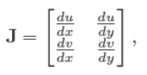

# Texture Mapping

当试图复制现实世界的外观时，人们很快就会意识到几乎没有任何表面是没有特征的。所有的材料放入现实世界后，必定会很快布满痕迹、凹痕、污渍、划痕、指纹和污垢。

在计算机图形学中，我们把这种现象称为“spatially varying”的表面属性，也就是这种表面属性因地而异，但并没有改变这个表面的真正的形状。为了实现这些效果，各种建模和渲染系统都提供了一些纹理映射的方法：使用一张图像，被称作texture map 或者 texture image。或者就只是一个texture，去存储想要在表面上实现的细节，然后使用数学的方法将图像或者纹理**映射（mapping）**到物体表面上。

事实证明，一旦将图像映射到物体表面的机制存在，纹理映射还能做远远不止创造表面细节的事情，比如创造阴影和反射、提供照明、甚至可以定义出物体的形状。在复杂的交互程序中，纹理被用来存储各种数据，这些数据甚至与图片无关!

本章讨论使用纹理来表示表面细节、阴影和反射。虽然基本思想很简单，但是一些实践性的问题会让纹理的使用复杂化。首先，纹理很容易变形，所以这种映射会很有挑战性。其次，texture映射是一个resample的过程，就像重新缩放图像一样，正如在上一章提到，resample会带来混叠的问题。纹理映射和动画的一起使用很容易会带来混叠的问题，所以大部分纹理系统之所以复杂就是为了antialiasing。

## 11.1 Looking Up Texture Values

从简单的场景开始考虑——一个木质地板。我们希望用显示木地板木纹的图像控制地板的漫反射颜色。不管是光追还是光栅化（前者需要计算光线与物体交点的颜色，后者需要计算光栅化后的片段颜色），我们都需要知道在这个shading point上纹理的颜色，将其作为漫反射颜色，以便于使用第5章提到的Lambertian渲染模型。

为了得到这个颜色，着色器执行纹理查找：它在纹理图像的坐标系统中找出与shading point对应的location，并读取图像中该点的颜色，从而得到纹理样本。不同的像素对应图像中不同的位置，从而得到不同的颜色，代码如下：

在这段代码中，着色器要求物体表面中的shadepoint能够提供坐标给texture查询，并且希望每个使用这个texture的表面都能够给出这个坐标。这带来了纹理映射的第一个关键要素：需要一个从表面映射到纹理的函数，使得我们可以很容易计算出每个像素。这被叫做纹理坐标函数（texture coordinate function）:

上图左侧部分是viewing projection的过程，是将S映射到图像上的任何一个位置（这时候还未光栅化），右侧是texture mapping的过程，是将S映射到纹理图上。

纹理坐标函数为物体表面上的每一个点都提供了纹理坐标。从数学角度，这是一个从3D域S到2D域T的映射：

集合T，通常被叫做“纹理空间”，只是一个包含纹理图像的矩形。普遍地，我们会使用单位正方形$(u,v)\in [0,1]^2$（在这本书中，我们使用$u$和$v$来表示纹理坐标）。这跟第8章提及的viewing projection（在本章被称作$\pi$过程）很相似，它将场景中的物体表面映射到了图像上的点。这两个过程都是3D to 2D的过程，也都是被渲染所需要的——一个需要知道怎么拿到纹理的值，一个需要知道怎么拿到图像像素的着色结果。但是这两个过程也有着重要的不同：$\pi$通常只包括投影变换和正交变换，而$\phi$可以有很多不同的形式；$\pi$只需要在整个场景中执行一次，而对于场景中不同的物体，可能需要执行不同的$\phi$。

有些人也许会感到惊讶，$\phi$是一个从表面到纹理图像的映射，而我们最终的目标是将纹理“贴”到物体表面上，但这就是我们需要的函数。

对于上述木制地板的情况，如果地板的z值恒定，并且长宽与xy轴都对齐，那么我们就可以简单地使用下面的mapping：
$$
u=ax;v=by,
$$
对于a、b的合适选择，可以为每个$(x,y,z)_{floor}$提供纹理坐标$(u,v)$，之后我们就可以使用纹理中位于这个位置的值，或者，**texel（texture image中的pixel）**，即最接近$(u,v)$的像素值来作为$(x,y)$处的纹理值。最终我们可以得到下图：

但是这种方式是非常有限的，比如表面需要xy轴对齐，比如物体表面并不是平面，而是曲面，该怎么办？这让我们需要找到一些更好的方法来计算表面上的纹理坐标。

从上述的最简单的纹理映射方式还会造成另外一个问题，这个问题会在下述场景被戏剧性地暴露出来：从一个瞭望的角度（类似从很低的位置瞭望地平线，grazing angle）渲染一张低分辨率的图像，但是所用到的纹理是高分辨率的图像，或者是高对比度的内容。比如下图展示的：

一个巨大的网格贴图，并且是以一种瞭望的角度。从中可以看到相当严重的混叠伪影（近处是清晰的网格，但是远处变成了波浪和闪烁），这特别像第10章resample的时候没有选择合适滤波器的结果。尽管这只是打印在书本上的一种极端情况，但是在动画中，这种情况哪怕只是出现一瞬也会严重影响观感。

现在我们看到了两个问题：

- 如何更好定义纹理坐标函数
- 如何在查询纹理时避免出现太多的混叠

这两个关注点是所有类型的纹理映射(tmap)的基础，将在11.2节和11.3节中讨论。一旦你理解了它们和它们的一些解决方案，你就理解了纹理映射。剩下的就是如何应用基本的纹理机制来实现各种不同的目的，这将在第11.4节中讨论。

## 11.2 Texture Coordinate Functions

设计一个好的纹理坐标函数$\phi$是获得良好纹理映射效果的关键要求。你可以认为这是决定如何变形一个平面，矩形图像，使它符合你想要绘制的3D表面。或者，对于物体表面，轻轻地将其压平，不让其起皱、撕裂或折叠，使其平躺在图像上。有时候，这很简单:也许3D曲面已经是一个平坦的矩形！在其他情况下，这是非常棘手的：3D形状可能非常复杂，就像角色身体的表面。

定义纹理坐标函数的问题对于计算机图形学来说并不新鲜。同样，制图师在设计覆盖地球表面的地图时也会遇到这样的问题。从曲面地球到平面地图的映射不可避免地会导致区域、角度和/或距离的失真，这很容易使地图产生误导。在过去的几个世纪里，已经提出了许多地图投影，它们都平衡了在纹理映射中面临的相同的棘手问题——在覆盖一个连续的大片区域的同时，尽量最小化各种各样的失真。

在一些应用程序中(一些例子在11.2.1节中)，使用特定的映射是有明确理由的。但在大多数情况下，设计纹理坐标映射是一项微妙的任务，需要平衡图中不同位置的失真点（有些失真是此消彼长的），熟练的建模师需要付出相当大的努力。

你可以用任何你能想到的方式定义$\phi$。但有几个彼此权衡的目标需要考虑：

- **双射性（Bijectivity）**。在大多数情况下，你希望$\phi$是双射的(参见章节2.1.1)，这样表面上的每个点映射到纹理空间中的一个不同的点。如果多个点映射到同一个纹理空间点，纹理中一个点的值将影响表面上的多个点。在您希望纹理在表面上重复的情况下(想想具有重复图案的壁纸或地毯)，有意地引入从表面点到纹理点的多对一映射是有意义的，但您不希望这种情况意外发生。
- **变形/失真尺度（Size distortion）**。纹理的尺度应该在整个表面上近似恒定。也就是说，表面上任何距离相同的紧密点都应该映射到纹理中距离相同的点。就函数$\phi$而言，$\phi$的导数的大小不宜变化太大。
- **变形/失真形状（Shape distortion）**。纹理不应该很扭曲。也就是说，在表面绘制的一个小圆应该映射到纹理空间中的一个合理的圆形，而不是一个极度压扁或拉长的形状。在$\phi$方面，$\phi$的导数在不同方向上不能相差太大。
- **连续性（Continuity）**。不应该有太多的接缝：表面上的相邻点应该映射到纹理中的相邻点。也就是说，φ应该是连续的或具有尽可能少的不连续。在大多数情况下，一些不连续是不可避免的，我们想把它们放在不显眼的位置。

通过参数方程(章节2.7.8)定义的曲面有一个固定的纹理坐标函数的选择：对定义曲面的函数求反，并使用表面的两个参数作为纹理坐标：
$$
f(p_1,p_2)=a \ point \ on \ the \ surface\\
\mapsto f^{-1}(a \ point \ on \ the \ surface)=(p_1,p_2)
$$
这些纹理坐标可能有也可能没有理想的属性，这取决于表面，但它们确实提供了映射。

但是对于隐式定义的曲面，或者只是由三角形网格定义的曲面，我们需要一些其他的方法来定义纹理坐标，而不依赖于现有的参数化。广义上讲，定义纹理坐标的两种方法是从几何上计算它们，从表面点的空间坐标，或者对于网格表面，在顶点存储纹理的值，并在整个表面上进行插值。让我们一个一个地看看这些选项。

### 11.2.1  Geometrically Determined Coordinates

几何确定的纹理坐标用于简单的形状或特殊情况，作为快速解决方案，或作为设计手工调整纹理坐标贴图的起点。我们将通过以下测试图像映射到物体表面来说明各种纹理坐标函数。图像中的数字可以让你从渲染的图像中读出近似的（u, v）坐标，而网格可以让你看到映射的失真程度：

**平面投影（Planar Projection）**

很可能，从3D到2D的最简单映射是平行投影，与用于正交视图的映射相同。我们已经推导的用于视图的机制（第8.1节）可以直接用于定义几何坐标：正如正交视图归结为乘以矩阵并丢弃z分量一样，通过平面投影生成纹理坐标可以通过简单的矩阵乘法来完成：

其中纹理矩阵$M_t$表示仿射变换，星号表示我们不关心第三坐标中的结果。这对于大多数平坦的表面非常有效，表面法线没有太大的变化，并且通过取平均法线可以找到良好的投影方向。对于一个封闭图形来说，这种平面投影并不是单射的：前面和后面的点将映射到纹理空间中的同一点。

可以看到，与投影平面相切的物体表面会发生极度扭曲，因为它们都被投影到纹理中非常相近的位置。通过简单地用透视投影代替正交投影，我们得到了投影纹理坐标：

现在4×4矩阵$P_t$表示投影（不一定是仿射）变换，即最后一行可能不是$[0，0，0，1]$。

投影纹理坐标在阴影映射技术（shadow mapping）中非常重要，如第11.4.4节所述。

**球形坐标（Spherical Coordinates）**

对于球体，纬度/经度参数化是熟悉且广泛使用的。它在极点附近会发生很多变形，这可能会导致困难，但它确实覆盖了球体，仅仅在一条纬度线上展现了不连续性。

形状大致为球形的曲面可以使用径向投影（radial projection）将曲面上的点映射到球体上的点：从球体中心穿过曲面上的一条线，然后找到与球体的交点。该交点的球面坐标就是曲面这个shading point的纹理坐标。

上述方法的另一种表示方式是，用球面坐标（ρ，θ，φ）表示表面点，然后丢弃ρ坐标，将θ和φ映射到范围[0，1]。该公式取决于球坐标计算的惯例；使用第2.7.8节的惯例：

如果从中心点可以看到整个表面，则球坐标图在除极点以外的任何地方都是双射的（不是极点的地方都对应着一个截切圆，而极点处对应的是点）。它在两极附近继承了与球体上的经纬度图相同的失真。下图显示了一个对象，球坐标为其提供了合适的纹理坐标函数：

对于上图模糊的球状物体，将每个点投影到以物体中心点为中心的球体上提供了单射映射，此处用于放置与地球图像相同的地图纹理。请注意，表面远离中心的区域会放大（表面点在纹理空间中挤在一起），而表面离中心较近的区域会缩小。（放大和缩小的比例由球坐标对应半径和点到物体中心距离的比例决定）。

**圆柱坐标（Cylindrical Coordinates）**

对于比较柱状的物体，将物体表面投影到圆柱上比球状更好：

上图的左边采用的是球状投影，可以看到出现了大量的失真（中心小两端大），而右边的圆柱形投影在外表面产生了非常好的效果。类似于球面投影，这相当于转换为圆柱坐标并丢弃半径：

圆柱坐标系是$(\rho,\theta,z)$，其中$\rho$是点M距离z轴的垂直距离，$\theta$是OM在x-y平面的投影与x轴正方向的夹角，$z$就是xyz坐标系中的z。xyz坐标系与圆柱坐标系之间的关系是：
$$
x=\rho cos\theta,\\
y=\rho sin\theta,\\
z=z.
$$
**立方体贴图（Cubemaps）**

使用球坐标来参数化球形或类球形形状会导致形状和极点附近区域的高度失真，这通常会导致可见的伪影，表明物体表面会有两个特殊点纹理出现问题。一种流行的替代方案更加统一失真比较少，但是代价是具有更多不连续性。这个想法是将物体表面投射到一个立方体上，而不是一个球体上，然后为立方体的六个面使用六个独立的正方形纹理。这六个面的纹理集合被称作立方体贴图，这会在所有的立方体边缘引入不连续性，但是它可以带来较低的形状和面积的失真。

计算Cubemaps纹理坐标比球面坐标更容易，因为投影到平面只需要一个除法——本质上与透视投影相同。比如对于投影到立方体+z面上的点：
$$
(x,y,z)\mapsto(\frac{x}{z},\frac{y}{z}).
$$
可以用等比的知识去理解，+z面上的z值是1，所以$(x,y,z)$对应着$(u,v,1)$。

Cubemaps的一大难点是如何在六个面上定义u-v的方向，任何定义都可以，但选择的定义会影响纹理的质量，因此标准化很重要。因为Cubemaps经常被用在从内部往外观察的场景中（比如11.4.5的环境贴图），所以通常的定义会指定u-v轴的朝向，从而在里面往外观察，每个面的u都在v的顺时针方向。OpenGL的定义是：

公式的下标代表着投影所对应的面。比如$\phi_{-x}$代表将点投影到x=1的面**（为什么不是x=-1?）** **（上面公式里的坐标符号也不能完全对上）**。可以通过坐标里最大的绝对值来判断应该把点投影到哪个面：比如$|x|$比$|y|$和$|z|$大，那么点就将被投影到+x或者-x面，进而如果x是正值，那么就是+x面，反之-x面，正如上图左图所示。

使用Cubemaps的纹理拥有六个正方形，它们通常是打包在一张图像中，就像立方体被打开了一样。

### 11.2.2 Interpolated Texture Coordinates

为了对三角形网格表面的纹理坐标函数进行更细粒度的控制，我们可以显式地存储每个顶点的纹理坐标，并使用重心插值在三角形上对它们进行插值(9.1.2节)。其他同样的属性（只要在三角上平滑变化）也可以这样操作，例如颜色、法线，甚至3D位置本身。

看只有一个三角形的例子：

从左图可以看到，三个顶点的位置是$(0.2,0.2)、(0.8、0.4)、(0.4,0.8)$。正如上一节中几何确定的映射一样，我们通过提供从表面到纹理域的映射来控制纹理在曲面上的位置，而在这一节我们只需要确定顶点到纹理域的映射。一旦确定了顶点的映射，剩下的部分就由重心坐标插值来完成。

下图展示了在整个网格上可视化纹理坐标：

可以看到，就是先确定顶点在纹理图像中的位置，然后简单地画出三角形就行了。这种可视化让我们看到纹理的哪部分对应于哪个三角形，这让我们很容易进行纹理坐标的评估和纹理映射代码的调试。

由顶点坐标定义的纹理坐标映射的质量取决于分配给顶点的坐标——也就是说，网格是如何在纹理空间中布局的。无论分配什么坐标，只要网格中的三角形顶点是共享的（12.1节），纹理坐标映射总是连续的，因为相邻的三角形在他们共享边的点上的纹理坐标是一致的。单射性保证了三角形在纹理空间中不会重叠——如果重叠，就代表一个在纹理空间中的点会出现在物体表面的多个地方。

当纹理空间中三角形的面积与其在3D中的面积成比例时，尺寸失真比较低。比如用连续的纹理映射函数表示一个人物的脸，通常会将鼻子压缩至纹理空间中一个相对较小的区域：

虽然在3D空间中，鼻子上的三角形比脸颊上的小，但是在纹理空间中，尺度的比例更加极端（鼻子附近的纹理坐标顶点更小更密集），这在一定程度上扩大了鼻子的纹理，因为纹理上的一小部分区域，因为纹理坐标的密集，会占据物体表面的更大区域。同样的，比较前额和太阳穴，两者的三角形在3D区域中大小相似，但是太阳穴附近的三角形在纹理空间中更大，导致了太阳穴的纹理在3D中看起来更小。

同样的，当三角形的形状在3D和纹理空间中相似时，纹理的形状失真也会比较小。上面人脸的例子已经实现了相当低的失真，但是11.5中的球体在极点附近就有非常大的形状畸变：

### 11.2.3 Tiling,Wrapping Modes,and Texture Transformations

允许纹理坐标超出纹理图像的范围通常是有用的。有时候，这恰巧是一个计算上的细节：对于一个本来精确落在纹理图像边界上的点，由于计算的舍入误差，这个点可能会落在图像稍外一点点。纹理坐标的映射机制必须保证这种情况不会发生取值的失败。

如果一个纹理只覆盖到表面的一部分，但是纹理坐标被设置成将整个表面映射到单位正方形，那么这时会有两个选项：（1）准备一个大部分是空白的纹理图像，内容只在其中的一个小区域。这需要一个超高分辨率的图像来获得相关区域的足够细节。（2）缩放所有纹理坐标，让他们覆盖更大的范围——比如$[-4.5,5.5]\times[-4.5,5.5]$，这时候单位正方形就位于这个更大范围的中心，同时大小是这个范围的1/10。有内容的区域这时同样被放大，位于单位正方形内，这时候对图像分辨率的要求就降低了。

对于上述第二种选项，当纹理查找位于单位正方形外，又位于纹理图像（就是上述的更大范围）内时，应该返回一个恒定的背景色。实现这一点的一种方法是设置一个背景色，当纹理查找在上述的范围内时，直接返回该背景色；如果纹理图像已经自带恒定的背景色（比如白色背景上的logo），则在扩展的纹理上自动计算背景色的方法是——返回距离该点最近的边缘点的纹理图像的颜色，这通常是对u-v坐标值进行clamp获得的。

有时，我们需要重复的图案，例如棋盘、瓷砖地板或砖墙。如果图案在矩形网格上重复，则创建具有相同数据的多个副本的图像将是浪费的。相反，当查找点离开纹理图像的右边缘时，我们可以使用环绕索引处理纹理图像外部的纹理查找，它环绕到左边缘。这是非常简单地使用像素坐标上的整数余数操作来处理的：

这两种处理越界查找的方式之间的选择是通过从列表中选择一种环绕模式来指定的，该列表包括tiling、clamping以及两者的组合或变体。有了环绕模式，我们可以自由地将纹理想象成一个函数，它返回无限二维平面中任何点的颜色：

当我们指定一个图像作为纹理时，环绕模式可以让我们知道如何利用这张有限的图像去定义上述的函数。在 11.5 节中，我们将看到程序纹理（procedural texture）可以自然地延伸到无限平面，因为它们不受有限图像数据的限制。由于两者在逻辑上都是无限的，因此这两种类型的纹理可以互换。

当调整纹理的比例和位置时，并不需要实际改变生成纹理坐标的函数，也不需要改变存储在网格顶点的纹理坐标值，只需要在纹理取值前对纹理坐标进行矩阵变换：

$\phi_{model}(x)$是纹理坐标函数。$M_T$是使用齐次坐标的3*3仿射或者投影矩阵，针对的是2D纹理坐标。这种变换有时候被限制在缩放/旋转两种，被使用纹理映射的大部分渲染器所支持。

### 11.2.4 Continuity and Seams

尽管低失真和连续性是纹理坐标函数中非常好的属性，但是不连续有时候在所难免。对于任何3D闭合曲面，拓扑学的一个基本结果是不存在一种双射函数将整个3D曲面映射到2D纹理图像中。所以我们必须引入接缝（seams）——在物体表面上的一条曲线，该曲线左右两侧的纹理坐标值会发生不连续的改变（跳变）。在除了接缝的地方，我们可以保证纹理映射的低失真。上面讨论的许多几何确定的纹理映射都包含了接缝：在球形和柱形坐标中，接缝是由atan2计算的角度从$-\pi$到$\pi$的地方；在cubemaps中，接缝就在立方体的边缘，在那里纹理映射会转换成不同面的uv坐标。

对于插值纹理坐标，接缝需要特别考虑，因为它不是自然发生的。我们之前观察到，在顶点共享的网格中，插值纹理坐标一定是连续的。但这意味这如果一个三角形跨越了一条接缝，其中一些顶点在一边，另一些顶点在另一边，插值机制会很愉快地提供一个连续的映射，但它可能会高度扭曲或者折叠，这使得其不是“注入式”的（不是单射）。下图在球面坐标映射的球体上说明了这个问题：

在地球底部有一个三角形，它的一个顶点位于新西兰南岛的顶端，另一个顶点在北岛东北约400公里的太平洋上。一个明智的飞行员会在这些点之间飞行会飞越新西兰，但是路径从东经167度开始，到西经179度结束，所以线性插值选择了一条途中穿越南美洲的路线。这会导致纹理被压缩成跨越180经线的三角形带。解决方案是用等价的东经181度来标记第二个顶点（这是一个虚拟的点），但这只会把问题推给下一个三角形。（下一个三角形仍要跨越经线）

**要想在接缝附近创建一个干净的过渡过程，就要避免在接缝处共享纹理坐标。**穿过新西兰的三角形需要插值到经度181，而太平洋的下一个三角形需要从经度-179开始。为了做到这一点，我们复制接缝处的顶点：对于每个顶点，我们添加第二个具有等效经度的顶点（只不过相差360度，比如经度180的对面是经度-179，-179+360=181还是同一个点，但是这时不再跨越整张地图），并且接缝对面不使用相同的顶点。这个解决方法如上图的右半边所示，其中纹理空间最左边和最右边的顶点是重复的，具有相同的3D位置。

### 11.2.5 Texture coordinates in rendering systems

纹理用于各种渲染系统，虽然基本原理相同，但光线追踪和光栅化系统的细节不同。

纹理坐标是正在渲染的模型的一部分，场景描述需要包含足够的信息来定义它们是什么。大多数情况下，这意味着将纹理坐标存储为将与纹理一起使用的所有三角形网格的逐顶点属性。如果渲染系统直接支持网格以外的几何图元，这些图元通常具有预定义的纹理坐标（例如，球体上的纬度-经度坐标），可能为每个图元类型选择映射方案。

在光线追踪渲染器中，支持光线相交的每种表面类型不仅必须能够计算交点和表面法线，还必须能够计算交点的纹理坐标。与有关相交的其他信息一样，纹理坐标可以存储在命中记录（hit record）中（参见第 4.4.3 节）。在三角形网格表示的几何体的常见情况下，光线-三角形相交代码将通过重心插值从存储在顶点处的纹理坐标计算纹理坐标，对于其他类型的几何体，相交代码必须要直接地计算出纹理坐标。

在基于光栅化的系统中，三角形通常是唯一受支持的几何类型，因此所有表面都必须转换为这种形式。纹理坐标可以与模型一起读入（常见情况），或者对于在代码中生成的三角形网格，可以在创建网格时计算和存储它们。或者，对于可以从其他顶点数据计算的纹理坐标（例如，纹理坐标是从 3D 位置计算的），纹理坐标也可以在顶点着色器中计算并传递给光栅化器。纹理坐标然后由光栅化器进行插值，这样片段着色器的每次调用都有适合其片段的纹理坐标。

## 11.3 Antialiasing Texture Lookups

纹理映射的第二个基本问题是抗锯齿。纹理映射图像是一个采样过程：将纹理映射到表面上，然后将表面投影到图像中，在图像平面上产生一个二维函数，我们以像素为单位对其进行采样。就如第10章所提，当图像包含细节或者锐边时，使用点采样会产生混叠伪影——而纹理的重点是为了引入细节，所以它们成为了我们在下图看到的混叠问题的主要根源：

正如直线或三角形的抗锯齿光栅化（第 9.3 节）、抗锯齿光线追踪或下采样图像（第 10.4 节）一样，解决方案是使每个像素不再是对某个点的采样，而是图像的区域平均值，这个区域的大小与像素相似。

使用supersampling（正如在光栅化或者光线追踪里使用的那些技术），拥有足够多的样本，就能在不改变纹理贴图机制的前提下获得出色的结果：一个像素区域内的许多样本，会对应到纹理图像的不同位置，而最终这个像素区域的颜色就是这些不同位置查询到的纹理值的平均，这就符合了上述所说的观点。

但是对于一个拥有许多细节的纹理，就需要非常多的采样，这通常是很慢的。在表面存在纹理的情况下如何有效地计算该区域平均值是纹理抗锯齿的第一个关键主题。

纹理图像通常也是一个被光栅化的图像（同样拥有像素），因此还需要考虑重建问题，就如上采样图像一样。对于纹理而言，解决办法跟10.4节是类似的，就是使用重建滤波器在texel（区别于正常图像的pixel）之间进行插值。

我们将在以下部分详细介绍这些主题中的每一个：

### 11.3.1 The Footprint of a pixel

使得纹理的抗锯齿与其他类型的抗锯齿更复杂的是，渲染图像与纹理之间的关系是不断变化的。每个像素值都应该计算为自己像素区域的平均颜色，如果这个像素区域恰好位于同一个表面内，就对应于表面上区域的平均。如果表面颜色来自纹理，这就反过来相当于对纹理的对应区域进行平均，称为像素的纹理空间覆盖区（texture space footprint）。下图说明了正方形区域（可能是低分辨率图像中的像素区域）的覆盖区如何映射到地板纹理空间中大小和形状截然不同的区域：

回想一下涉及纹理渲染的三个空间：将3D映射到2D图像的映射$\pi$、将3D映射到2D纹理图像的映射$\phi$。要找到图像像素在纹理空间的覆盖区，就需要知道这两种映射的使用过程：（1）使用$\pi$的逆变换从图像到达3D物体表面。（2）从3D物体表面使用$\phi$到达纹理空间。这组成$\psi=\phi\pi^{-1}$，决定了像素区域在纹理空间的覆盖区。

纹理抗锯齿的核心问题是如何计算覆盖区的平均值。想要解决任何情况的平均计算问题是一个很复杂的工作：对于一个拥有复杂平面形状的远处物体，其像素区域在纹理空间的覆盖区可能是一个复杂形状的大区域，或者干脆被分为了不连通的几个单独区域。但是在典型情况中，一个像素区域一般会落在较为平滑的物体表面上，这时其在纹理空间的覆盖区也会是一个单独的区域。

因为$\psi$是两种映射的组合，所以覆盖区的大小和形状受视角情况和纹理坐标函数的影响。当表面靠近摄影机时，像素的覆盖区就会比较小；当表面拉远后，覆盖区就会变大。当以一个比较倾斜的角度观察表面时，像素在物体表面的覆盖区就会拉长，这意味着其在纹理空间的覆盖区也会被拉长。即使是一个固定的视角，纹理坐标函数也会造成覆盖区的变化：如果它扭曲了区域，覆盖区的大小也会变化；如果它扭曲了形状，即使是在一个正面的表面视图，覆盖区也会被拉长。

然而，为了找到抗锯齿纹理查找的有效算法，将需要一些实质性的近似。如果一个函数是光滑的，那么线性逼近通常是有用的。在纹理抗锯齿的情况下，这意味着从图像空间到纹理空间的映射$\psi$可以被近似为2D到2D线性映射：
$$
\psi(x)=\psi(x_0)+J(x-x_0),
$$
其中$J$是2x2的矩阵，代表$\psi$的导数的近似。这个矩阵一共有四个元素，如果我们将图像空间的位置表示为$\bold x=(x,y)$，将纹理空间的位置表示为$\bold u=(u,v)$，那么：

矩阵元素中的这四个导数描述了当我们改变$x、y$时，$(x,y)$处的纹理坐标$(u,v)$是如何变化的。

这种近似的几何解释是：

图中以$\bold x$为中心的单位大小正方形像素区域将近似映射到纹理空间中的平行四边形，以$\psi(\bold x)$为中心，其边缘平行于向量$\bold u_x=(du/dx,dv/dx)$和$\bold u_y=(du/dy,dv/dy)$。图中的蓝线就代表当x或者y变化时，其纹理坐标的相应变化。黑色框线代表像素区域覆盖区和对应的纹理空间覆盖区，而灰色代表了一种近似。

导数矩阵$J$很有用，因为它告诉了我们在（近似的）纹理空间内，覆盖区在整个图像中变化的完整情况。导数的值越大表示纹理空间的覆盖区越大，导数向量$\bold u_x$和$\bold u_y$的关系决定了覆盖区的形状。当它们是正交并且长度相等时，覆盖区是正方形的；当它们彼此倾斜或者在长度上非常不同时，覆盖区会被拉长。

这里使用了box filter对图像进行采样，一些系统采用了高斯像素滤波器，这在纹理空间中会形成椭圆高斯。这就是椭圆加权平均（elliptical weighted averaging，EWA）。

我们现在已经达到了通常被认为是"正确答案"的问题形式：**在特定图像区域的滤波纹理采样值应该是在纹理空间对应的平行四边形覆盖区的平均值，该平行四边形覆盖区由该点的纹理坐标对图像坐标的偏导定义。**上述的这种定义需要一些前提假设——比如从图像到纹理的映射应该是平滑的。虽说这是一种近似，也需要一定的前提假设，但是这种方法对于优秀的图像质量来说已经足够准确。然而，计算纹理空间的平行四边形覆盖区平均值太昂贵，无法进行精确计算，所以我们仍然需要用到更多的近似。纹理抗锯齿的方法在近似查找的速度/质量上有所不同，我们将在下面几节中讨论这个问题：

### 11.3.2 Reconstruction

当覆盖区面积小于texel时，我们将”放大“纹理，因为我们最终要在这个小面积里面取到值。这种情况类似于对图像进行上采样，需要考虑的问题是如何在texel之间插值，使得产生一张平滑的图像，texel的网格不会那么明显。就像图像上采样一样，这个平滑的过程由重建滤波器定义，用于计算在纹理空间里任何位置的纹理值：

覆盖区的大小不同，所面临的问题也会不同。对于小面积（左边），需要在像素之间插值以避免块状的伪影；对于大面积（右边），挑战是高效地找到区域内像素的平均值。

对于小面积的插值，考虑因素与图像重采样几乎相同，但有一个重要的区别。在图像重采样中，任务是在规则网络上计算输出样本，而这种规则在可分离重建滤波器的情况下实现了重要的优化。在纹理滤波中，查找的模式是不规则的，所以需要单独计算样本。这意味着大型的、高质量的重建滤波器使用起来的代价是很大的，因此，通常用于纹理的最高质量滤波器就是双线性插值。

双线性插值的计算跟图像中的双线性插值是一样的。首先我们用texel表示纹理空间的样本点，然后我们读取四个相邻的texel并对它们进行平均。纹理通常会被限制在$[0,1]$的正方形内，texel的定位方式与任何图像的pixel相同：在$u$方向上间隔$1/n_u$，在$v$方向上间隔$1/n_v$。texel的原点$(0,0)$位于从边缘向内半个texel，从而实现对称。（完整解释见第10章）

在许多系统中，此操作成为一个重要的性能瓶颈，主要是因为从纹理数据中获取四个纹素值所涉及的内存延迟。纹理样本点的模式是不规则的，因为从图像到纹理空间的映射是任意的，但通常是连贯的，因为互相靠近的图像采样倾向于映射到可能读取相同纹素的相互靠近的纹理采样。出于这个原因，高性能系统具有专门用于纹理采样的特殊硬件，用于处理插值和管理最近使用的纹理数据的缓存，以最大限度地减少从存储纹理数据的内存中获取慢速数据的次数。

有可能会抱怨线性插值对于某些要求苛刻的应用程序可能不够平滑。但是，始终可以通过使用更好的滤波器将纹理重新采样到更高的分辨率来使其足够好，这样纹理就足够平滑，这种情况下双线性插值效果就会很好。

### 11.3.3 Mipmapping

插值工作只适用于覆盖区相较于纹理元素间距很小的情况。当覆盖区覆盖了很多texel，为了保证抗锯齿的效果，就要计算这些texel的平均值，从而平滑信号，保证采样不会出现伪影。

计算平均值的一种非常准确的方法是找到覆盖区内所有texel并将它们相加。然鹅，当占用空间很大时，所付出的代价可能会非常大——可能读取数千个texel才能进行一次查找。更好的方法是预先计算和存储不同大小和位置的各个区域的纹理平均值。

这个方法有着非常著名的名字——Mipmapping。mipmap是一系列纹理，它们都包含相同的图像，但分辨率越来越低。原始的全分辨率纹理图像称为 mipmap 的基础级别或级别 0，级别 1 是在该图像每个维度上按因子 2 进行下采样生成的，所以产生的图像大小是级别0的1/4。粗略地说，该图像中的纹素是 0 级图像中大小为 2 x 2 纹素的方形区域的平均值。

这个过程可以继续定义任意多的 mipmap 层级：层级$k$的图像是通过将层级$k-1$的图像下采样2倍来得到的。级别$k$的纹素对应于原始纹理中$2^k\times 2^k$纹素的正方形区域。例如，从一张 $1024×1024$ 的纹理图像开始，我们可以生成一个有 11 个级别的 mipmap：级别 0 是$1024 × 1024$；第 1 级是 $512 × 512$，依此类推直到第 10 级，它只有一个纹素。这种结构以一系列越来越低的采样率表示相同内容的图像被称为图像金字塔，基于将所有较小的图像堆叠在原始图像之上的视觉隐喻。

### 11.3.4 Basic Texture Filtering with Mipmaps

使用mipmap，纹理滤波（求平均）可以更有效率地完成。当我们需要在大面积上平均纹理值时，我们只需使用来自 mipmap 更高级别的值，这些值已经是图像大面积上的平均值。最简单和最快的方法是从 mipmap 中查找单个值，选择级别，以便该级别的texel覆盖的大小与像素区域对应的纹理覆盖区的整体大小大致相同。当然，纹理覆盖区的形状可能与texel表示的（始终为正方形）区域有很大不同，所以在这个地方估计会产生一些伪影。（从平行四边形到正方形，又一次近似）（不一定是正方形，也可以是长方形，比如长宽的缩放因子不相同）

暂时不管当纹理覆盖区具有细长形状时该怎么做的问题，假设覆盖区是一个宽度为D的正方形，D这个测量值来自完全分辨率（级别0）的纹理图像。什么级别的 mipmap 适合采样？由于第 k 层的texel覆盖宽度为 $2^k$ 的正方形，因此选择这样的 k 似乎是合适的：
$$
2^k\approx D
$$
所以我们让$k=log_2D$。当然，这可能使得k不是整数，但是我们存储的都是整数级别的mipmap图像。对于这种情况，有两种解决方案：（1）找到离k最近的整数，作为要查询的级别。（这个方法很快，但是在两个级别正中间左右会对应到两个不同级别的mipmap图像，从而产生接缝）（2）找到离k最近的两个整数，这两个整数级别分别查询纹理值，最终的结果是在这两个纹理值之间进行插值。（需要做两次查询，但是结果会更加平滑）。

在我们写出利用mipmap做采样的算法之前，我们需要决定D的值，当覆盖区实际上不是正方形时。一些可能的方法是使用覆盖区面积的平方根，或者使用最长的轴作为D的值。一个易于计算的实用折衷方案是使用最长边的长度：
$$
D=max\{||u_x||,||u_y||\}.
$$

这里其实可以看出u、v都是$[0,1]$范围的好处，对于不同大小的mipmap图像，uv都可以映射到图像中的某四个像素（双线性插值），从而取到纹理值。

基本 mipmap 可以很好地消除锯齿，但由于它无法处理拉长或各向异性的覆盖区，因此在以掠射角查看表面时效果不佳。这在代表观察者所站立的表面的大平面上最常见。地板上距离很远的点会以非常陡峭的角度进行观察，从而导致非常各向异性的足迹，mipmapping 近似于更大的方形区域。生成的图像在水平方向上会显得模糊。

### 11.3.5 Anisotropic Filtering

mipmap可以通过多次查询，更好地估计被拉长的覆盖区的平均值。思想就是通过选择较短的轴作为选择mipmap层级的基础，而不是较长的轴，然后将沿着较长轴的多次查询结果平均起来作为最终的结果。

上图使用了三种不同的策略对测试场景进行了纹理采样。点采样直接使用了纹理坐标的最近邻插值；使用mipmap的双线性插值会求每个像素区域在纹理空间里的正方形区域的平均值，从而导致较为模糊的结果；使用mipmap在沿较长轴多次查询的平均可以更好地贴近各向异性（被拉长）覆盖区的面积区域，从而带来更为清晰的结果。

对于”沿着较长轴多次查询“的个人理解：

（1）假设较长轴为$\bold{u}_x$，较短轴$\bold{u}_y$。

（2）获得覆盖区的纵横比$\alpha=||\bold{u}_x||/||\bold{u}_y||$，并对$\alpha$下取整。

（3）求覆盖区在短轴上的边缘$p=\psi(x)-\frac{1}{2}\bold{u}_x$。

（4）从p开始对覆盖区进行$\alpha$等分，求出每个等分区域的中心纹理坐标：$p+\frac{1}{2\alpha}\bold{u}_x$、$p+\frac{3}{2\alpha}\bold{u}_x$、......、$p+\frac{2\alpha-1}{2\alpha}\bold{u}_x$。

（5）对上述纹理坐标在mipmap中求得纹理值（$\bold{u}_y$确定$k_0、k_1$，三线性插值），并求平均。

## 11.4 Applications of Texture Mapping

一旦了解了为一个表面定义纹理坐标的思想和查找纹理值的机制，这个机制就很有用途。本节将介绍纹理映射中最重要的技术，但是纹理（texture）实际上是非常通用的工具，只有你想不到，没有它做不到。

### 11.4.1 Controlling Shading Parameters

纹理映射的一个最基础的用途就是为表面带来颜色的变化——从纹理中取值来控制着色计算中漫反射的颜色，无论是在光栅化还是光线追踪的程序里。纹理漫反射组件可用于黏贴粘花、油漆装饰或在表面上打印文本，它还可以模拟材料颜色的变化，例如木材或石头。

不过，不仅仅是漫反射颜色，镜面反射率、镜面粗糙度，也可以被纹理化，被赋予到物体表面的属性中。例如，一个粘有透明包装胶带的纸板箱可能到处都有相同的漫反射颜色，但在胶带所在的地方比其他地方更亮，具有更高的镜面反射率和更低的粗糙度。在许多情况下，不同参数的映射是相关的：例如，一个有光泽的白色陶瓷杯子上印着一个标志，打印的地方可能既粗糙又暗；一本用金属墨水印刷标题的书可能会同时改变漫反射颜色、镜面反射颜色和粗糙度。

### 11.4.2 Normal Maps and Bump Maps

另一个对着色很重要的量是表面法线。使用插值法线（第 9.2 节），我们知道着色法线不必与底层表面的几何法线相同。Normal mapping（法线贴图），正是利用了上述的事实，让每个着色点的法线取自一张texure map，而不必再去插值或者计算。最简单的方法是将法线存储在纹理中，在每个被解释的texel中存储三个数字，作为法向量的 3D 坐标，而不是作为颜色的三个分量。

但是，在使用法线贴图之前，我们需要知道从贴图读取的法线应该在哪个坐标系中表示。存储在贴图中的法线直接被定义为与物体表面使用相同的坐标系，是最简单的方式。这样取得的法线，就可以直接在世界坐标空间中进行光照计算。

然而，这意味着法线贴图必须要时刻跟踪物体表面的情况。如果表面发生变形，从而几何法线发生变化，那么原有的法线贴图将不再可用——因为贴图仍然会提供变化前的法线值。

解决方案是为附加到表面的法线定义一个相对坐标系，这样的坐标系可以基于表面的切线空间来定义（参见第 2.7 节）：选择一对切向量并使用它们定义正交基（第 2.4.5 节）。这样无论模型表面如何变化，原有的法线贴图仍然可用。纹理坐标函数提供了一种选择一对切线向量的有用方法：**使用与u固定的线相切的方向和v固定的线相切的方向。**这两个方向通常不是正交的，但是可以通过它们构建出正交基（2.4.7节）。这个正交基还可以通过表面法线和一个切向量来定义。

当使用相对坐标系表示法线后，它们的变化就会小得多：由于它们主要都是指向几何法线附近，因此它们将靠近法线贴图中的矢量$(0,0,1)^T$。

法线贴图从何而来？它们通常是根据更详细的模型计算得出的，光滑表面是该模型的近似值；其他时候，它们可以直接从真实表面测量。它们也可以作为建模过程的一部分进行创作：在这种情况下，最好使用bump map（凹凸贴图）间接指定法线。这个想法是凹凸贴图是一个高度场：一个函数，它给出了光滑表面上方详细表面的局部高度。在值高的地方（地图看起来很亮，如果将其显示为图像），表面突出到光滑表面之外；在值较低的地方（地图看起来很暗的地方），表面在其下方陷落。例如，凹凸贴图中的一条窄黑线是一个划痕，或者一个小白点是一个凹凸。[凹凸贴图、法线贴图、切线空间、TBN矩阵讲解 - 知乎 (zhihu.com)](https://zhuanlan.zhihu.com/p/412555049)

从凹凸贴图导出法线贴图很简单：法线贴图（在切线框架中表示）是凹凸贴图的导数：
$$
normal = \frac{<H_g-H_r,H_g-H_a,1>}{\sqrt{(H_g-H_r)^2+(H_g-H_a)^2+1}}
$$
其中$H_g$是凹凸贴图中给定texel的高度，$H_a$是给定texel正上方texel的高度，$H_r$是给定texel正右方texel的高度。

下图显示纹理贴图用于创建木纹颜色并模拟由于饰面浸入木材更多孔部分而增加的表面粗糙度，以及用于创建不完美饰面和木板之间间隙的凹凸贴图，以制作逼真的木材地面：

使用纹理贴图的木质地板控制着色的过程：（a）根据第一个纹理贴图，只有漫反射颜色。（b）根据第二个纹理贴图，控制镜面粗糙度。（c）根据第三个凹凸贴图，控制表面法线。

### 11.4.3  Displacement Maps

法线贴图的一个问题是它们实际上根本不改变表面；它们只是一种着色技巧。当法线贴图隐含的几何体在 3D 中产生明显的效果时，这一点就变得很明显了。在静止图像中，第一个要注意的问题通常是尽管内部出现凹凸不平，但物体的轮廓仍保持平滑（比如光照阴影仍然是平滑的）。在动画中，视差的缺乏暴露出颠簸，无论多么令人信服，实际上只是“画”在表面上。

纹理不仅可以用于着色，还可以用于改变几何形状。置换贴图是这个想法的最简单版本之一。这个概念与凹凸贴图相同：标量（单通道）贴图，给出“平均地形”上的局部高度。但效果不同。置换贴图实际上改变了表面，将每个点沿着光滑表面的法线移动到新位置，而不是在使用平滑几何体时从高度贴图导出着色法线。每种情况下的法线大致相同，但表面不同。

实现置换贴图最常见的方法是用大量小三角形细分光滑表面，然后使用置换贴图置换生成的网格的顶点。在图形管道中，这可以在顶点阶段使用纹理查找来完成，这对于地形特别方便。

### 11.4.4 Shadow Maps

阴影是场景中对象关系的重要线索，正如我们所见，它们在光线追踪技术中会自然地生成。然而，如何在光栅化渲染中获得阴影并不是显而易见的事，因为每个表面只会渲染一次，并且是相互独立的。阴影贴图是一种使用纹理映射机制从点光源获取阴影的技术。

阴影贴图的想法是表示由点光源照亮的空间体积。将光源想象成聚光灯或视频投影仪，它们从一个点向有限范围的方向发射光。被照亮的体积——如果你把它拿在手上，你会在手上看到光的一组点——是沿着离开该点的每条光线将光源连接到最近的表面点的线段的并集。

**有趣的是，这个体积与位于与光源相同点的透视相机可见的体积相同：当且仅当从光源位置可见时，一个点才被光源照亮。**对于这两种情况，我们都需要对场景中点的可见性进行评估：（1）对于观察者来说，我要知道这个片段对于相机而言是否可见，这决定了我要不要把它画在屏幕上。（2）对于光照阴影而言，我要知道这个片段对于光源来说是否可见（把光源也当成相机），这决定了它是否被这个光源照亮了：

对于这两种情况，解决方案是一样的：深度图（depth map）告诉我们沿一束射线距离最近的表面位置。在相机可见性的情况下，这就是z-buffer；在光照阴影的情况下，这就是shadow map。在这两种情况下，可见性都是通过将新片段的深度与已经存储的深度进行比较来评估的，如果其深度大于最近可见表面的深度，则该表面将被遮挡，或者存在阴影。不同的是，z-buffer用于跟踪每一帧看到的最近的表面，是会随相机运动而变化的，故每一帧渲染都要刷新；而shadow map则是告诉整个场景中最近的表面的距离，不会随每一帧渲染而变化（除非光源也在不断移动）。

shadow map是提前在单独的渲染通道中计算的：像往常一样光栅化整个场景，并保留结果的深度图（不需要费心计算像素值）。然后，有了shadow map，就可以执行一个简单的渲染过程：当你需要知道一个片段是否能被光源照亮时，只需要在shadow map投影中找到它的位置（片段位置->3D位置->shadow map位置），并将查找值$d_{map}$与实际距离$d$（距离光源的距离）进行比较。如果距离相同，则片段的点被照亮；如果 $d\gt d_{map}$，这意味着有一个不同的表面更靠近光源，所以它被遮蔽了。

“如果距离相同”这个短语应该在您的脑海中引起一些危险信号：由于所有涉及的数量都是精度有限的近似值，我们不能期望它们完全相同。对于可见点，$d ≈ dmap$ 但有时 d 会大一点，有时小一点。出于这个原因，需要一个公差：如果 $d − dmap < \epsilon$ ，则认为点被照亮。这种容差$\epsilon$被称为阴影偏差（最大阈值）。

在shadow map中查找时，在shadow map中记录的深度值之间进行插值没有多大意义。这可能会导致平滑区域中的深度更准确（需要更少的$\epsilon$），但会在阴影边界附近导致更大的问题，深度值会突然发生变化。因此，shadow map中的纹理查找是使用最近邻重建来完成的（最近邻取整）。为了减少混叠，可以使用更加密集的采样，或者使用一个区域范围的1-0比较结果（比如$d − dmap < \epsilon$就是1，$d − dmap > \epsilon$就是0）的平均来代表该点的一个可见程度（不再是非0即1，非遮蔽即照亮的关系，而是一个逐渐被照亮的过程），这个方法也被叫做**percentage closer filtering（PCF）**。[GAMES202-03 Real-Time Shadows 1 (Shadow Mapping, PCF & PCSS) - 知乎 (zhihu.com)](https://zhuanlan.zhihu.com/p/361417128)

### 11.4.5 Environment Maps

## 11.5 Procedural 3D Textures

### 11.5.1 3D Stripe Textures

### 11.5.2 Solid Noise

### 11.5.3 Turbulence

## 11.6 Frequently Asked Questions

